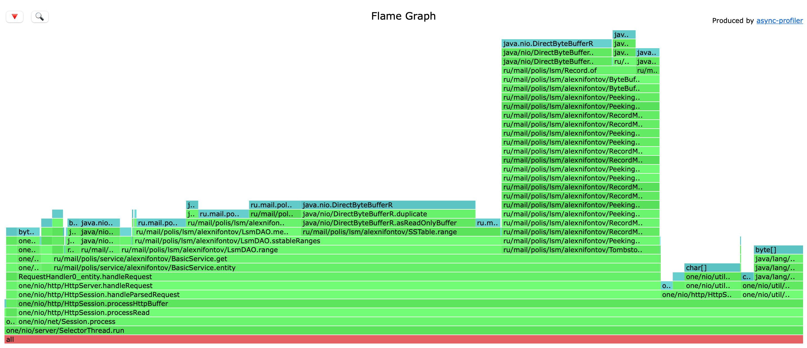

# Этап 1. Результаты профилирования

## Содержание

Для нагрузочного тестирования были использованы:

- `wrk2` — [https://github.com/giltene/wrk2](https://github.com/giltene/wrk2)
- `async-profiler` — [https://github.com/jvm-profiling-tools/async-profiler](https://github.com/jvm-profiling-tools/async-profiler)

## Нагрузочное тестирование сервера (Метод PUT)

Для тестирования метода GET нужно заполнить базу значения. Для этого проведём тестирорвание для метода PUT. 

### CPU

Утилита `wrk2` запускается следующим образом:

```bash
wrk2 -c 1 -t 1 -d 1m -R 15000 -L -s put.lua http://localhost:8080
```

Утилита `async-profiler` запускается следующим образом:

```bash
./profiler.sh -d 60 -f cpu_put.html 69929
```

Результат работы `wrk2`:

```bash
Running 1m test @ http://localhost:8080
  1 threads and 1 connections
  Thread calibration: mean lat.: 674.087ms, rate sampling interval: 3991ms
  Thread Stats   Avg      Stdev     Max   +/- Stdev
    Latency   593.42ms  720.78ms   2.33s    78.54%
    Req/Sec    15.00k     5.62k   23.05k    50.00%
  Latency Distribution (HdrHistogram - Recorded Latency)
 50.000%  160.64ms
 75.000%    1.18s 
 90.000%    1.78s 
 99.000%    2.20s 
 99.900%    2.31s 
 99.990%    2.33s 
 99.999%    2.33s 
100.000%    2.33s 

  899989 requests in 1.00m, 57.51MB read
Requests/sec:  14999.87
Transfer/sec:      0.96MB
```

Результат профилирования CPU для метода PUT:


Из этих данных следует, что:

- Наша система выдерживает 15000 запросов PUT в секунду
- ~90% запросов выполняется менее 2 секунд
- 95.5% ресурсов процессора использует SelectorThread

    Среди них ~43.8% ресурсов занимает реализованный нами метод entity, который обрабатывает запросы

    Остальные ресурсы, используемые SelectorThread, заняты методами one-nio

- 4.5% ресурсов занимает GarbageCollector

### Alloc

Запуск утилиты ничем не отличается от запуска для профилирования CPU.

Утилита `async-profiler` запускается следующим образом:

```bash
./profiler.sh -e alloc -d 60 -f alloc_put.html 69929
```

Результат работы `wrk2`:

```bash
Running 1m test @ http://localhost:8080
  1 threads and 1 connections
  Thread calibration: mean lat.: 670.056ms, rate sampling interval: 3729ms
  Thread Stats   Avg      Stdev     Max   +/- Stdev
    Latency   644.05ms  733.42ms   2.31s    78.01%
    Req/Sec    15.00k     5.69k   22.53k    38.46%
  Latency Distribution (HdrHistogram - Recorded Latency)
 50.000%  305.15ms
 75.000%    1.27s 
 90.000%    1.82s 
 99.000%    2.20s 
 99.900%    2.29s 
 99.990%    2.31s 
 99.999%    2.31s 
100.000%    2.31s 

  899986 requests in 1.00m, 57.51MB read
  Socket errors: connect 0, read 0, write 0, timeout 3
Requests/sec:  14999.83
Transfer/sec:      0.96MB
```

Результат профилирования Alloc для метода PUT:


Из этих данных следует, что:

- 100% ресурсов процессора использует SelectorThread
- Среди них ~52.7% занимает обработка запроса, в которую входит наша обработка с помощью BasicService
- ~41.1% занимают парсинг запроса, его тела, а также заголовков вместе с методом read в UTF8

## Нагрузочное тестирование сервера (Метод GET)

Благодаря проведённым тестам база заполнена значения для проведения нагрузочного тестирования метода GET. 

### CPU

Утилита `wrk2` запускается следующим образом:

```bash
wrk2 -c 1 -t 1 -d 1m -R 4000 -L -s get.lua http://localhost:8080
```

Утилита `async-profiler` запускается следующим образом:

```bash
./profiler.sh -d 60 -f cpu_get.html 69929
```

Результат работы `wrk2`:

```bash
Running 1m test @ http://localhost:8080
  1 threads and 1 connections
  Thread calibration: mean lat.: 0.855ms, rate sampling interval: 10ms
  Thread Stats   Avg      Stdev     Max   +/- Stdev
    Latency   824.35us  446.72us  13.66ms   69.15%
    Req/Sec     4.21k   341.59     7.44k    69.65%
  Latency Distribution (HdrHistogram - Recorded Latency)
 50.000%  822.00us
 75.000%    1.14ms
 90.000%    1.34ms
 99.000%    1.47ms
 99.900%    2.18ms
 99.990%   12.21ms
 99.999%   13.51ms
100.000%   13.66ms

  239996 requests in 1.00m, 16.82MB read
Requests/sec:   3999.94
Transfer/sec:    287.09KB
```

Результат профилирования CPU для метода GET:


Из этих данных следует, что:

- Наша система выдерживает 4000 запросов GET в секунду
- ~99% запросов выполняется менее 2 милисекунд
- 95.6% ресурсов процессора использует SelectorThread

    Среди них ~2% ресурсов занимает чтение из сокетов информации

    ~90.3% занимает метод `get`, который мы реализовали. Это связано с большим количеством обращений к памяти в SSTable

- 4.5% ресурсов занимает GarbageCollector

### Alloc

Запуск утилиты ничем не отличается от запуска для профилирования Alloc.

Утилита `async-profiler` запускается следующим образом:

```bash
./profiler.sh -e alloc -d 60 -f alloc_get.html 69929
```

Результат работы `wrk2`:

```bash
Running 1m test @ http://localhost:8080
  1 threads and 1 connections
  Thread calibration: mean lat.: 1.139ms, rate sampling interval: 10ms
  Thread Stats   Avg      Stdev     Max   +/- Stdev
    Latency     1.77ms    7.87ms 114.94ms   98.14%
    Req/Sec     4.23k   455.88     8.22k    78.50%
  Latency Distribution (HdrHistogram - Recorded Latency)
 50.000%    0.88ms
 75.000%    1.21ms
 90.000%    1.41ms
 99.000%   34.17ms
 99.900%  110.85ms
 99.990%  114.43ms
 99.999%  114.94ms
100.000%  115.01ms

  239997 requests in 1.00m, 16.82MB read
Requests/sec:   3999.89
Transfer/sec:    287.08KB
```

Результат профилирования Alloc для метода GET:



Из этих данных следует, что:

- 100% ресурсов процессора использует SelectorThread
- Среди них ~96.6% занимает обработка запроса нашим методом `get`. Это связано в методом `range` и `hasNext` в нашем DAO. Эти методы являются самыми ресурсоёмкими