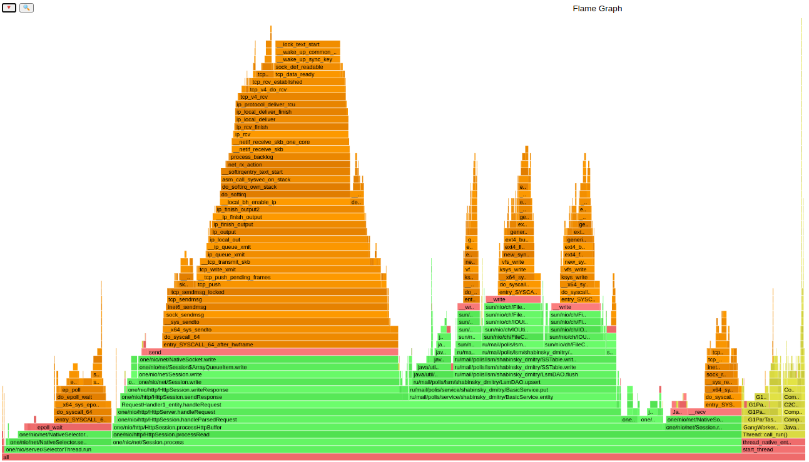
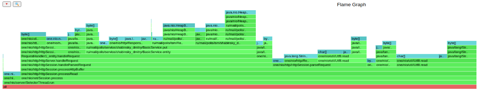
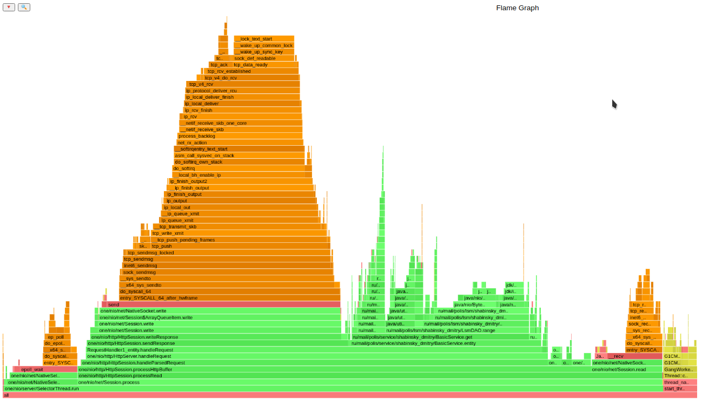
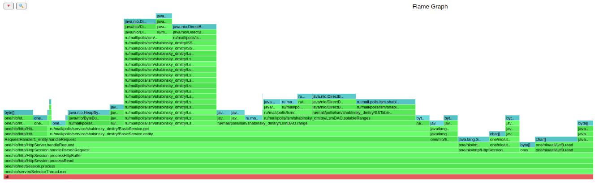

# 2021-highload-dht
Курсовой проект 2021 года [курса](https://polis.mail.ru/curriculum/program/discipline/1257/) "Проектирование высоконагруженных систем" в [Технополис](https://polis.mail.ru).

## Этап 1. HTTP + storage (deadline 2021-09-29 23:59:59 MSK)
## Report

### Использование wrk2 для нагрузочного тестирования с заданным rate (стабильная нагрузка) 
#### Type request: [PUT](https://github.com/sdimosik/2021-highload-dht/tree/stage1/wrk/put.lua)
#### Запуск wrk2 для put-запроосов
```
wrk2 -c 1 -t 1 -d 2m -R 5k -L -s wrk/put.lua http://localhost:8080
```
#### Output
```
Running 2m test @ http://localhost:8080
  1 threads and 1 connections
  Thread calibration: mean lat.: 1.456ms, rate sampling interval: 10ms
  Thread Stats   Avg      Stdev     Max   +/- Stdev
    Latency    59.13ms  260.75ms   1.93s    94.84%
    Req/Sec     5.28k     2.79k   31.56k    93.48%
  Latency Distribution (HdrHistogram - Recorded Latency)
 50.000%    1.48ms
 75.000%    2.14ms
 90.000%    2.68ms
 99.000%    1.56s 
 99.900%    1.85s 
 99.990%    1.92s 
 99.999%    1.93s 
100.000%    1.93s 

  Detailed Percentile spectrum:
       Value   Percentile   TotalCount 1/(1-Percentile)

       0.033     0.000000            1         1.00
       0.406     0.100000        55024         1.11
       0.713     0.200000       110134         1.25
       0.978     0.300000       165039         1.43
       1.162     0.400000       220148         1.67
       1.477     0.500000       275051         2.00
       1.636     0.550000       302555         2.22
       1.784     0.600000       330041         2.50
       1.914     0.650000       357697         2.86
       2.028     0.700000       385001         3.33
       2.141     0.750000       412682         4.00
       2.211     0.775000       426425         4.44
       2.285     0.800000       440158         5.00
       2.363     0.825000       453882         5.71
       2.449     0.850000       467706         6.67
       2.547     0.875000       481424         8.00
       2.607     0.887500       488198         8.89
       2.685     0.900000       494986        10.00
       2.805     0.912500       501917        11.43
       2.993     0.925000       508767        13.33
      12.359     0.937500       515591        16.00
     183.167     0.943750       519027        17.78
     367.615     0.950000       522467        20.00
     553.471     0.956250       525903        22.86
     736.767     0.962500       529341        26.67
     921.599     0.968750       532781        32.00
    1014.783     0.971875       534504        35.56
    1107.967     0.975000       536219        40.00
    1201.151     0.978125       537940        45.71
    1294.335     0.981250       539657        53.33
    1387.519     0.984375       541373        64.00
    1434.623     0.985938       542241        71.11
    1480.703     0.987500       543093        80.00
    1527.807     0.989062       543957        91.43
    1574.911     0.990625       544823       106.67
    1619.967     0.992188       545666       128.00
    1643.519     0.992969       546101       142.22
    1667.071     0.993750       546536       160.00
    1690.623     0.994531       546971       182.86
    1713.151     0.995313       547387       213.33
    1736.703     0.996094       547827       256.00
    1747.967     0.996484       548036       284.44
    1759.231     0.996875       548245       320.00
    1772.543     0.997266       548463       365.71
    1789.951     0.997656       548677       426.67
    1807.359     0.998047       548891       512.00
    1816.575     0.998242       549006       568.89
    1824.767     0.998437       549107       640.00
    1833.983     0.998633       549221       731.43
    1842.175     0.998828       549325       853.33
    1850.367     0.999023       549426      1024.00
    1854.463     0.999121       549483      1137.78
    1862.655     0.999219       549538      1280.00
    1870.847     0.999316       549590      1462.86
    1879.039     0.999414       549641      1706.67
    1888.255     0.999512       549697      2048.00
    1892.351     0.999561       549723      2275.56
    1896.447     0.999609       549748      2560.00
    1900.543     0.999658       549776      2925.71
    1904.639     0.999707       549802      3413.33
    1908.735     0.999756       549829      4096.00
    1910.783     0.999780       549842      4551.11
    1912.831     0.999805       549855      5120.00
    1915.903     0.999829       549875      5851.43
    1917.951     0.999854       549888      6826.67
    1918.975     0.999878       549895      8192.00
    1919.999     0.999890       549903      9102.22
    1921.023     0.999902       549910     10240.00
    1922.047     0.999915       549916     11702.86
    1923.071     0.999927       549923     13653.33
    1924.095     0.999939       549929     16384.00
    1925.119     0.999945       549936     18204.44
    1925.119     0.999951       549936     20480.00
    1926.143     0.999957       549942     23405.71
    1926.143     0.999963       549942     27306.67
    1927.167     0.999969       549949     32768.00
    1927.167     0.999973       549949     36408.89
    1927.167     0.999976       549949     40960.00
    1928.191     0.999979       549955     46811.43
    1928.191     0.999982       549955     54613.33
    1928.191     0.999985       549955     65536.00
    1928.191     0.999986       549955     72817.78
    1929.215     0.999988       549962     81920.00
    1929.215     1.000000       549962          inf
#[Mean    =       59.134, StdDeviation   =      260.754]
#[Max     =     1928.192, Total count    =       549962]
#[Buckets =           27, SubBuckets     =         2048]
----------------------------------------------------------
  599987 requests in 2.00m, 38.34MB read
Requests/sec:   4999.90
Transfer/sec:    327.14KB
```

### Async-profiler
#### [Output CPU for PUT-requests](cpuPut.html)

#### [Output ALLOC for PUT-requests](allocPut.html)


### Conclusions

1. Сервер выдержал нагрузку в 5к req/ses в течении 2m . 
В промежутке 90% - 99% происходит резкое увеличение задержки. Это связанно 
со сбросом файлов на диск из memtable, который не происходит в большинстве случаев.  
Максимальная задержка состовляет 1,93s, а минимальная 0.000406s 
(если исключить 1 незначимый запрос с задержкой 0.000033s)


2. При профилировании CPU мы видим, что 78.41% ресурсов процессора занято Session.process.
В этих 78.41% 35.13% занимают процессы onenio, связанные с записью в сокет (Здесь всё хорошо). 
А 25.9% находятся у нашего BasicService, где 21% приходится на работу SSTable (запись на диск).
Возможно применение многопоточности сократит эти цифры. Так же стоит отметить работу garbage collector в 5% нагрузки CPU, что говорит нам о том, что код можно доработать.
Например, добавив временную метку в структуру ключа для более коррктной сборки мусора (Как в реализации  Google BigTable).


3. При профилировании alloc мы видим, что BasicService.put занимает 36%, в которых 
на создание инстанса записи приходится 10%, а на вставку данных в таблику 13%. 
Около 40% памяти занимают parseRequest, getHeader и Utf8.read, что связанно с выбором HTTP протокола 

### Type request: [GET](https://github.com/sdimosik/2021-highload-dht/tree/stage1/wrk/get.lua)
#### Запуск wrk2 для put-запроосов
```0
wrk2 -c 1 -t 1 -d 2m -R 5k -L -s wrk/get.lua http://localhost:8080
```
#### Output
```
Running 2m test @ http://localhost:8080
  1 threads and 1 connections
  Thread calibration: mean lat.: 0.961ms, rate sampling interval: 10ms
  Thread Stats   Avg      Stdev     Max   +/- Stdev
    Latency     0.92ms  616.75us  15.72ms   72.16%
    Req/Sec     5.29k   432.43    10.56k    70.93%
  Latency Distribution (HdrHistogram - Recorded Latency)
 50.000%  837.00us
 75.000%    1.16ms
 90.000%    1.77ms
 99.000%    2.80ms
 99.900%    4.28ms
 99.990%   11.38ms
 99.999%   15.52ms
100.000%   15.73ms

  Detailed Percentile spectrum:
       Value   Percentile   TotalCount 1/(1-Percentile)

       0.040     0.000000           11         1.00
       0.253     0.100000        55058         1.11
       0.404     0.200000       110008         1.25
       0.551     0.300000       165001         1.43
       0.696     0.400000       220246         1.67
       0.837     0.500000       275288         2.00
       0.906     0.550000       302787         2.22
       0.973     0.600000       330260         2.50
       1.035     0.650000       357817         2.86
       1.095     0.700000       385173         3.33
       1.157     0.750000       412609         4.00
       1.194     0.775000       426376         4.44
       1.281     0.800000       440081         5.00
       1.393     0.825000       453806         5.71
       1.515     0.850000       467577         6.67
       1.641     0.875000       481277         8.00
       1.704     0.887500       488155         8.89
       1.767     0.900000       495023        10.00
       1.830     0.912500       501928        11.43
       1.890     0.925000       508783        13.33
       1.951     0.937500       515704        16.00
       1.983     0.943750       519143        17.78
       2.017     0.950000       522525        20.00
       2.059     0.956250       525948        22.86
       2.123     0.962500       529364        26.67
       2.225     0.968750       532795        32.00
       2.283     0.971875       534536        35.56
       2.343     0.975000       536245        40.00
       2.411     0.978125       537980        45.71
       2.489     0.981250       539703        53.33
       2.575     0.984375       541407        64.00
       2.625     0.985938       542250        71.11
       2.683     0.987500       543118        80.00
       2.747     0.989062       543962        91.43
       2.827     0.990625       544822       106.67
       2.917     0.992188       545691       128.00
       2.965     0.992969       546109       142.22
       3.027     0.993750       546555       160.00
       3.097     0.994531       546969       182.86
       3.181     0.995313       547406       213.33
       3.291     0.996094       547834       256.00
       3.349     0.996484       548049       284.44
       3.411     0.996875       548261       320.00
       3.497     0.997266       548475       365.71
       3.601     0.997656       548687       426.67
       3.723     0.998047       548903       512.00
       3.791     0.998242       549010       568.89
       3.901     0.998437       549120       640.00
       4.025     0.998633       549225       731.43
       4.167     0.998828       549335       853.33
       4.295     0.999023       549440      1024.00
       4.383     0.999121       549493      1137.78
       4.503     0.999219       549547      1280.00
       4.675     0.999316       549602      1462.86
       4.875     0.999414       549654      1706.67
       5.231     0.999512       549709      2048.00
       5.427     0.999561       549736      2275.56
       5.707     0.999609       549762      2560.00
       6.295     0.999658       549789      2925.71
       6.799     0.999707       549815      3413.33
       7.671     0.999756       549842      4096.00
       8.075     0.999780       549856      4551.11
       8.375     0.999805       549869      5120.00
       8.759     0.999829       549884      5851.43
       9.231     0.999854       549896      6826.67
      10.311     0.999878       549909      8192.00
      10.959     0.999890       549916      9102.22
      11.583     0.999902       549923     10240.00
      12.295     0.999915       549930     11702.86
      12.839     0.999927       549936     13653.33
      13.431     0.999939       549943     16384.00
      13.711     0.999945       549946     18204.44
      14.063     0.999951       549950     20480.00
      14.351     0.999957       549953     23405.71
      14.607     0.999963       549956     27306.67
      14.991     0.999969       549960     32768.00
      15.063     0.999973       549961     36408.89
      15.127     0.999976       549963     40960.00
      15.255     0.999979       549965     46811.43
      15.263     0.999982       549966     54613.33
      15.343     0.999985       549968     65536.00
      15.359     0.999986       549969     72817.78
      15.455     0.999988       549970     81920.00
      15.519     0.999989       549971     93622.86
      15.519     0.999991       549971    109226.67
      15.575     0.999992       549972    131072.00
      15.647     0.999993       549974    145635.56
      15.647     0.999994       549974    163840.00
      15.647     0.999995       549974    187245.71
      15.647     0.999995       549974    218453.33
      15.647     0.999996       549974    262144.00
      15.695     0.999997       549975    291271.11
      15.695     0.999997       549975    327680.00
      15.695     0.999997       549975    374491.43
      15.695     0.999998       549975    436906.67
      15.695     0.999998       549975    524288.00
      15.727     0.999998       549976    582542.22
      15.727     1.000000       549976          inf
#[Mean    =        0.921, StdDeviation   =        0.617]
#[Max     =       15.720, Total count    =       549976]
#[Buckets =           27, SubBuckets     =         2048]
----------------------------------------------------------
  599996 requests in 2.00m, 42.23MB read
  Non-2xx or 3xx responses: 8
Requests/sec:   4999.95
Transfer/sec:    360.34KB
```
### Async-profiler
#### [Output CPU for GET-requests](cpuGet.html)

#### [Output ALLOC for GET-requests](allocGet.html)


### Conclusions

1. Сервер выдержал нагрузку в 5к req/ses в течении 2m .
   В промежутке 90% - 99.99% происходит ощутимый прирост задержки.
   Максимальная задержка состовляет 15.72 ms, а минимальная 0.92s


2. При профилировании CPU мы видим, что ≈85% ресурсов процессора занято Session.process.
   В этих 85% ≈34% занимают процессы onenio, связанные с передачи запроса и 
   записью в сокет (Здесь всё хорошо).
   А ≈28% находятся у нашего BasicService, где 20% приходится на работу range по SSTable.
   Применение фильтра Блума должно сократить эти цифры.
   Так же стоит отметить работу garbage collector < 5% нагрузки CPU


3. При профилировании alloc мы видим, что BasicService.get занимает 64%, в которых
   на range по таблице тратится 34% памяти, а на итераторы, получения значения тратится примерно 25%.
   Так же около 20% памяти занимают parseRequest, getHeader и Utf8.read, что связанно с выбором HTTP протокола 


Так же хочется добавить, что резкое увеличение latency может быть связано со множеством факторов 
(потери сетевого пакета и повторная передача, паузы на сборку мусора, требование чтения с диска + какие-то физические явления, связанные с аппаратной частью).
