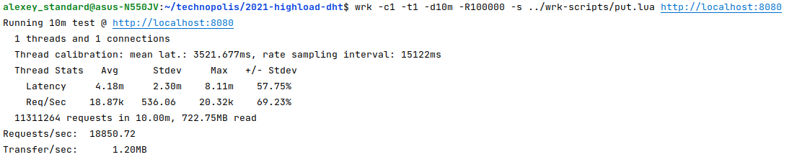
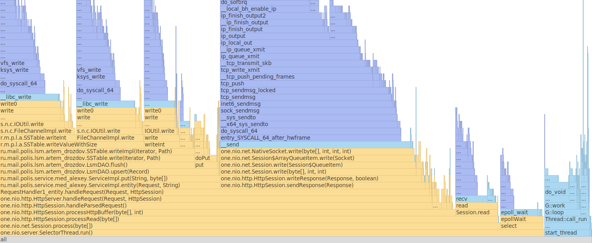
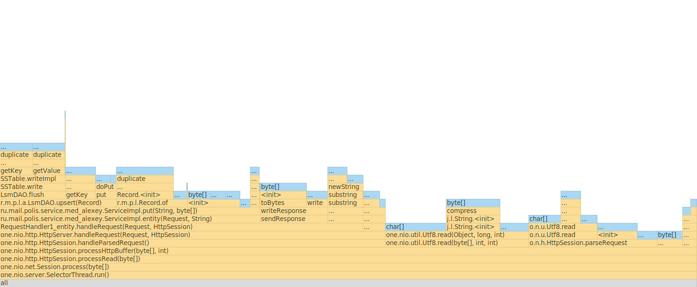
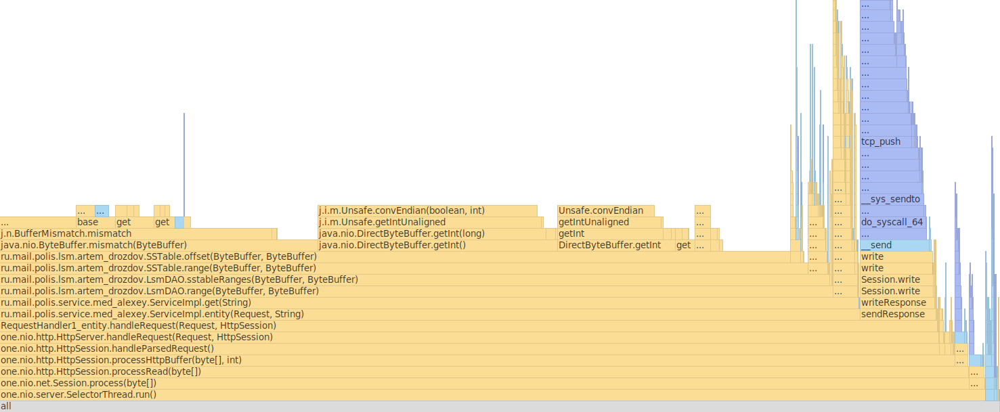

### Результаты нагрузочного тестирования

---

#### PUT-запросы (одно соединение, один поток, 100к запросов/сек) :

Wrk скрипт:

```
counter = 0

request = function()
   path = "/v0/entity?id=key" .. counter
   wrk.method = "PUT"
   wrk.body = "value" .. counter
   counter = counter + 1
   return wrk.format(nil, path)
end
```

Результаты тестирования:



Сервер способен обрабатывать ~19к PUT-запросов в секунду.

#### GET-запросы по наполненной БД (одно соединение, один поток, 20к запросов/сек) :

Wrk скрипт:

```
counter = 0

request = function()
   path = "/v0/entity?id=key" .. counter
   wrk.method = "GET"
   wrk.body = "value" .. counter
   counter = counter + 1
   return wrk.format(nil, path)
end
```

Результаты тестирования:


Сервер способен обрабатывать ~18к GET-запросов в секунду.

### Профилирование приложения с помощью async-profiler

---

#### PUT-нагрузка:

**Cpu:**



73.07% занимает обработка запроса (one.nio.http.HttpServer.handleRequest(...)).

37.22% занимает сохранение сущностей (ru.mail.polis.service.medalexey.ServiceImpl.put(...)).

34.67% занимает отправка ответов (one.nio.http.HttpSession.sendResponse(...)).

**Memory:**



55.32% занимает обработка запроса (one.nio.http.HttpSession.handleParsedRequest(...)).

37.38% занимает сохранение записи (ru.mail.polis.service.medalexey.ServiceImpl.put(...)).

9,66% занимает отправка ответов (sendResponse).

#### GET-нагрузка:

**Cpu:**



85.93% занимает получение записи (ru.mail.polis.service.medalexey.ServiceImpl.get(...)).

7.61% занимает отправка ответов (sendResponse).

**Memory:**


94.82% занимает получение записи (ru.mail.polis.service.medalexey.ServiceImpl.get(...)).

54.38% занимает получение метод merge (ru.mail.polis.lsm.artemdrozdov.LsmDAO.merge(List)).

40.0% занимает получение метод range (ru.mail.polis.lsm.artemdrozdov.SSTable.range(...)).
