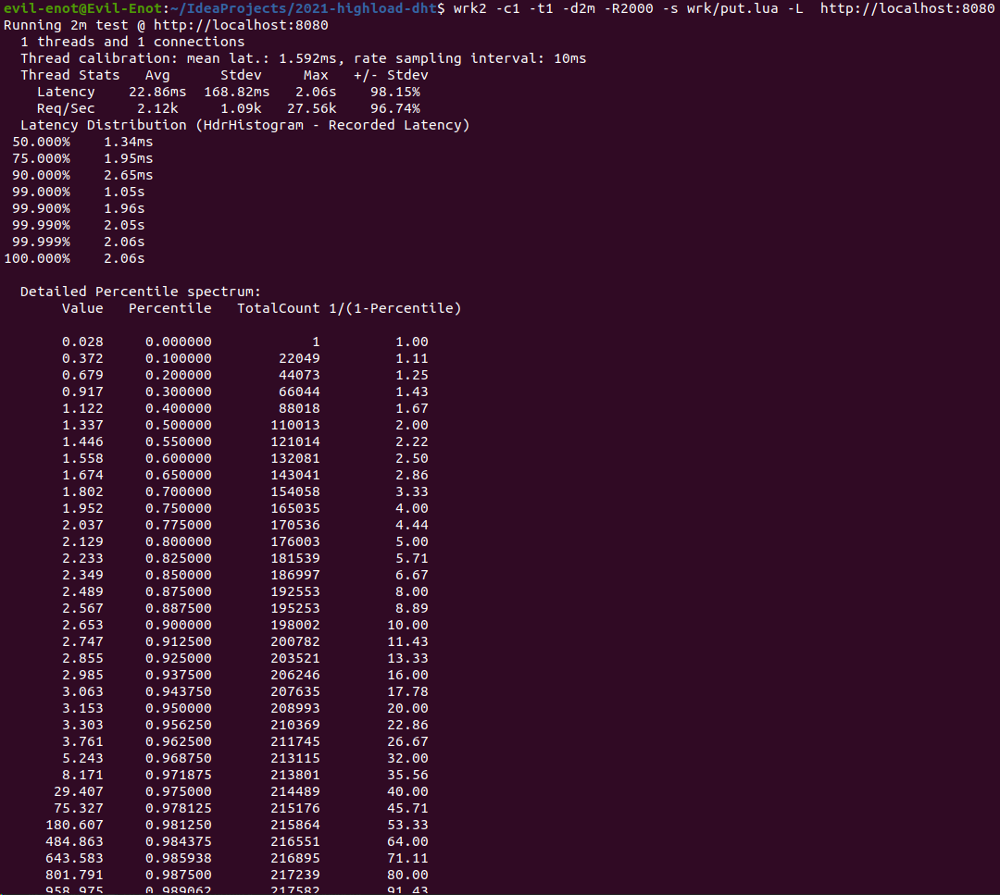
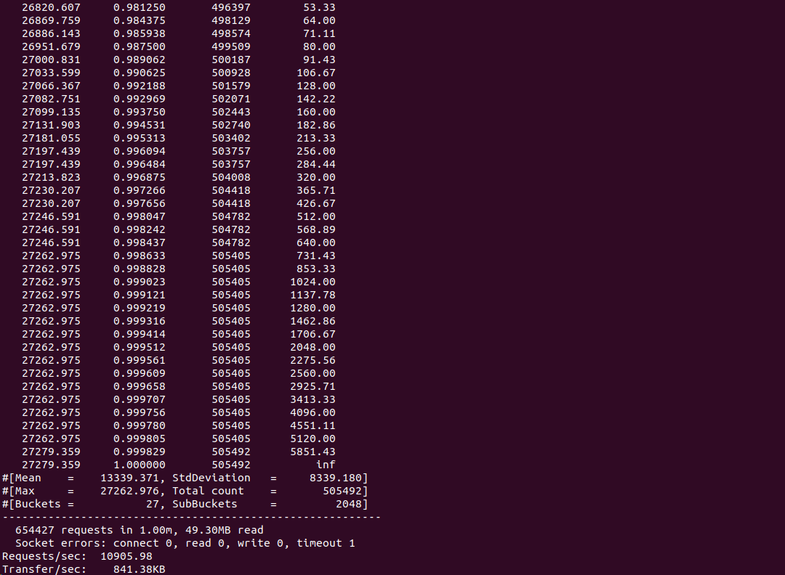
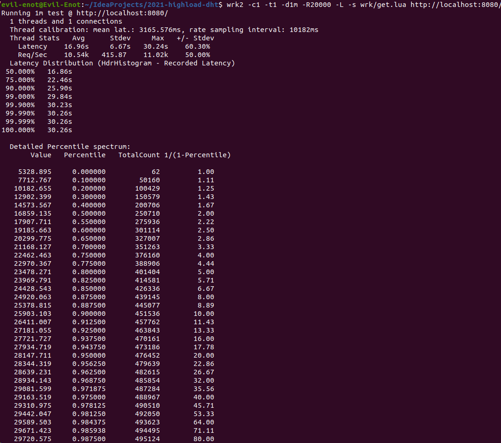
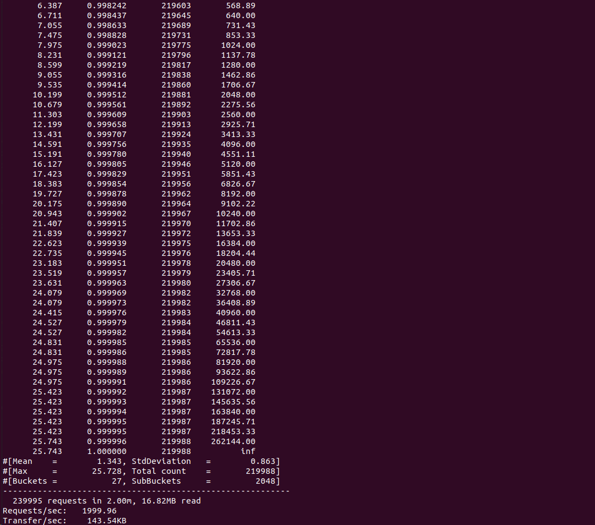
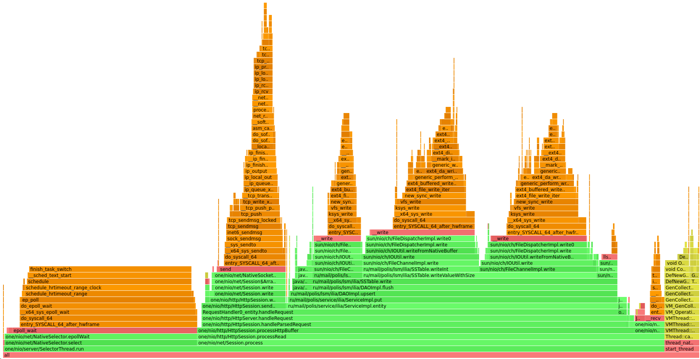
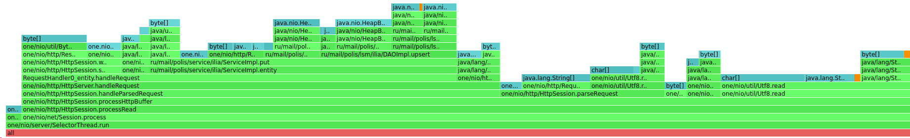
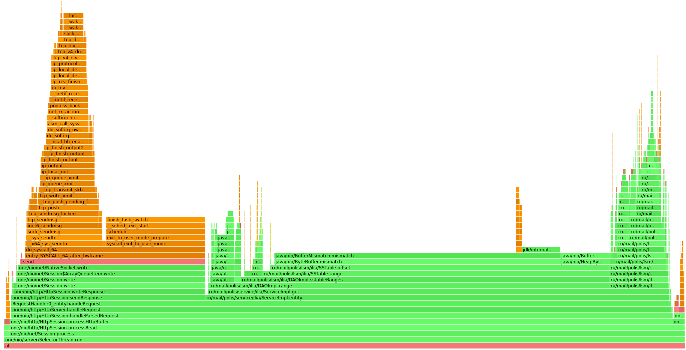
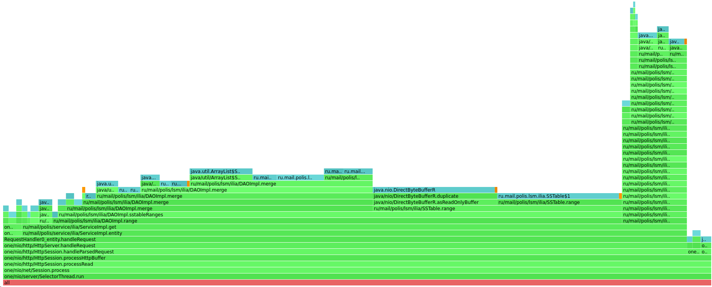

# Отчет по первой работе

## Автор: Солянкин Илья

## Часть 1: Нагрузочное тестирование запросов с использованием [wrk2](https://github.com/giltene/wrk2)

### Wrk2 скрипт для PUT-запросов:

```
counter = 0

request = function()
   path = "/v0/entity?id=key" .. counter
   wrk.method = "PUT"
   wrk.body = "value" .. counter
   counter = counter + 1
   return wrk.format(nil, path)
end
```

Запустим тестирование, задав одно соединение, один поток, 20000 запросов/секунду и продолжительность в 1 минуту:

```
wrk2 -c1 -t1 -d1m -R20000 -L -s wrk/put.lua http://localhost:8080/
```

В итоге получим следующие результаты:




Как можно увидеть, среднее выполнение запросов равно 13.34 сек, максимальное 27.2 сек, в секунду передавалось ~10906
запросов, а общее количество запросов и количество переданной информации было равно 654427 и 49.30МБ соответственно.

Проанализировав результаты можно заметить, что 90 и более процентов запросов обрабатывается с задержкой более чем в
25.48 сек

### Wrk2 скрипт для GET-запросов:

```
counter = 0

request = function()
   path = "/v0/entity?id=key" .. counter
   wrk.method = "GET"
   counter = counter + 1
   return wrk.format(nil, path)
end
```

Запустим тестирование с теми же значениями, что и для PUT-запросов:

```
wrk2 -c1 -t1 -d1m -R20000 -L -s wrk/get.lua http://localhost:8080/
```

В итоге получим следующие результаты:




Как можно увидеть, среднее выполнение запросов равно 16.96 сек, максимальное 30.24 сек, в секунду передавалось ~9916
запросов, а общее количество запросов и количество переданной информации было равно 594980 и 41.87МБ соответственно.

Проанализировав результаты можно заметить, что 90% запросов выполняются с задержкой в 25.9 сек, а 99% и более
обрабатывается с задержкой более чем за 29.84 сек

## Часть 2: Профилирование запросов с использованием [async-profiler](https://github.com/jvm-profiling-tools/async-profiler)

### Профилирование для PUT-запросов:

#### CPU

Для начала профилируем CPU для PUT-запросов. Для этого воспользуемся следующей командой:

```
./profiler.sh -d 20 -f cpu_put.html 33769
```

Т.е. мы запускаем профилировку длительностью 20 секунд и результаты просим сохранить в файл cpu_put.html.



Как можно увидеть, 27.68% занимает NativeSelector и его метод select(). Кроме этого 61.08% занимает обработка Http
запроса (HttpServer.handleRequest). При этом 12.07% уходит на отправку ответов (HttpSession.SendResponse), а 43.91%
уходит на запись (DAOImpl.flush). Помимо этого 5% уходит на работу сборщика мусора

#### MEM

Теперь профилируем MEM для PUT-запросов. Для этого воспользуемся следующей командой:

```
/profiler.sh -d 20 -e alloc -f mem_put.html 33769
```

Смысл команды такой же как и при профилировки CPU, но тут необходимо указать -e alloc, т.к. мы хотим посмотреть MEM (по
умолчанию всегда выводится CPU) и, соответственно, поменять название выходного файла



По полученным результатам можно сказать, что 52.92% уходят на обработку запроса(HttpSession.handleParsedRequest), 32.04%
из которых уходят на запись в базу(ServiceImpl.put) и 11% на отправку ответа(HttpSession.sendResponse). Также 18.21%
уходит на парсинг самого запроса(HttpSession.ParseRequest) и почти 21% на читку Utf8(Utf8.read)

### Профилирование для GET-запросов:

#### CPU

Для начала профилируем CPU для GET-запросов. Для этого воспользуемся следующей командой:

```
./profiler.sh -d 20 -f cpu_get.html 33769
```

Команда остается той же, что и для PUT-запросов с CPU



Как можно увидеть, 96.87% занимает обработка Http запроса (HttpServer.handleRequest), из которых 27.44 уходит на запись
в сокет (NativeSocket.write), а 67.79% уходит на получение записи из базы (ServiceImpl.get).

#### MEM

Теперь профилируем MEM для GET-запросов. Для этого воспользуемся следующей командой:

```
/profiler.sh -d 20 -e alloc -f mem_get.html 33769
```

Команда остается той же, что и для PUT-запросов с MEM



Как можно увидеть, 96.56% занимает обработка Http запроса (HttpServer.handleRequest), из которых 80.46% уходит на
взаимодействие с базой, а именно получение записей (DAOImpl.range). Около 2% уходит на отправку ответа(
HttpSession.sendResponse)
 
