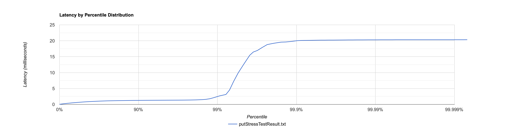
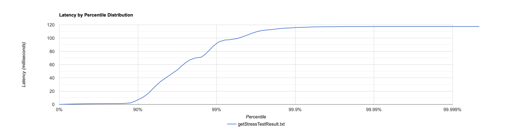

# Этап 1. HTTP + storage 

## Нагрузочное тестирование

Проведем нагрузочное тестирование с помощью wrk2. В качестве параметров возьмем следующие значения:
* 1 соединение
* 1 поток
* 30 секунд
* 20000 RPS

**Выполним тестирование PUT запросам**, содержимое которого, описано в скрипте [put.lua](scripts/put.lua)
```bash
wrk2 -c 1 -t 1 -d 30s -R 20000 --latency -s put.lua http://localhost:8080  
```

Результаты:
```bash
  Thread Stats   Avg      Stdev     Max   +/- Stdev
    Latency   849.97us    1.31ms  20.32ms   98.90%
    Req/Sec    20.23k   556.44    25.64k    87.50%
  Latency Distribution (HdrHistogram - Recorded Latency)
 50.000%  764.00us
 75.000%    1.12ms
 90.000%    1.26ms
 99.000%    2.43ms
 99.900%   20.00ms
 99.990%   20.29ms
 99.999%   20.32ms
100.000%   20.33ms

  Detailed Percentile spectrum:
       Value   Percentile   TotalCount 1/(1-Percentile)

       0.032     0.000000            1         1.00
       0.187     0.100000        40190         1.11
       0.334     0.200000        80172         1.25
       0.477     0.300000       120039         1.43
       0.620     0.400000       160214         1.67
       0.764     0.500000       200059         2.00
       0.836     0.550000       220146         2.22
       0.907     0.600000       240012         2.50
       0.978     0.650000       260050         2.86
       1.049     0.700000       280118         3.33
       1.115     0.750000       300141         4.00
       1.141     0.775000       309971         4.44
       1.166     0.800000       320013         5.00
       1.191     0.825000       330135         5.71
       1.215     0.850000       339963         6.67
       1.240     0.875000       350114         8.00
       1.253     0.887500       355319         8.89
       1.265     0.900000       360109        10.00
       1.278     0.912500       365299        11.43
       1.290     0.925000       370135        13.33
       1.303     0.937500       375250        16.00
       1.309     0.943750       377506        17.78
       1.316     0.950000       379994        20.00
       1.324     0.956250       382724        22.86
       1.331     0.962500       385119        26.67
       1.341     0.968750       387491        32.00
       1.350     0.971875       388723        35.56
       1.363     0.975000       390006        40.00
       1.382     0.978125       391207        45.71
       1.419     0.981250       392443        53.33
       1.500     0.984375       393685        64.00
       1.589     0.985938       394311        71.11
       1.779     0.987500       394931        80.00
       2.173     0.989062       395554        91.43
       2.687     0.990625       396178       106.67
       3.119     0.992188       396805       128.00
       4.523     0.992969       397116       142.22
       7.195     0.993750       397428       160.00
       9.879     0.994531       397740       182.86
      12.471     0.995313       398053       213.33
      15.431     0.996094       398366       256.00
      16.463     0.996484       398523       284.44
      16.943     0.996875       398679       320.00
      17.839     0.997266       398834       365.71
      18.799     0.997656       398993       426.67
      19.199     0.998047       399148       512.00
      19.375     0.998242       399228       568.89
      19.567     0.998437       399331       640.00
      19.615     0.998633       399387       731.43
      19.775     0.998828       399459       853.33
      20.031     0.999023       399539      1024.00
      20.095     0.999121       399596      1137.78
      20.111     0.999219       399624      1280.00
      20.127     0.999316       399658      1462.86
      20.159     0.999414       399698      1706.67
      20.191     0.999512       399768      2048.00
      20.191     0.999561       399768      2275.56
      20.207     0.999609       399797      2560.00
      20.207     0.999658       399797      2925.71
      20.223     0.999707       399819      3413.33
      20.239     0.999756       399834      4096.00
      20.255     0.999780       399849      4551.11
      20.255     0.999805       399849      5120.00
      20.271     0.999829       399870      5851.43
      20.271     0.999854       399870      6826.67
      20.287     0.999878       399892      8192.00
      20.287     0.999890       399892      9102.22
      20.287     0.999902       399892     10240.00
      20.303     0.999915       399904     11702.86
      20.303     0.999927       399904     13653.33
      20.303     0.999939       399904     16384.00
      20.319     0.999945       399924     18204.44
      20.319     0.999951       399924     20480.00
      20.319     0.999957       399924     23405.71
      20.319     0.999963       399924     27306.67
      20.319     0.999969       399924     32768.00
      20.319     0.999973       399924     36408.89
      20.319     0.999976       399924     40960.00
      20.319     0.999979       399924     46811.43
      20.319     0.999982       399924     54613.33
      20.319     0.999985       399924     65536.00
      20.319     0.999986       399924     72817.78
      20.319     0.999988       399924     81920.00
      20.319     0.999989       399924     93622.86
      20.319     0.999991       399924    109226.67
      20.319     0.999992       399924    131072.00
      20.335     0.999993       399927    145635.56
      20.335     1.000000       399927          inf
#[Mean    =        0.850, StdDeviation   =        1.311]
#[Max     =       20.320, Total count    =       399927]
#[Buckets =           27, SubBuckets     =         2048]
----------------------------------------------------------
  599985 requests in 30.00s, 40.63MB read
  Non-2xx or 3xx responses: 599985
Requests/sec:  19999.64
Transfer/sec:      1.35MB
```

Построим гистограмму для полученных перцентелией в рекомендованном автором wrk2 [ресурсе](http://hdrhistogram.org):


**Проанализируем результаты.** За 30 секунд было отправлено 599985 запросов.  

Интерес представляют следующие полученные характеристики:
* Медиана (p50) = 0.764мс
* "Хвостовые" время ожидания (p99, p999, p9999) = 2.687мс, 20.031мс, 20.287мс соответственно

За время отклика для верхних процентелей, несет отвественность задержка запросов в очереди, иногда еще называемое
блокировкой головы очереди, где даже небольшое кол-во медленных запросов способно значимо повлиять на задержку последующих.
Получить более конкретизированный ответ, где именно происходит застой, выйдет после этапа профилирования,

В качестве решения можно добавить нашему серверу возможность обрабатывать запросы параллельно и
это было бы неплохим вариантом до некоторого времени, пока мы не упремся в ограничение в виде кол-ва ядер у CPU.
После чего стоило бы задуматься о горизонтальном масштабирование.

**Выполним тестирование GET запросом**, содержимое которого, описано в скрипте [get.lua](scripts/get.lua)

Будут использованы аналогичные хар-ки, как и в случае с PUT запросом.
Наша БД предварительно заполнена более чем на 300к+ записей

```bash
wrk2 -c 1 -t 1 -d 30s -R 20000 --latency -s get.lua http://localhost:8080
```

Результаты:
```bash
  Thread Stats   Avg      Stdev     Max   +/- Stdev
    Latency     4.98ms   15.54ms 117.50ms   93.26%
    Req/Sec    21.10k     2.64k   30.78k    79.28%
  Latency Distribution (HdrHistogram - Recorded Latency)
 50.000%    0.87ms
 75.000%    1.23ms
 90.000%    7.01ms
 99.000%   92.03ms
 99.900%  115.84ms
 99.990%  117.44ms
 99.999%  117.50ms
100.000%  117.57ms

  Detailed Percentile spectrum:
       Value   Percentile   TotalCount 1/(1-Percentile)

       0.032     0.000000            3         1.00
       0.218     0.100000        40084         1.11
       0.386     0.200000        80108         1.25
       0.549     0.300000       120113         1.43
       0.708     0.400000       159981         1.67
       0.868     0.500000       200091         2.00
       0.946     0.550000       220105         2.22
       1.022     0.600000       240147         2.50
       1.093     0.650000       260028         2.86
       1.161     0.700000       280173         3.33
       1.229     0.750000       299986         4.00
       1.265     0.775000       310172         4.44
       1.301     0.800000       320109         5.00
       1.350     0.825000       329933         5.71
       1.520     0.850000       339945         6.67
       2.259     0.875000       349927         8.00
       4.009     0.887500       354922         8.89
       7.011     0.900000       359927        10.00
      10.295     0.912500       364921        11.43
      15.935     0.925000       369928        13.33
      25.279     0.937500       374922        16.00
      30.671     0.943750       377419        17.78
      35.775     0.950000       379933        20.00
      40.415     0.956250       382416        22.86
      45.983     0.962500       384920        26.67
      52.447     0.968750       387416        32.00
      57.599     0.971875       388671        35.56
      62.559     0.975000       389918        40.00
      67.199     0.978125       391165        45.71
      69.951     0.981250       392467        53.33
      71.359     0.984375       393684        64.00
      75.263     0.985938       394291        71.11
      81.279     0.987500       394914        80.00
      88.255     0.989062       395542        91.43
      94.335     0.990625       396165       106.67
      97.215     0.992188       396957       128.00
      97.407     0.992969       397105       142.22
      98.367     0.993750       397492       160.00
      99.327     0.994531       397725       182.86
     101.951     0.995313       398038       213.33
     105.343     0.996094       398350       256.00
     107.455     0.996484       398507       284.44
     109.503     0.996875       398667       320.00
     111.167     0.997266       398820       365.71
     112.191     0.997656       399003       426.67
     113.023     0.998047       399133       512.00
     113.727     0.998242       399216       568.89
     114.431     0.998437       399297       640.00
     115.071     0.998633       399371       731.43
     115.263     0.998828       399445       853.33
     115.967     0.999023       399528      1024.00
     116.223     0.999121       399567      1137.78
     116.351     0.999219       399605      1280.00
     116.607     0.999316       399647      1462.86
     116.863     0.999414       399685      1706.67
     117.055     0.999512       399730      2048.00
     117.119     0.999561       399753      2275.56
     117.183     0.999609       399776      2560.00
     117.183     0.999658       399776      2925.71
     117.311     0.999707       399812      3413.33
     117.375     0.999756       399850      4096.00
     117.375     0.999780       399850      4551.11
     117.375     0.999805       399850      5120.00
     117.375     0.999829       399850      5851.43
     117.439     0.999854       399877      6826.67
     117.439     0.999878       399877      8192.00
     117.439     0.999890       399877      9102.22
     117.439     0.999902       399877     10240.00
     117.503     0.999915       399910     11702.86
     117.503     0.999927       399910     13653.33
     117.503     0.999939       399910     16384.00
     117.503     0.999945       399910     18204.44
     117.503     0.999951       399910     20480.00
     117.503     0.999957       399910     23405.71
     117.503     0.999963       399910     27306.67
     117.503     0.999969       399910     32768.00
     117.503     0.999973       399910     36408.89
     117.503     0.999976       399910     40960.00
     117.503     0.999979       399910     46811.43
     117.503     0.999982       399910     54613.33
     117.503     0.999985       399910     65536.00
     117.503     0.999986       399910     72817.78
     117.503     0.999988       399910     81920.00
     117.503     0.999989       399910     93622.86
     117.503     0.999991       399910    109226.67
     117.503     0.999992       399910    131072.00
     117.503     0.999993       399910    145635.56
     117.503     0.999994       399910    163840.00
     117.503     0.999995       399910    187245.71
     117.567     0.999995       399912    218453.33
     117.567     1.000000       399912          inf
#[Mean    =        4.979, StdDeviation   =       15.543]
#[Max     =      117.504, Total count    =       399912]
#[Buckets =           27, SubBuckets     =         2048]
----------------------------------------------------------
  599985 requests in 30.00s, 40.63MB read
  Non-2xx or 3xx responses: 599985
Requests/sec:  19999.63
Transfer/sec:      1.35MB
```

Гистограмма:



**Проанализируем результаты.** За 30 секунд было отправлено 599985 запросов.

Интерес представляют следующие полученные характеристики:
* Медиана (p50) = 0.868мс
* "Хвостовые" время ожидания (p99, p999, p9999) = 94.335мс, 115.967мс, 117.439мс соответственно

Как мы можем заметить время ожидания для получения записи в БД, на порядок отличаются от ее вставки.
Это является вполне очевидным, взглянув на "не бесплатные" операции получения и слияния итераторов. Опять таки
ввести конкретику выйдет лишь после этапа профилирования.

## Профилирование

Проведем профилирование путем использования библиотеки async-profiler. Обсуловимся выполнять этап
параллельно с нагрузочным тестированием со следующими хар-ки:
* 1 соединение
* 1 поток
* 60 секунд
* 20000 RPS

Для GET запросов - БД наполнена

Для async-profiler:
* 25 секунд


### Результат профиллирования по CPU на вставку данных

[Click me](profiling/putCpu17rps.html)  

Как мы помним сценарий правильной работы метода LsmDAO.upsert имеет 2 варианта:
1. Добавить record в memoryStorage
2. Флашнуть на диск и добавить record в memoryStorage

Взглянув на результаты профилирования можно заметить, 
что метод flush занимает **43.3%** времени работы программы, когда обычная вставка в мапу **1.89%**.
Теперь зная эту информацию, мы можем сопоставить ее с нагрузочным тестированием и сделать вывод,
что долгая обработка запроса на вставку, вероятно, приходится на сценарий, когда нам требуется сделать флаш на диск.

### Результат профиллирования по CPU на получение данных:

[Click me](profiling/getCpu17rps.html)  

Стандартные операции по типу получения диапазона значений выглядит довольно прозрачно и не удивляют
своим использованием времени работы. В то же время возникают подозрения, на то, почему столько времени
отрабатывает GC, для этого стоит обратиться к результатам профилирования по аллокациям.

### Результат профиллирования по Allocation на получение данных:

[Click me](profiling/getAlloc17rps.html)

Взглянув на граф, а в особенности на записи по типу: DirectBufferR.asReadOnlyBuffer
становится ясно, что в погоне за иммутабельностью, мы делаем аллокацию. Для данного набора запросов,
это происходило в сумме около 25% времени работы программы. Стоит ли жертвовать этим свойством ради оптимизации?
Довольно субъективный вопрос и зависит от решаемой задачи. По-моему мнению, для нас это не критично, куда страшнее
будет случайно модифицировать ByteBuffer.

### Результат профиллирования по Allocation на вставку данных:

[Click me](profiling/putAlloc17rps.html)

Для данного графа ситуация аналогична. Помимо большого кол-ва аллокаций от one-nio, имеются те же
самые операции для поддержания иммутабельности ByteBuffer.


