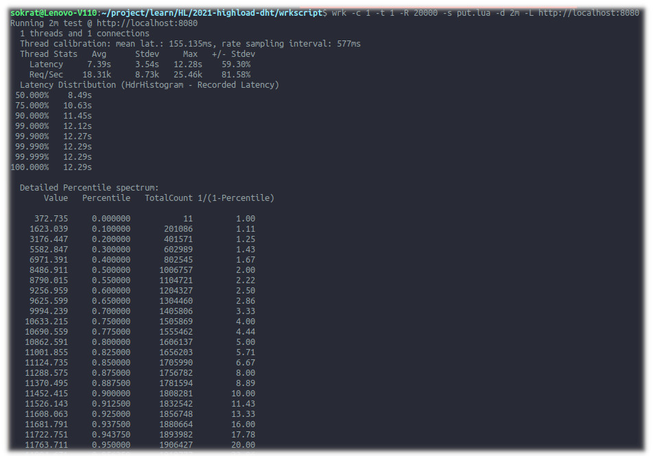
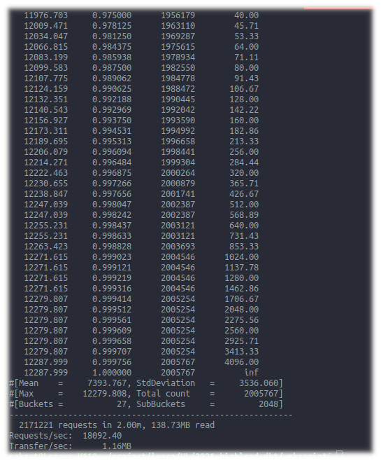
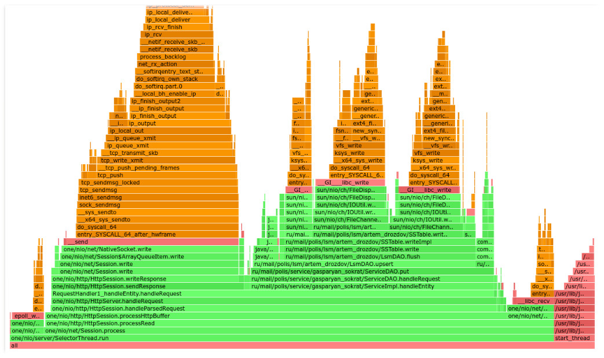
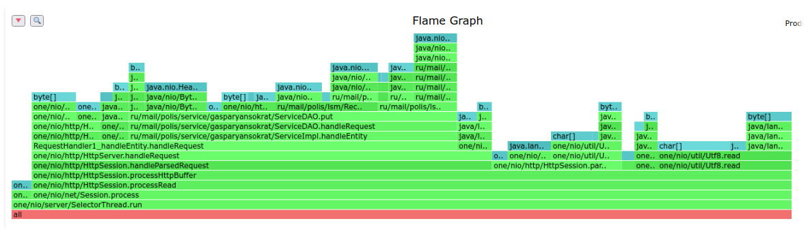
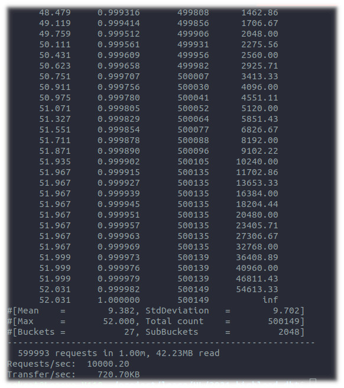
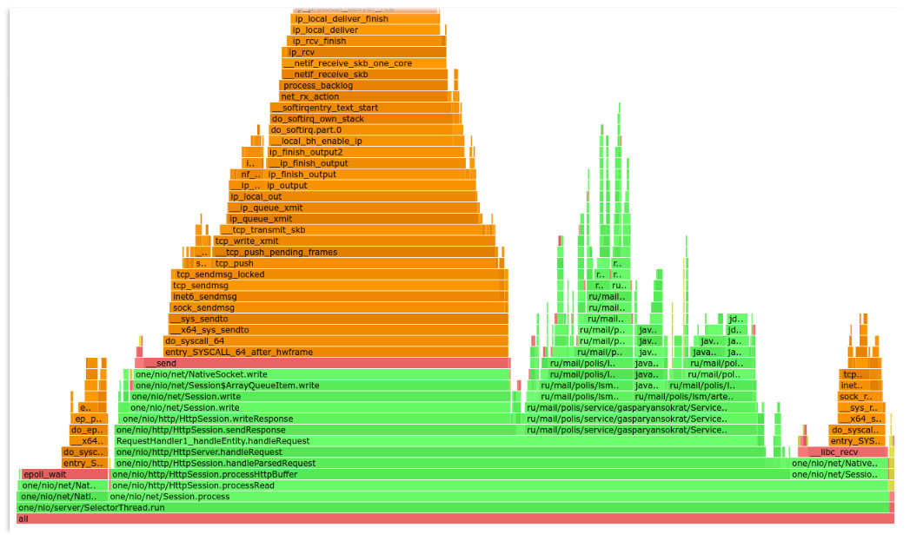
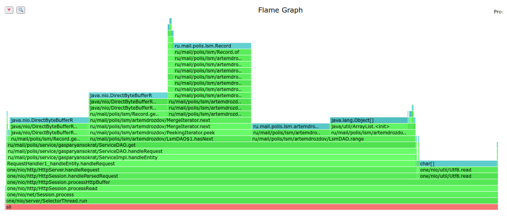

## Отчет №1 "HTTP Server"
## Автор: Гаспарян Сократ

### Проведите нагрузочное тестирование с помощью wrk2 в одно соединение PUT запросами.
На рисунке 1 и 2 представлены результаты нагрузочного тестирования PUT запросами в течение 1 минуты с одним соединением, одним потоком и стабильной нагрузкой - rate равен 10000 запросов. Как видно из рисунков среднее время запроса составляет 163.65 мсек., а пиковое время запроса 1.8 сек. Количество запросов 9999 в секунду, общее количество запросов составляет 599993 запросов и общее количество переданного трафика составляет 38.34 Мб. Также стоит отметить, что на 75% запросов задержка составляет 12.1 мсек, а на 99.99% 1.8 сек., что сильно отличается от среднего значения задержки. Объяснение такой разницы в секундах у перцентилей можно получить, взглянув на FlameGraph. Как видно из него, у нас достаточно большая часть работы CPU уходит на операцию flush, т.е. запись на диск, которая запускается при определенном накоплений данных в памяти таблицы и создание новой таблицы и выделением для неё нового куска памяти.

</img>
<h6>Рис.1 нагрузка wrk PUT запросы часть 1</h6>
</img>
<h6>Рис.2 нагрузка wrk PUT запросы часть 2</h6>

### Профайлер для нагрузочного тестирования PUT запросов
Профилировка выполнялась в течение 15 секунд.
Как видно из рисунка 3 большая часть CPU уходит на обработку Http запроса(HttpServer.handleRequest) около 67.2% при этом 30.67% уходит на запись в сокет и 28.8% на запись в базу. Из этих 28.8% большая часть времени уходит на запись в файловую систему 22.8% (LsmDAO.flush). На рисунке 4 представлен отчет профайлера по памяти. Из рисунка видно, что большая часть использованной памяти идет на обработку запроса(handleParsedRequest) - 54.5% и из этих процентов большую часть занимает запись в базу(LsmDAO). Также 16.64% памяти уходит на парсинг самого запроса(HttpSession.parseRequest).

</img>
<h6>Рис.3 Flame Graph CPU async-profile для PUT запросов</h6>
</img>
<h6>Рис.4 Flame Graph Memory allocation async-profile для PUT запросов</h6>

<h4>Оптимизации:</h4>
Не совсем очевидно, что в случае с PUT запросами можно оптимизировать - В случае с записью в таблицу внутри LsmDAO используется ConcurrentSkipListMap сложность которого O(log(N)) и из-за того, что нужно поддерживать упорядоченность, остальные возможные структуры будут иметь такую же сложность. При записи данных на диск в SSTable уже используются все известные мне оптимизации, например, отображения файла в память. Да и запись производится всего один раз при накоплений опредленного порога по памяти. Единственное, что можно сделать это уменьшить количество системных вызовов для записи файл и увеличить количество памяти для таблицы до сброса на диск. Для оптимизации по памяти узким местом стоит парсинг запроса в котором постоянно создается новый объект String, может быть можно заранее создать строку для парсинга определенного размера. Также много памяти используется для вызовова wrap, т.е. для обертки ключа строки в ByteBuffer это тоже можно рассмотреть с точки зрения оптимизации. Ну и использование многопоточности точно должно дать буст по производительности.

### Проведите нагрузочное тестирование с помощью wrk2 в одно соединение GET запросами.
На рисунке 5 и 6 представлены результаты нагрузочного тестирования GET запросами в течение 1 минуты с одним соединением, одним потоком и стабильной нагрузкой - rate равен 10000 запросов. Как видно из рисунков среднее время запроса составляет 9.38 мсек., а пиковое время запроса 52.0 мсек. Количество запросов 15684 в секунду, общее количество запросов составляет 599993 запросов и общее количество переданного трафика составляет 42.23 Мб. Также стоит отметить, что на 75% запросов задержка составляет 14.53 мсек, а на 99.99% 51.9 мсек. и скорость передаваемого трафика составляет 720.7 KB/s.

</img>
<h6>Рис.5 нагрузка wrk GET запросы часть 1</h6>
</img>
<h6>Рис.6 нагрузка wrk GET запросы часть 2</h6>

### Профайлер для нагрузочного тестирования GET запросов
Профилировка выполнялась в течение 15 секунд.
На рисунке 7 видно, что большую часть времени занимает метод считывания из базы(LsmDAO.range) - 48.7%. При этом от момента принятия HTTP запроса до момента запроса в базу разница в загрузке CPU составляет 10.82%. Ещё 22.68% занимает процесс записи данных в сокет. Профилировка по памяти показывает, что наибольшее количество памяти 65.49% занимает метод извлечения данных из базы - LsmDAO.sstableRange, в этом методе есть наиболее требовательных вызова по памяти - LsmDAO.merge 32.26% и SSTable.range 31.3%.
</img>
<h6>Рис.7 Flame Graph CPU async-profile для GET запросов</h6>
</img>
<h6>Рис.8 Flame Graph Memory allocation async-profile для GET запросов</h6>
<h4>Оптимизации:</h4>

В случае с GET запросами можно использовать LRU cache для кэширования запросов, например, [Google Guava Loading Cache](https://guava.dev/releases/18.0/api/docs/com/google/common/cache/LoadingCache.html). Тест wrk, который используется в отчете, генерирует постоянно новые значения и в таком случае, конечно, мы не получим буст по произвидетельности. Но в действительных системах использование кэша в большинстве случаев даст улучшения, так как мы получаем значение за O(1). Да и в таком случае, проанализировав данные, мы можем делать prefetching и извлекать соседние данные из базы. Также, как и в случае с PUT запросами, можно рассмотреть добавление многопоточности, что даст увеличение производительности.