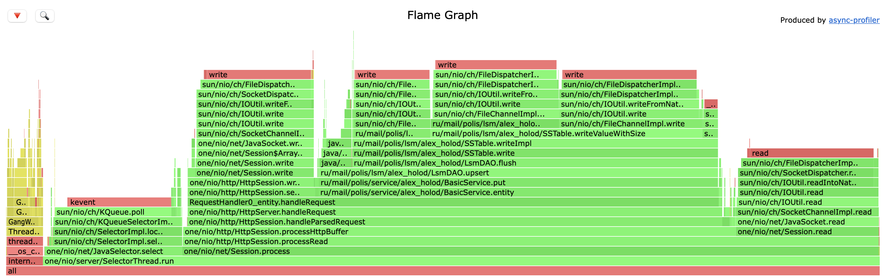
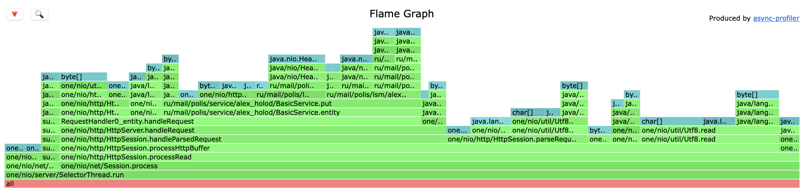
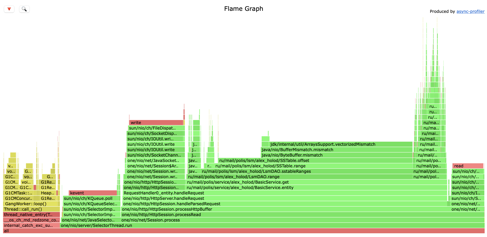
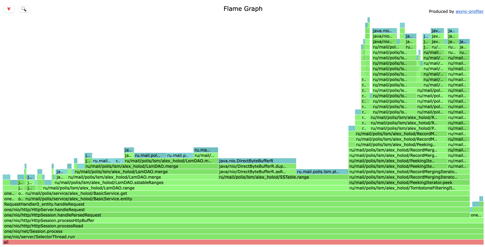

# Отчёт

- Содержание отчёта

# Нагрузочное тестирование(wrk2)

Нам необходимо было произвести нагрузочное тестирование. Для этого мы используем утилиту **wrk2**. Произведем тестирование в течение 1 минуты, используя 1 поток и одно активное соединение с пропускной способностью 15000 запросов в секунду. 

## PUT-запросы

```bash
MacBook-Pro-Aleksandr:2021-highload-dht aleksandrholod$ wrk2 -c1 -t1 -d1m -R15000 -L -s /Users/aleksandrholod/Desktop/2021-highload/2021-highload-dht/src/report/put.lua http://localhost:8080
Running 1m test @ http://localhost:8080
  1 threads and 1 connections
  Thread calibration: mean lat.: 0.766ms, rate sampling interval: 10ms
  Thread Stats   Avg      Stdev     Max   +/- Stdev
    Latency   521.49ms  711.26ms   2.32s    79.16%
    Req/Sec    16.44k    10.23k   33.89k    56.63%
  Latency Distribution (HdrHistogram - Recorded Latency)
 50.000%    1.27ms
 75.000%    1.03s 
 90.000%    1.76s 
 99.000%    2.20s 
 99.900%    2.31s 
 99.990%    2.32s 
 99.999%    2.32s 
100.000%    2.32s 

  Detailed Percentile spectrum:
       Value   Percentile   TotalCount 1/(1-Percentile)

       0.031     0.000000            1         1.00
       0.346     0.100000        75118         1.11
       0.615     0.200000       150017         1.25
       0.836     0.300000       225183         1.43
       1.054     0.400000       300182         1.67
       1.273     0.500000       375200         2.00
      71.487     0.550000       412454         2.22
     316.927     0.600000       449976         2.50
     559.103     0.650000       487479         2.86
     799.231     0.700000       524990         3.33
    1033.727     0.750000       562452         4.00
    1154.047     0.775000       581276         4.44
    1272.831     0.800000       600056         5.00
    1391.615     0.825000       618778         5.71
    1514.495     0.850000       637566         6.67
    1636.351     0.875000       656273         8.00
    1696.767     0.887500       665572         8.89
    1756.159     0.900000       675040        10.00
    1816.575     0.912500       684357        11.43
    1876.991     0.925000       693674        13.33
    1938.431     0.937500       703132        16.00
    1968.127     0.943750       707828        17.78
    1997.823     0.950000       712451        20.00
    2028.543     0.956250       717123        22.86
    2058.239     0.962500       721799        26.67
    2088.959     0.968750       726552        32.00
    2105.343     0.971875       729096        35.56
    2119.679     0.975000       731317        40.00
    2134.015     0.978125       733558        45.71
    2150.399     0.981250       736145        53.33
    2162.687     0.984375       738203        64.00
    2172.927     0.985938       739552        71.11
    2181.119     0.987500       740583        80.00
    2189.311     0.989062       741974        91.43
    2199.551     0.990625       742944       106.67
    2209.791     0.992188       744185       128.00
    2217.983     0.992969       744682       142.22
    2228.223     0.993750       745308       160.00
    2236.415     0.994531       745819       182.86
    2246.655     0.995313       746496       213.33
    2252.799     0.996094       747069       256.00
    2254.847     0.996484       747360       284.44
    2263.039     0.996875       747611       320.00
    2271.231     0.997266       747863       365.71
    2281.471     0.997656       748188       426.67
    2289.663     0.998047       748444       512.00
    2295.807     0.998242       748685       568.89
    2297.855     0.998437       748746       640.00
    2303.999     0.998633       748945       731.43
    2308.095     0.998828       749080       853.33
    2312.191     0.999023       749217      1024.00
    2314.239     0.999121       749295      1137.78
    2316.287     0.999219       749393      1280.00
    2318.335     0.999316       749478      1462.86
    2318.335     0.999414       749478      1706.67
    2320.383     0.999512       749671      2048.00
    2320.383     0.999561       749671      2275.56
    2320.383     0.999609       749671      2560.00
    2320.383     0.999658       749671      2925.71
    2322.431     0.999707       749908      3413.33
    2322.431     1.000000       749908          inf
#[Mean    =      521.487, StdDeviation   =      711.261]
#[Max     =     2320.384, Total count    =       749908]
#[Buckets =           27, SubBuckets     =         2048]
----------------------------------------------------------
  899973 requests in 1.00m, 57.50MB read
Requests/sec:  14999.73
Transfer/sec:      0.96MB
```

После проведения тестирования мы получили следующие результаты:

- 50% приходящих запросов у нас обрабатываются до 1.27 ms
- 75% приходящих запросов у нас обрабатываются до 1.03 s
- 90% приходящих запросов у нас обрабатываются до 1.76 s
- 99% приходящих запросов у нас обрабатываются до 2.20 s
- 99.999% приходящих запросов у нас обрабатываются до 2.32 s
- 100% приходящих запросов у нас обрабатываются за 2.32 s

За все время время тестирования мы совершили 899973 запроса (14999.73 запросов в секунду) и всего передано 57.5 МВ трафика.

## GET-запросы

```bash
MacBook-Pro-Aleksandr:2021-highload-dht aleksandrholod$ wrk2 -c1 -t1 -d1m -R15000 -L -s /Users/aleksandrholod/Desktop/2021-highload/2021-highload-dht/src/report/get.lua  http://localhost:8080
Running 1m test @ http://localhost:8080
  1 threads and 1 connections
  Thread calibration: mean lat.: 88.522ms, rate sampling interval: 880ms
  Thread Stats   Avg      Stdev     Max   +/- Stdev
    Latency   796.65us  445.43us   7.01ms   68.69%
    Req/Sec    15.01k    12.23    15.04k    60.71%
  Latency Distribution (HdrHistogram - Recorded Latency)
 50.000%  842.00us
 75.000%    1.12ms
 90.000%    1.27ms
 99.000%    1.56ms
 99.900%    4.76ms
 99.990%    6.60ms
 99.999%    6.96ms
100.000%    7.01ms

  Detailed Percentile spectrum:
       Value   Percentile   TotalCount 1/(1-Percentile)

       0.041     0.000000            1         1.00
       0.211     0.100000        75217         1.11
       0.371     0.200000       149994         1.25
       0.531     0.300000       225062         1.43
       0.691     0.400000       300165         1.67
       0.842     0.500000       375459         2.00
       0.904     0.550000       412819         2.22
       0.960     0.600000       450168         2.50
       1.014     0.650000       488046         2.86
       1.066     0.700000       525274         3.33
       1.118     0.750000       563080         4.00
       1.143     0.775000       581376         4.44
       1.169     0.800000       600532         5.00
       1.194     0.825000       618869         5.71
       1.220     0.850000       638123         6.67
       1.245     0.875000       656734         8.00
       1.257     0.887500       665663         8.89
       1.270     0.900000       675334        10.00
       1.283     0.912500       684921        11.43
       1.295     0.925000       693705        13.33
       1.308     0.937500       703402        16.00
       1.314     0.943750       707898        17.78
       1.321     0.950000       712988        20.00
       1.327     0.956250       717483        22.86
       1.334     0.962500       722032        26.67
       1.343     0.968750       726666        32.00
       1.351     0.971875       728916        35.56
       1.362     0.975000       731281        40.00
       1.376     0.978125       733519        45.71
       1.398     0.981250       735869        53.33
       1.431     0.984375       738216        64.00
       1.454     0.985938       739377        71.11
       1.487     0.987500       740572        80.00
       1.529     0.989062       741715        91.43
       1.583     0.990625       742893       106.67
       1.663     0.992188       744056       128.00
       1.735     0.992969       744646       142.22
       1.817     0.993750       745227       160.00
       1.934     0.994531       745812       182.86
       2.091     0.995313       746405       213.33
       2.363     0.996094       746983       256.00
       2.605     0.996484       747276       284.44
       2.765     0.996875       747569       320.00
       3.039     0.997266       747862       365.71
       3.395     0.997656       748154       426.67
       3.809     0.998047       748447       512.00
       3.957     0.998242       748594       568.89
       4.053     0.998437       748740       640.00
       4.183     0.998633       748886       731.43
       4.399     0.998828       749036       853.33
       4.791     0.999023       749179      1024.00
       4.939     0.999121       749254      1137.78
       5.075     0.999219       749326      1280.00
       5.323     0.999316       749399      1462.86
       5.619     0.999414       749472      1706.67
       5.811     0.999512       749547      2048.00
       5.887     0.999561       749583      2275.56
       6.047     0.999609       749620      2560.00
       6.135     0.999658       749655      2925.71
       6.203     0.999707       749696      3413.33
       6.243     0.999756       749728      4096.00
       6.287     0.999780       749747      4551.11
       6.339     0.999805       749768      5120.00
       6.359     0.999829       749785      5851.43
       6.427     0.999854       749803      6826.67
       6.507     0.999878       749820      8192.00
       6.547     0.999890       749829      9102.22
       6.611     0.999902       749839     10240.00
       6.643     0.999915       749847     11702.86
       6.731     0.999927       749857     13653.33
       6.799     0.999939       749866     16384.00
       6.811     0.999945       749872     18204.44
       6.819     0.999951       749876     20480.00
       6.839     0.999957       749879     23405.71
       6.871     0.999963       749884     27306.67
       6.891     0.999969       749889     32768.00
       6.907     0.999973       749891     36408.89
       6.919     0.999976       749896     40960.00
       6.919     0.999979       749896     46811.43
       6.931     0.999982       749899     54613.33
       6.947     0.999985       749901     65536.00
       6.947     0.999986       749901     72817.78
       6.959     0.999988       749902     81920.00
       6.963     0.999989       749904     93622.86
       6.975     0.999991       749905    109226.67
       6.979     0.999992       749906    131072.00
       6.979     0.999993       749906    145635.56
       6.991     0.999994       749907    163840.00
       6.991     0.999995       749907    187245.71
       6.995     0.999995       749908    218453.33
       7.003     0.999996       749909    262144.00
       7.003     0.999997       749909    291271.11
       7.003     0.999997       749909    327680.00
       7.003     0.999997       749909    374491.43
       7.007     0.999998       749910    436906.67
       7.007     0.999998       749910    524288.00
       7.007     0.999998       749910    582542.22
       7.007     0.999998       749910    655360.00
       7.007     0.999999       749910    748982.86
       7.011     0.999999       749911    873813.33
       7.011     1.000000       749911          inf
#[Mean    =        0.797, StdDeviation   =        0.445]
#[Max     =        7.008, Total count    =       749911]
#[Buckets =           27, SubBuckets     =         2048]
----------------------------------------------------------
  899967 requests in 1.00m, 63.40MB read
Requests/sec:  14999.55
Transfer/sec:      1.06MB
```

После проведения тестирования мы получили следующие результаты:

- 50% приходящих запросов у нас обрабатываются до 0.842 ms
- 75% приходящих запросов у нас обрабатываются до 1.12 ms
- 90% приходящих запросов у нас обрабатываются до 1.27 ms
- 99% приходящих запросов у нас обрабатываются до 1.56 ms
- 99.900% приходящих запросов у нас обрабатываются до 4.76 ms
- 99.999% приходящих запросов у нас обрабатываются до 6.96 ms
- 100% приходящих запросов у нас обрабатываются за 7.01 ms

За все время время тестирования мы совершили 899967 запроса (14999.55 запросов в секунду) и всего передано 63.4 МВ трафика.

# Профилирование с помощью async-profiler

Далее нам необходимо произвести профилирование процессорного времени и запросов выделения памяти. Для этого воспользуемся утилитой **async-profiler.**

## PUT-нагрузка

### СPU



По результатам профилирования видно следующее:

- SelectorThread занимает 95.75%, из которых 79.74% составляет процесс Session.
- 3.45% занимает Garbage collector
- 60.81% занимает метод handleRequest, из которых 14.57% приходится на sendResponce, а 45.68% на метод put

### Alloc



Здесь мы видим:

- SelectorThread занимает 99.97% ресурсов памяти, из которых 93.07% составляет процесс Session
- 32.56% занимает сохранение записи (метод put)
- 45.44% приходится на handleRequest

## GET-нагрузка

### CPU



По результатам профилирования видно следующие:

- SelectorThread занимает 88.20%, из которых 75.56% составляет процесс Session.
- 11.09% занимает Garbage collector
- 67.43% занимает метод handleRequest, из которых 12.87% приходится на sendResponce, а 54.11% на метод get

### Alloc



- SelectorThread занимает 100% ресурсов памяти, из которых 99.89% составляет процесс Session
- 92.57% занимает получение записи (метод get)
- 97% приходится на handleRequest