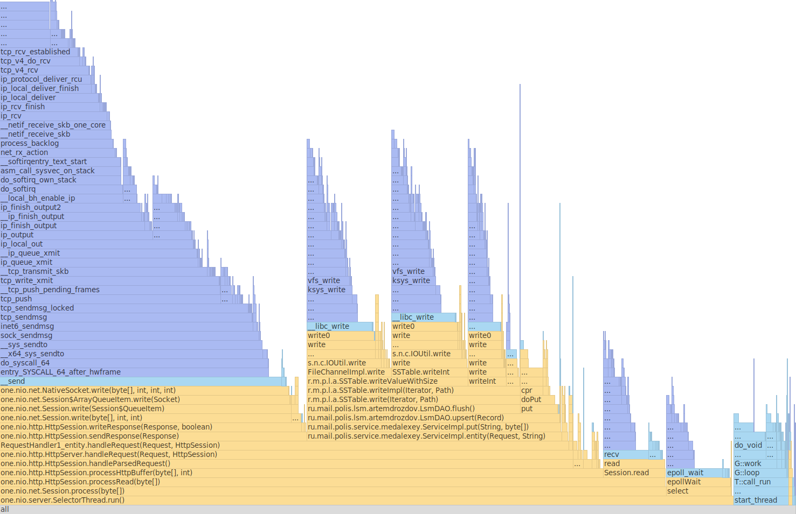
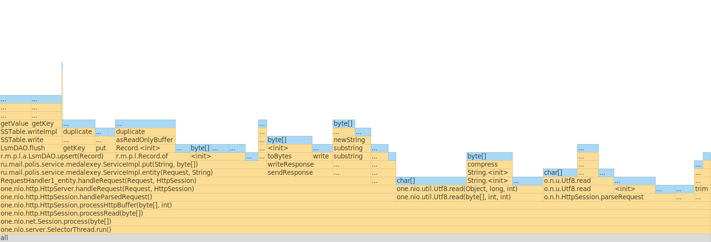

### Результаты нагрузочного тестирования

---

#### PUT-запросы (одно соединение, один поток, 10к запросов/сек) :

Lua скрипт:

```
counter = 0

request = function()
   path = "/v0/entity?id=key" .. counter
   wrk.method = "PUT"
   wrk.body = "value" .. counter
   counter = counter + 1
   return wrk.format(nil, path)
end
```

Результаты тестирования:

```
alexey_standard@asus-N550JV:~/technopolis/2021-highload-dht$ wrk -c 1 -t 1 -R 10000 -s ../wrk-scripts/put.lua -d 1m -L http://localhost:8080
Running 1m test @ http://localhost:8080
1 threads and 1 connections
Thread calibration: mean lat.: 0.804ms, rate sampling interval: 10ms
Thread Stats   Avg      Stdev     Max   +/- Stdev
Latency   110.58ms  306.84ms   1.53s    89.26%
Req/Sec    10.58k     4.88k   36.67k    84.51%
Latency Distribution (HdrHistogram - Recorded Latency)
50.000%  820.00us
75.000%    1.22ms
90.000%  490.24ms
99.000%    1.35s
99.900%    1.51s
99.990%    1.53s
99.999%    1.53s
100.000%    1.53s

Detailed Percentile spectrum:
Value   Percentile   TotalCount 1/(1-Percentile)

       0.028     0.000000            5         1.00
       0.212     0.100000        50030         1.11
       0.369     0.200000       100278         1.25
       0.522     0.300000       150114         1.43
       0.673     0.400000       200237         1.67
       0.820     0.500000       250048         2.00
       0.892     0.550000       275174         2.22
       0.961     0.600000       299984         2.50
       1.028     0.650000       325001         2.86
       1.091     0.700000       350008         3.33
       1.221     0.750000       375033         4.00
       1.401     0.775000       387481         4.44
       1.618     0.800000       399971         5.00
       1.880     0.825000       412468         5.71
      19.071     0.850000       424961         6.67
     255.487     0.875000       437461         8.00
     370.943     0.887500       443712         8.89
     490.239     0.900000       449962        10.00
     610.303     0.912500       456223        11.43
     730.623     0.925000       462469        13.33
     850.943     0.937500       468738        16.00
     908.287     0.943750       471851        17.78
     968.191     0.950000       474969        20.00
    1027.583     0.956250       478095        22.86
    1087.487     0.962500       481226        26.67
    1147.903     0.968750       484336        32.00
    1179.647     0.971875       485939        35.56
    1210.367     0.975000       487478        40.00
    1241.087     0.978125       489023        45.71
    1270.783     0.981250       490593        53.33
    1300.479     0.984375       492176        64.00
    1315.839     0.985938       492947        71.11
    1331.199     0.987500       493720        80.00
    1346.559     0.989062       494530        91.43
    1360.895     0.990625       495277       106.67
    1375.231     0.992188       496071       128.00
    1382.399     0.992969       496471       142.22
    1389.567     0.993750       496865       160.00
    1396.735     0.994531       497232       182.86
    1405.951     0.995313       497637       213.33
    1422.335     0.996094       498002       256.00
    1434.623     0.996484       498207       284.44
    1445.887     0.996875       498399       320.00
    1457.151     0.997266       498592       365.71
    1467.391     0.997656       498794       426.67
    1478.655     0.998047       498992       512.00
    1483.775     0.998242       499078       568.89
    1489.919     0.998437       499177       640.00
    1497.087     0.998633       499281       731.43
    1503.231     0.998828       499377       853.33
    1508.351     0.999023       499470      1024.00
    1511.423     0.999121       499523      1137.78
    1514.495     0.999219       499574      1280.00
    1516.543     0.999316       499621      1462.86
    1518.591     0.999414       499667      1706.67
    1520.639     0.999512       499717      2048.00
    1521.663     0.999561       499736      2275.56
    1523.711     0.999609       499773      2560.00
    1524.735     0.999658       499797      2925.71
    1525.759     0.999707       499820      3413.33
    1526.783     0.999756       499914      4096.00
    1526.783     0.999780       499914      4551.11
    1526.783     0.999805       499914      5120.00
    1526.783     0.999829       499914      5851.43
    1526.783     0.999854       499914      6826.67
    1526.783     0.999878       499914      8192.00
    1526.783     0.999890       499914      9102.22
    1526.783     0.999902       499914     10240.00
    1526.783     0.999915       499914     11702.86
    1527.807     0.999927       499954     13653.33
    1527.807     1.000000       499954          inf
#[Mean    =      110.580, StdDeviation   =      306.841]
#[Max     =     1526.784, Total count    =       499954]
#[Buckets =           27, SubBuckets     =         2048]
----------------------------------------------------------
599993 requests in 1.00m, 38.34MB read
Requests/sec:   9999.80
Transfer/sec:    654.28KB
```

Нагрузочное тестирование сервера put-запросами производилось в одно соединение, один поток, 
со стабильной нагрузкой (rate = 10к запросов/сек) в течение одной минуты. 
За время тестирования было совершено 599993 запросов (9999.8 запросов/сек) и передано 38.34 MB трафика.

Результаты показывают, что среднее время запроса составляет 110.58 ms, максимальное время запроса равняется 1.53 s.

#### GET-запросы по наполненной БД (одно соединение, один поток, 10к запросов/сек) :

Lua скрипт:

```
counter = 0

request = function()
   path = "/v0/entity?id=key" .. counter
   wrk.method = "GET"
   wrk.body = "value" .. counter
   counter = counter + 1
   return wrk.format(nil, path)
end
```

Результаты тестирования:

```
alexey_standard@asus-N550JV:~/technopolis/2021-highload-dht$ wrk -c 1 -t 1 -R 10000 -s ../wrk-scripts/get.lua -d 1m -L http://localhost:8080
Running 1m test @ http://localhost:8080
1 threads and 1 connections
Thread calibration: mean lat.: 0.909ms, rate sampling interval: 10ms
Thread Stats   Avg      Stdev     Max   +/- Stdev
Latency   643.31us  365.55us   8.41ms   65.32%
Req/Sec    10.57k   762.21    15.40k    65.26%
Latency Distribution (HdrHistogram - Recorded Latency)
50.000%  633.00us
75.000%    0.91ms
90.000%    1.08ms
99.000%    1.66ms
99.900%    2.23ms
99.990%    6.66ms
99.999%    8.31ms
100.000%    8.41ms

Detailed Percentile spectrum:
Value   Percentile   TotalCount 1/(1-Percentile)

       0.032     0.000000            1         1.00
       0.179     0.100000        50182         1.11
       0.294     0.200000       100266         1.25
       0.407     0.300000       150274         1.43
       0.520     0.400000       200107         1.67
       0.633     0.500000       250150         2.00
       0.689     0.550000       275253         2.22
       0.745     0.600000       300338         2.50
       0.801     0.650000       325301         2.86
       0.857     0.700000       350277         3.33
       0.912     0.750000       375045         4.00
       0.940     0.775000       387653         4.44
       0.968     0.800000       400268         5.00
       0.995     0.825000       412495         5.71
       1.023     0.850000       425400         6.67
       1.050     0.875000       437876         8.00
       1.063     0.887500       443851         8.89
       1.076     0.900000       449964        10.00
       1.090     0.912500       456560        11.43
       1.103     0.925000       462963        13.33
       1.115     0.937500       468816        16.00
       1.123     0.943750       472214        17.78
       1.131     0.950000       475094        20.00
       1.143     0.956250       478218        22.86
       1.162     0.962500       481291        26.67
       1.196     0.968750       484364        32.00
       1.221     0.971875       485944        35.56
       1.252     0.975000       487462        40.00
       1.297     0.978125       489057        45.71
       1.354     0.981250       490592        53.33
       1.439     0.984375       492154        64.00
       1.491     0.985938       492938        71.11
       1.550     0.987500       493714        80.00
       1.616     0.989062       494501        91.43
       1.687     0.990625       495275       106.67
       1.764     0.992188       496058       128.00
       1.806     0.992969       496446       142.22
       1.847     0.993750       496841       160.00
       1.886     0.994531       497233       182.86
       1.929     0.995313       497617       213.33
       1.972     0.996094       498016       256.00
       1.993     0.996484       498205       284.44
       2.014     0.996875       498403       320.00
       2.034     0.997266       498597       365.71
       2.057     0.997656       498799       426.67
       2.083     0.998047       498989       512.00
       2.101     0.998242       499091       568.89
       2.117     0.998437       499179       640.00
       2.145     0.998633       499277       731.43
       2.185     0.998828       499376       853.33
       2.235     0.999023       499473      1024.00
       2.257     0.999121       499526      1137.78
       2.305     0.999219       499570      1280.00
       2.395     0.999316       499619      1462.86
       2.607     0.999414       499668      1706.67
       2.875     0.999512       499717      2048.00
       3.017     0.999561       499741      2275.56
       3.143     0.999609       499765      2560.00
       3.319     0.999658       499790      2925.71
       3.457     0.999707       499814      3413.33
       3.755     0.999756       499838      4096.00
       4.359     0.999780       499851      4551.11
       4.955     0.999805       499863      5120.00
       5.519     0.999829       499875      5851.43
       6.115     0.999854       499887      6826.67
       6.439     0.999878       499899      8192.00
       6.539     0.999890       499906      9102.22
       6.691     0.999902       499912     10240.00
       6.811     0.999915       499918     11702.86
       6.871     0.999927       499924     13653.33
       7.003     0.999939       499930     16384.00
       7.147     0.999945       499933     18204.44
       7.319     0.999951       499936     20480.00
       7.511     0.999957       499939     23405.71
       7.699     0.999963       499942     27306.67
       7.875     0.999969       499945     32768.00
       8.003     0.999973       499947     36408.89
       8.059     0.999976       499948     40960.00
       8.139     0.999979       499950     46811.43
       8.167     0.999982       499951     54613.33
       8.247     0.999985       499953     65536.00
       8.279     0.999986       499954     72817.78
       8.279     0.999988       499954     81920.00
       8.311     0.999989       499955     93622.86
       8.343     0.999991       499956    109226.67
       8.375     0.999992       499957    131072.00
       8.375     0.999993       499957    145635.56
       8.375     0.999994       499957    163840.00
       8.391     0.999995       499958    187245.71
       8.391     0.999995       499958    218453.33
       8.399     0.999996       499959    262144.00
       8.399     0.999997       499959    291271.11
       8.399     0.999997       499959    327680.00
       8.399     0.999997       499959    374491.43
       8.399     0.999998       499959    436906.67
       8.415     0.999998       499960    524288.00
       8.415     1.000000       499960          inf
#[Mean    =        0.643, StdDeviation   =        0.366]
#[Max     =        8.408, Total count    =       499960]
#[Buckets =           27, SubBuckets     =         2048]
----------------------------------------------------------
599994 requests in 1.00m, 42.23MB read
Non-2xx or 3xx responses: 1
Requests/sec:   9999.94
Transfer/sec:    720.68KB
```

Нагрузочное тестирование сервера get-запросами производилось в одно соединение, один поток,
со стабильной нагрузкой (rate = 10к запросов/сек) в течение одной минуты.
За время тестирования было совершено 599994 запросов (9999.94 запросов/сек) и передано 42.23 MB трафика.

Результаты показывают, что среднее время запроса составляет 643.31 us, максимальное время запроса равняется 8.41 ms.

### Профилирование приложения с помощью async-profiler

---

#### PUT-нагрузка:

**Cpu:**



Результаты профилирования показывают, что большая часть времени CPU (75.81%) уходит на обработку запросов 
(HttpSession.processHttpBuffer).

38.56% всего времени уходит на отправку ответов клиентам (HttpSession.sendResponse).

31.8% времени уходит на запись (LsmDAO.upsert), из них 84.38% на запись в файловую систему (LsmDAO.flush).

**Memory:**



55.73% занимает обработка запроса (one.nio.http.HttpSession.handleParsedRequest(...)).

37.6% занимает сохранение записи (ru.mail.polis.service.medalexey.ServiceImpl.put(...)).

9.21% занимает отправка ответов (sendResponse).

**Оптимизация:**

Оптимизации можно подвергнуть метод put класса ServiceImpl, т.к. он занимает ~31% CPU и 37% памяти.

#### GET-нагрузка:

**Cpu:**


72.59% занимает получение записи (ru.mail.polis.service.medalexey.ServiceImpl.get(...)).

16.5% занимает отправка ответов (sendResponse).

**Memory:**


88.24% занимает получение записи (ru.mail.polis.service.medalexey.ServiceImpl.get(...)).

38.28% занимает метод merge (ru.mail.polis.lsm.artemdrozdov.LsmDAO.merge(List)).

35.25% занимает получение метод range (ru.mail.polis.lsm.artemdrozdov.SSTable.range(...)).

**Оптимизация:**

Оптимизации можно подвергнуть метод get класса ServiceImpl, т.к. он занимает ~72% CPU и ~88% памяти. 
