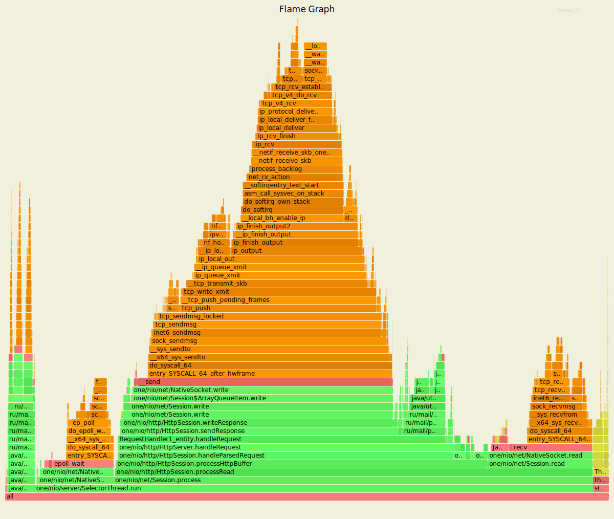
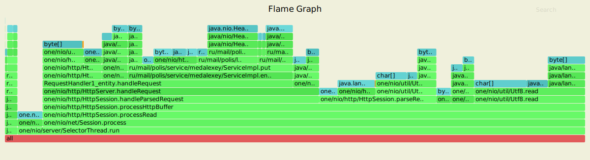
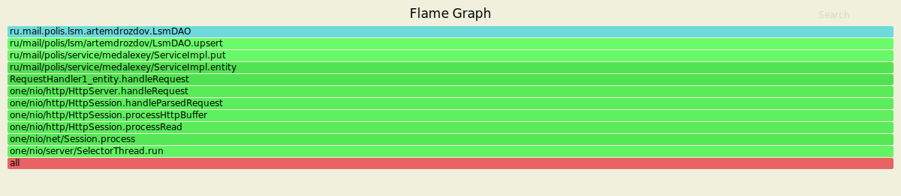
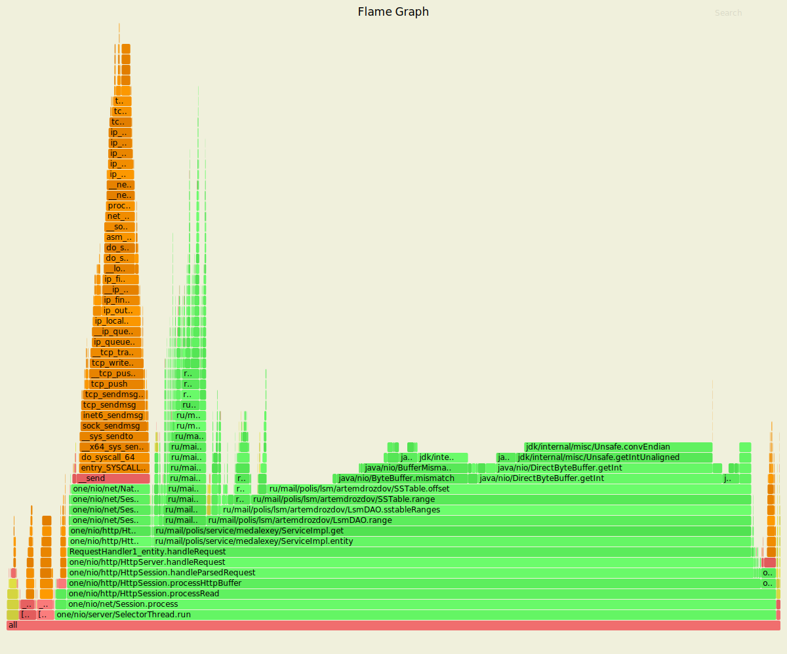
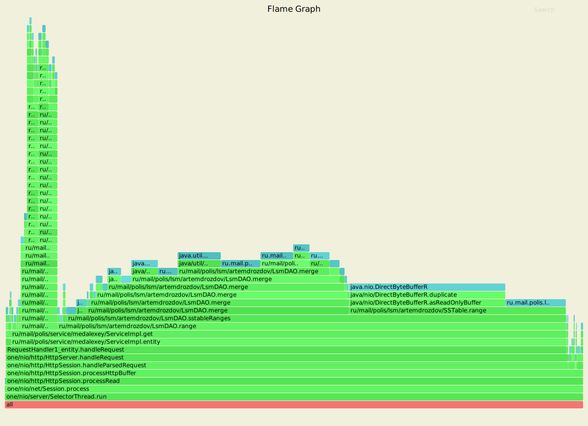
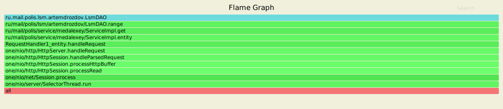

Нагрузочное тестирование PUT-запросами
===========

```
wrk -c 16 -t 4 -R 10000 -s ../wrk-scripts/put.lua -d 5m -L http://localhost:8080
Running 5m test @ http://localhost:8080
  4 threads and 16 connections
  Thread calibration: mean lat.: 0.888ms, rate sampling interval: 10ms
  Thread calibration: mean lat.: 0.887ms, rate sampling interval: 10ms
  Thread calibration: mean lat.: 0.880ms, rate sampling interval: 10ms
  Thread calibration: mean lat.: 0.886ms, rate sampling interval: 10ms
  Thread Stats   Avg      Stdev     Max   +/- Stdev
    Latency     0.89ms  431.27us  24.18ms   66.42%
    Req/Sec     2.62k   148.91     5.67k    73.14%

  Latency Distribution (HdrHistogram - Recorded Latency)
 50.000%    0.88ms
 75.000%    1.20ms
 90.000%    1.42ms
 99.000%    1.68ms
 99.900%    3.92ms
 99.990%    7.93ms
 99.999%   18.09ms
100.000%   24.19ms

  Detailed Percentile spectrum:
       Value   Percentile   TotalCount 1/(1-Percentile)

       0.030     0.000000            1         1.00
       0.370     0.100000       291131         1.11
       0.492     0.200000       581871         1.25
       0.620     0.300000       870548         1.43
       0.755     0.400000      1160346         1.67
       0.880     0.500000      1449937         2.00
       0.941     0.550000      1596653         2.22
       1.003     0.600000      1741673         2.50
       1.067     0.650000      1885215         2.86
       1.134     0.700000      2030840         3.33
       1.202     0.750000      2175356         4.00
       1.236     0.775000      2247532         4.44
       1.271     0.800000      2322035         5.00
       1.305     0.825000      2393409         5.71
       1.341     0.850000      2465101         6.67
       1.380     0.875000      2537659         8.00
       1.401     0.887500      2573765         8.89
       1.424     0.900000      2611351        10.00
       1.447     0.912500      2646765        11.43
       1.472     0.925000      2683188        13.33
       1.499     0.937500      2719309        16.00
       1.514     0.943750      2737788        17.78
       1.529     0.950000      2755489        20.00
       1.545     0.956250      2773594        22.86
       1.562     0.962500      2791453        26.67
       1.581     0.968750      2809588        32.00
       1.591     0.971875      2818402        35.56
       1.603     0.975000      2828050        40.00
       1.615     0.978125      2836766        45.71
       1.629     0.981250      2846003        53.33
       1.645     0.984375      2854908        64.00
       1.654     0.985938      2859410        71.11
       1.664     0.987500      2863892        80.00
       1.675     0.989062      2868245        91.43
       1.689     0.990625      2872818       106.67
       1.705     0.992188      2877175       128.00
       1.715     0.992969      2879405       142.22
       1.727     0.993750      2881794       160.00
       1.741     0.994531      2884006       182.86
       1.758     0.995313      2886264       213.33
       1.782     0.996094      2888529       256.00
       1.799     0.996484      2889619       284.44
       1.823     0.996875      2890770       320.00
       1.858     0.997266      2891864       365.71
       1.947     0.997656      2893000       426.67
       2.345     0.998047      2894134       512.00
       2.617     0.998242      2894697       568.89
       2.911     0.998437      2895264       640.00
       3.243     0.998633      2895829       731.43
       3.583     0.998828      2896396       853.33
       3.989     0.999023      2896964      1024.00
       4.179     0.999121      2897245      1137.78
       4.399     0.999219      2897530      1280.00
       4.647     0.999316      2897812      1462.86
       4.919     0.999414      2898094      1706.67
       5.215     0.999512      2898378      2048.00
       5.379     0.999561      2898520      2275.56
       5.567     0.999609      2898662      2560.00
       5.779     0.999658      2898806      2925.71
       6.019     0.999707      2898944      3413.33
       6.319     0.999756      2899087      4096.00
       6.491     0.999780      2899157      4551.11
       6.683     0.999805      2899229      5120.00
       6.887     0.999829      2899298      5851.43
       7.179     0.999854      2899371      6826.67
       7.555     0.999878      2899440      8192.00
       7.719     0.999890      2899476      9102.22
       7.959     0.999902      2899511     10240.00
       8.143     0.999915      2899546     11702.86
       8.415     0.999927      2899581     13653.33
       8.831     0.999939      2899617     16384.00
       8.983     0.999945      2899635     18204.44
       9.127     0.999951      2899652     20480.00
       9.455     0.999957      2899671     23405.71
       9.815     0.999963      2899687     27306.67
      10.535     0.999969      2899705     32768.00
      11.055     0.999973      2899714     36408.89
      11.863     0.999976      2899723     40960.00
      12.623     0.999979      2899732     46811.43
      13.927     0.999982      2899740     54613.33
      15.399     0.999985      2899749     65536.00
      16.431     0.999986      2899754     72817.78
      16.975     0.999988      2899758     81920.00
      17.983     0.999989      2899763     93622.86
      18.799     0.999991      2899768    109226.67
      19.519     0.999992      2899771    131072.00
      19.999     0.999993      2899774    145635.56
      20.335     0.999994      2899776    163840.00
      20.863     0.999995      2899778    187245.71
      21.119     0.999995      2899780    218453.33
      21.535     0.999996      2899782    262144.00
      21.887     0.999997      2899784    291271.11
      22.271     0.999997      2899785    327680.00
      22.335     0.999997      2899786    374491.43
      22.607     0.999998      2899787    436906.67
      22.639     0.999998      2899788    524288.00
      22.943     0.999998      2899789    582542.22
      22.943     0.999998      2899789    655360.00
      22.975     0.999999      2899790    748982.86
      22.975     0.999999      2899790    873813.33
      23.391     0.999999      2899791   1048576.00
      23.391     0.999999      2899791   1165084.44
      23.391     0.999999      2899791   1310720.00
      24.095     0.999999      2899792   1497965.71
      24.095     0.999999      2899792   1747626.67
      24.095     1.000000      2899792   2097152.00
      24.095     1.000000      2899792   2330168.89
      24.095     1.000000      2899792   2621440.00
      24.191     1.000000      2899793   2995931.43
      24.191     1.000000      2899793          inf
#[Mean    =        0.894, StdDeviation   =        0.431]
#[Max     =       24.176, Total count    =      2899793]
#[Buckets =           27, SubBuckets     =         2048]
----------------------------------------------------------
  2999918 requests in 5.00m, 191.68MB read
Requests/sec:   9999.74
Transfer/sec:    654.28KB

```

**Вывод:**

Выполнение операции flush в отдельном потоке позволило значительно уменьшить время ответа для большего кол-ва запросов. 

Ниже представлено сравнение времени ответа при использовании нескольких потоков и одного.

| | Multithreading | One thread|
|:-----:|:----:|:----:|
| 50.000% | 0.88ms | 820.00us |
| 75.000% | 1.20ms | 1.22ms |
| 90.000% | 1.42ms | 490.24ms |
| 99.000% | 1.68ms | 1.35s |
| 99.900% | 3.92ms | 1.51s |
| 99.990% | 7.93ms | 1.53s |
| 99.999% | 18.09ms | 1.53s |
| 100.000% | 24.19ms | 1.53s |


Нагрузочное тестирование GET-запросами
===========

```
 wrk -c 16 -t 4 -R 10000 -s ../wrk-scripts/get.lua -d 5m -L http://localhost:8080
Running 5m test @ http://localhost:8080
  4 threads and 16 connections
  Thread calibration: mean lat.: 1.343ms, rate sampling interval: 10ms
  Thread calibration: mean lat.: 1.374ms, rate sampling interval: 10ms
  Thread calibration: mean lat.: 1.602ms, rate sampling interval: 10ms
  Thread calibration: mean lat.: 1.440ms, rate sampling interval: 10ms
  Thread Stats   Avg      Stdev     Max   +/- Stdev
    Latency     1.07ms  554.15us  17.41ms   71.91%
    Req/Sec     2.64k   185.64     6.44k    75.76%
  Latency Distribution (HdrHistogram - Recorded Latency)
 50.000%    1.01ms
 75.000%    1.39ms
 90.000%    1.72ms
 99.000%    2.50ms
 99.900%    5.06ms
 99.990%    9.61ms
 99.999%   14.09ms
100.000%   17.42ms

  Detailed Percentile spectrum:
       Value   Percentile   TotalCount 1/(1-Percentile)

       0.056     0.000000            1         1.00
       0.435     0.100000       291195         1.11
       0.593     0.200000       581196         1.25
       0.734     0.300000       870137         1.43
       0.873     0.400000      1161374         1.67
       1.014     0.500000      1451128         2.00
       1.085     0.550000      1594901         2.22
       1.157     0.600000      1740507         2.50
       1.231     0.650000      1886567         2.86
       1.308     0.700000      2030323         3.33
       1.390     0.750000      2174868         4.00
       1.435     0.775000      2248908         4.44
       1.481     0.800000      2320831         5.00
       1.531     0.825000      2392370         5.71
       1.587     0.850000      2465932         6.67
       1.649     0.875000      2538153         8.00
       1.683     0.887500      2573836         8.89
       1.721     0.900000      2609833        10.00
       1.763     0.912500      2646713        11.43
       1.811     0.925000      2682894        13.33
       1.867     0.937500      2718968        16.00
       1.899     0.943750      2736746        17.78
       1.936     0.950000      2755136        20.00
       1.977     0.956250      2773195        22.86
       2.025     0.962500      2791249        26.67
       2.083     0.968750      2809524        32.00
       2.117     0.971875      2818613        35.56
       2.155     0.975000      2827658        40.00
       2.199     0.978125      2836703        45.71
       2.251     0.981250      2845703        53.33
       2.317     0.984375      2854594        64.00
       2.355     0.985938      2859043        71.11
       2.401     0.987500      2863578        80.00
       2.457     0.989062      2868098        91.43
       2.527     0.990625      2872625       106.67
       2.621     0.992188      2877195       128.00
       2.677     0.992969      2879414       142.22
       2.753     0.993750      2881682       160.00
       2.847     0.994531      2883957       182.86
       2.983     0.995313      2886217       213.33
       3.185     0.996094      2888486       256.00
       3.313     0.996484      2889608       284.44
       3.459     0.996875      2890736       320.00
       3.637     0.997266      2891873       365.71
       3.843     0.997656      2893008       426.67
       4.103     0.998047      2894138       512.00
       4.255     0.998242      2894701       568.89
       4.423     0.998437      2895270       640.00
       4.607     0.998633      2895841       731.43
       4.835     0.998828      2896401       853.33
       5.103     0.999023      2896968      1024.00
       5.271     0.999121      2897253      1137.78
       5.455     0.999219      2897533      1280.00
       5.695     0.999316      2897815      1462.86
       5.951     0.999414      2898102      1706.67
       6.271     0.999512      2898384      2048.00
       6.499     0.999561      2898524      2275.56
       6.743     0.999609      2898665      2560.00
       6.987     0.999658      2898807      2925.71
       7.343     0.999707      2898948      3413.33
       7.727     0.999756      2899091      4096.00
       7.935     0.999780      2899161      4551.11
       8.207     0.999805      2899231      5120.00
       8.479     0.999829      2899302      5851.43
       8.831     0.999854      2899374      6826.67
       9.127     0.999878      2899446      8192.00
       9.399     0.999890      2899481      9102.22
       9.671     0.999902      2899514     10240.00
       9.959     0.999915      2899551     11702.86
      10.271     0.999927      2899585     13653.33
      10.783     0.999939      2899621     16384.00
      11.055     0.999945      2899638     18204.44
      11.295     0.999951      2899657     20480.00
      11.495     0.999957      2899674     23405.71
      11.807     0.999963      2899691     27306.67
      12.231     0.999969      2899710     32768.00
      12.463     0.999973      2899718     36408.89
      12.703     0.999976      2899728     40960.00
      13.103     0.999979      2899736     46811.43
      13.335     0.999982      2899744     54613.33
      13.631     0.999985      2899753     65536.00
      13.775     0.999986      2899758     72817.78
      13.831     0.999988      2899762     81920.00
      14.079     0.999989      2899767     93622.86
      14.319     0.999991      2899771    109226.67
      14.447     0.999992      2899775    131072.00
      14.879     0.999993      2899778    145635.56
      14.975     0.999994      2899781    163840.00
      15.079     0.999995      2899782    187245.71
      15.159     0.999995      2899784    218453.33
      15.407     0.999996      2899786    262144.00
      15.743     0.999997      2899788    291271.11
      15.823     0.999997      2899789    327680.00
      15.839     0.999997      2899790    374491.43
      16.055     0.999998      2899791    436906.67
      16.239     0.999998      2899792    524288.00
      16.479     0.999998      2899793    582542.22
      16.479     0.999998      2899793    655360.00
      16.687     0.999999      2899794    748982.86
      16.687     0.999999      2899794    873813.33
      16.799     0.999999      2899795   1048576.00
      16.799     0.999999      2899795   1165084.44
      16.799     0.999999      2899795   1310720.00
      16.911     0.999999      2899796   1497965.71
      16.911     0.999999      2899796   1747626.67
      16.911     1.000000      2899796   2097152.00
      16.911     1.000000      2899796   2330168.89
      16.911     1.000000      2899796   2621440.00
      17.423     1.000000      2899797   2995931.43
      17.423     1.000000      2899797          inf
#[Mean    =        1.066, StdDeviation   =        0.554]
#[Max     =       17.408, Total count    =      2899797]
#[Buckets =           27, SubBuckets     =         2048]
----------------------------------------------------------
  2999918 requests in 5.00m, 211.25MB read
Requests/sec:   9999.73
Transfer/sec:    721.06KB

```

**Вывод:**

Время ответа на get-запросы незначительно увеличилось. 
Это связано с усложнением метода range класса LmsDAO (теперь необходимо мержить на один итератор больше).

Ниже представлено сравнение времени ответа при использовании нескольких потоков и одного.

| | Multithreading | One thread|
|:-----:|:----:|:----:|
| 50.000% | 1.01ms | 633.00us |
| 75.000% | 1.39ms | 0.91ms |
| 90.000% | 1.72ms | 1.08ms |
| 99.000% | 2.50ms | 1.66ms |
| 99.900% | 5.06ms | 2.23ms |
| 99.990% | 9.61ms | 6.66ms |
| 99.999% | 14.09ms | 8.31ms |
| 100.000% | 17.42ms | 8.41ms |


Профилирование приложения при нагрузке PUT-запросами
===

**Cpu:**



Методы flush и handleRequest стали занимать меньше процессорного времени.

Flush: **26.84%** при одном потоке, **4.71%** при нескольких потоках.

HandleRequest: **71.47%** при одном потоке, **54.08%** при нескольких потоках.

**Alloc:**



Методы flush и handleRequest стали занимать меньше памяти.

Flush: **8.77%** при одном потоке, **2.71%** при нескольких потоках.

HandleRequest: **52.18%** при одном потоке, **43.47%** при нескольких потоках.

**Lock:**



Профилирование показало 3 lock'a (total samples = 3). 

Профилирование приложения при нагрузке GET-запросами
===

**Cpu:**



**Alloc:**



**Lock:**



Профилирование показало 907,431 lock (total samples = 907,431). 