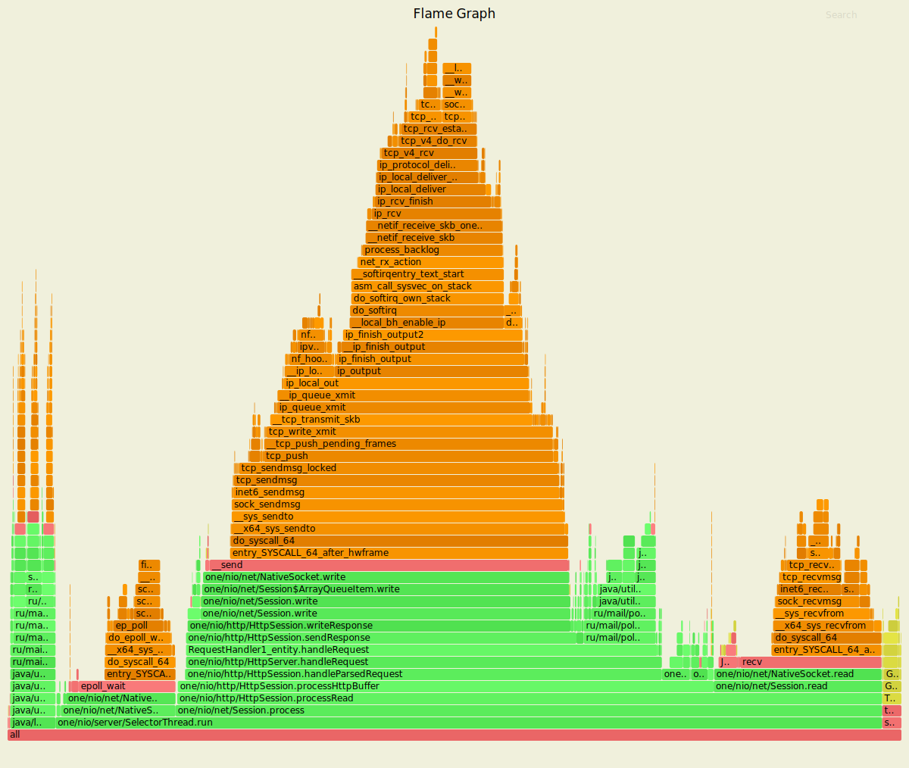
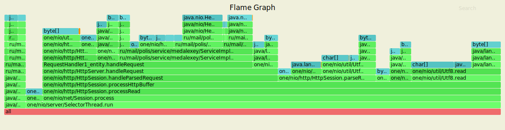
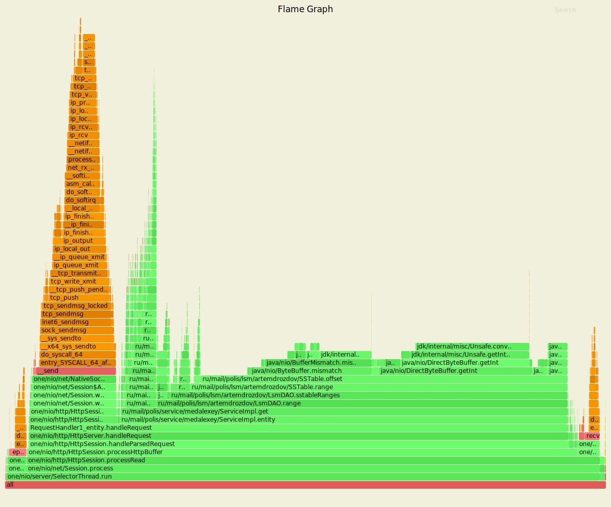
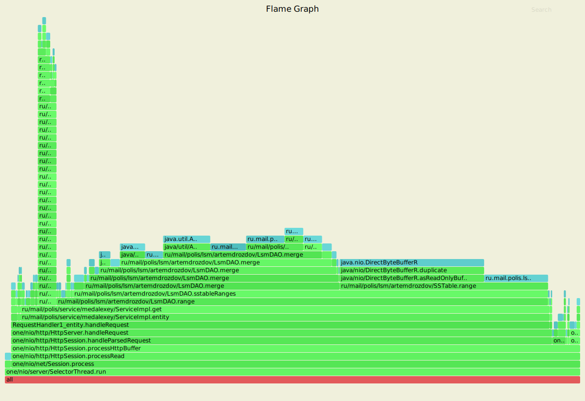

Нагрузочное тестирование PUT-запросами
===========

```
wrk -c 16 -t 4 -R 10000 -s ../wrk-scripts/put.lua -d 5m -L http://localhost:8080
Running 5m test @ http://localhost:8080
  4 threads and 16 connections
  Thread calibration: mean lat.: 0.876ms, rate sampling interval: 10ms
  Thread calibration: mean lat.: 0.887ms, rate sampling interval: 10ms
  Thread calibration: mean lat.: 0.862ms, rate sampling interval: 10ms
  Thread calibration: mean lat.: 0.898ms, rate sampling interval: 10ms
  Thread Stats   Avg      Stdev     Max   +/- Stdev
    Latency     0.88ms  437.71us  30.85ms   71.22%
    Req/Sec     2.62k   177.83     6.70k    58.59%
  Latency Distribution (HdrHistogram - Recorded Latency)
 50.000%    0.86ms
 75.000%    1.16ms
 90.000%    1.38ms
 99.000%    1.72ms
 99.900%    3.83ms
 99.990%    7.05ms
 99.999%   23.36ms
100.000%   30.86ms

  Detailed Percentile spectrum:
       Value   Percentile   TotalCount 1/(1-Percentile)

       0.031     0.000000            1         1.00
       0.375     0.100000       291591         1.11
       0.500     0.200000       580704         1.25
       0.623     0.300000       871370         1.43
       0.745     0.400000      1161728         1.67
       0.864     0.500000      1451089         2.00
       0.922     0.550000      1596255         2.22
       0.979     0.600000      1741226         2.50
       1.036     0.650000      1885425         2.86
       1.095     0.700000      2030221         3.33
       1.158     0.750000      2176745         4.00
       1.191     0.775000      2249362         4.44
       1.224     0.800000      2320274         5.00
       1.259     0.825000      2393089         5.71
       1.296     0.850000      2465862         6.67
       1.336     0.875000      2538408         8.00
       1.358     0.887500      2575270         8.89
       1.379     0.900000      2609976        10.00
       1.403     0.912500      2646730        11.43
       1.428     0.925000      2682362        13.33
       1.456     0.937500      2719072        16.00
       1.471     0.943750      2737229        17.78
       1.487     0.950000      2755120        20.00
       1.505     0.956250      2773727        22.86
       1.524     0.962500      2791304        26.67
       1.547     0.968750      2809859        32.00
       1.559     0.971875      2818620        35.56
       1.573     0.975000      2827528        40.00
       1.589     0.978125      2836517        45.71
       1.609     0.981250      2845767        53.33
       1.634     0.984375      2854589        64.00
       1.650     0.985938      2859100        71.11
       1.671     0.987500      2863695        80.00
       1.700     0.989062      2868204        91.43
       1.745     0.990625      2872677       106.67
       1.852     0.992188      2877154       128.00
       1.980     0.992969      2879417       142.22
       2.133     0.993750      2881683       160.00
       2.301     0.994531      2883945       182.86
       2.479     0.995313      2886214       213.33
       2.685     0.996094      2888489       256.00
       2.793     0.996484      2889614       284.44
       2.927     0.996875      2890752       320.00
       3.065     0.997266      2891871       365.71
       3.209     0.997656      2893006       426.67
       3.363     0.998047      2894142       512.00
       3.447     0.998242      2894708       568.89
       3.533     0.998437      2895268       640.00
       3.623     0.998633      2895840       731.43
       3.731     0.998828      2896404       853.33
       3.843     0.999023      2896981      1024.00
       3.907     0.999121      2897255      1137.78
       3.977     0.999219      2897533      1280.00
       4.063     0.999316      2897816      1462.86
       4.163     0.999414      2898099      1706.67
       4.287     0.999512      2898387      2048.00
       4.367     0.999561      2898526      2275.56
       4.447     0.999609      2898666      2560.00
       4.571     0.999658      2898813      2925.71
       4.715     0.999707      2898955      3413.33
       4.935     0.999756      2899093      4096.00
       5.119     0.999780      2899162      4551.11
       5.299     0.999805      2899232      5120.00
       5.595     0.999829      2899303      5851.43
       5.907     0.999854      2899374      6826.67
       6.339     0.999878      2899445      8192.00
       6.619     0.999890      2899480      9102.22
       7.231     0.999902      2899515     10240.00
       7.627     0.999915      2899551     11702.86
       8.303     0.999927      2899586     13653.33
       9.983     0.999939      2899622     16384.00
      11.687     0.999945      2899639     18204.44
      13.599     0.999951      2899657     20480.00
      15.319     0.999957      2899675     23405.71
      16.767     0.999963      2899692     27306.67
      17.855     0.999969      2899710     32768.00
      18.543     0.999973      2899719     36408.89
      19.055     0.999976      2899728     40960.00
      20.111     0.999979      2899737     46811.43
      20.783     0.999982      2899745     54613.33
      21.711     0.999985      2899755     65536.00
      22.319     0.999986      2899759     72817.78
      23.087     0.999988      2899763     81920.00
      23.343     0.999989      2899768     93622.86
      23.999     0.999991      2899772    109226.67
      24.687     0.999992      2899776    131072.00
      24.815     0.999993      2899779    145635.56
      25.007     0.999994      2899781    163840.00
      26.143     0.999995      2899784    187245.71
      26.271     0.999995      2899785    218453.33
      26.319     0.999996      2899787    262144.00
      27.711     0.999997      2899789    291271.11
      27.807     0.999997      2899790    327680.00
      27.823     0.999997      2899791    374491.43
      27.887     0.999998      2899792    436906.67
      29.215     0.999998      2899794    524288.00
      29.215     0.999998      2899794    582542.22
      29.215     0.999998      2899794    655360.00
      29.327     0.999999      2899795    748982.86
      29.327     0.999999      2899795    873813.33
      29.343     0.999999      2899796   1048576.00
      29.343     0.999999      2899796   1165084.44
      29.343     0.999999      2899796   1310720.00
      29.455     0.999999      2899797   1497965.71
      29.455     0.999999      2899797   1747626.67
      29.455     1.000000      2899797   2097152.00
      29.455     1.000000      2899797   2330168.89
      29.455     1.000000      2899797   2621440.00
      30.863     1.000000      2899798   2995931.43
      30.863     1.000000      2899798          inf
#[Mean    =        0.880, StdDeviation   =        0.438]
#[Max     =       30.848, Total count    =      2899798]
#[Buckets =           27, SubBuckets     =         2048]
----------------------------------------------------------
  2999928 requests in 5.00m, 191.68MB read
Requests/sec:   9999.72
Transfer/sec:    654.28KB

```

**Вывод:**

Выполнение операции flush в отдельном потоке позволило значительно уменьшить время ответа для большего кол-ва запросов. 

Ниже представлено сравнение времени ответа при использовании нескольких потоков и одного.

| | Multithreading | One thread|
|:-----:|:----:|:----:|
| 50.000% | 0.86ms | 820.00us |
| 75.000% | 1.16ms | 1.22ms |
| 90.000% | 1.38ms | 490.24ms |
| 99.000% | 1.72ms | 1.35s |
| 99.900% | 3.83ms | 1.51s |
| 99.990% | 7.05ms | 1.53s |
| 99.999% | 23.36ms | 1.53s |
| 100.000% | 30.86ms | 1.53s |


Нагрузочное тестирование GET-запросами
===========

```
 wrk -c 16 -t 4 -R 10000 -s ../wrk-scripts/get.lua -d 5m -L http://localhost:8080
Running 5m test @ http://localhost:8080
  4 threads and 16 connections
  Thread calibration: mean lat.: 1.010ms, rate sampling interval: 10ms
  Thread calibration: mean lat.: 1.028ms, rate sampling interval: 10ms
  Thread calibration: mean lat.: 1.033ms, rate sampling interval: 10ms
  Thread calibration: mean lat.: 0.998ms, rate sampling interval: 10ms
  Thread Stats   Avg      Stdev     Max   +/- Stdev
    Latency     1.02ms  449.36us  10.06ms   62.19%
    Req/Sec     2.64k   157.36     4.90k    79.31%
  Latency Distribution (HdrHistogram - Recorded Latency)
 50.000%    1.00ms
 75.000%    1.36ms
 90.000%    1.62ms
 99.000%    2.01ms
 99.900%    2.48ms
 99.990%    3.82ms
 99.999%    6.79ms
100.000%   10.07ms

  Detailed Percentile spectrum:
       Value   Percentile   TotalCount 1/(1-Percentile)

       0.083     0.000000            1         1.00
       0.437     0.100000       290966         1.11
       0.575     0.200000       581651         1.25
       0.710     0.300000       871864         1.43
       0.850     0.400000      1161034         1.67
       0.995     0.500000      1451822         2.00
       1.069     0.550000      1596441         2.22
       1.142     0.600000      1740857         2.50
       1.215     0.650000      1886389         2.86
       1.288     0.700000      2031247         3.33
       1.364     0.750000      2176449         4.00
       1.403     0.775000      2248643         4.44
       1.442     0.800000      2320486         5.00
       1.483     0.825000      2394010         5.71
       1.525     0.850000      2466106         6.67
       1.570     0.875000      2537751         8.00
       1.595     0.887500      2574918         8.89
       1.620     0.900000      2610685        10.00
       1.647     0.912500      2647189        11.43
       1.675     0.925000      2682332        13.33
       1.708     0.937500      2718750        16.00
       1.727     0.943750      2737370        17.78
       1.747     0.950000      2755043        20.00
       1.770     0.956250      2773244        22.86
       1.797     0.962500      2791615        26.67
       1.827     0.968750      2809507        32.00
       1.845     0.971875      2818666        35.56
       1.864     0.975000      2827523        40.00
       1.886     0.978125      2836666        45.71
       1.911     0.981250      2845734        53.33
       1.940     0.984375      2854598        64.00
       1.957     0.985938      2859113        71.11
       1.976     0.987500      2863668        80.00
       1.998     0.989062      2868219        91.43
       2.023     0.990625      2872624       106.67
       2.053     0.992188      2877332       128.00
       2.069     0.992969      2879459       142.22
       2.089     0.993750      2881726       160.00
       2.113     0.994531      2884105       182.86
       2.139     0.995313      2886302       213.33
       2.173     0.996094      2888542       256.00
       2.193     0.996484      2889657       284.44
       2.217     0.996875      2890760       320.00
       2.243     0.997266      2891910       365.71
       2.275     0.997656      2893069       426.67
       2.313     0.998047      2894135       512.00
       2.339     0.998242      2894731       568.89
       2.365     0.998437      2895267       640.00
       2.399     0.998633      2895836       731.43
       2.439     0.998828      2896405       853.33
       2.487     0.999023      2896971      1024.00
       2.513     0.999121      2897260      1137.78
       2.547     0.999219      2897540      1280.00
       2.581     0.999316      2897821      1462.86
       2.627     0.999414      2898102      1706.67
       2.683     0.999512      2898383      2048.00
       2.715     0.999561      2898525      2275.56
       2.755     0.999609      2898667      2560.00
       2.801     0.999658      2898807      2925.71
       2.863     0.999707      2898947      3413.33
       2.949     0.999756      2899090      4096.00
       2.999     0.999780      2899160      4551.11
       3.067     0.999805      2899230      5120.00
       3.187     0.999829      2899301      5851.43
       3.365     0.999854      2899372      6826.67
       3.629     0.999878      2899443      8192.00
       3.725     0.999890      2899478      9102.22
       3.873     0.999902      2899513     10240.00
       4.059     0.999915      2899549     11702.86
       4.255     0.999927      2899584     13653.33
       4.475     0.999939      2899620     16384.00
       4.555     0.999945      2899637     18204.44
       4.671     0.999951      2899655     20480.00
       4.931     0.999957      2899673     23405.71
       5.155     0.999963      2899690     27306.67
       5.407     0.999969      2899708     32768.00
       5.503     0.999973      2899717     36408.89
       5.607     0.999976      2899726     40960.00
       5.767     0.999979      2899735     46811.43
       5.947     0.999982      2899743     54613.33
       6.239     0.999985      2899752     65536.00
       6.419     0.999986      2899757     72817.78
       6.571     0.999988      2899762     81920.00
       6.763     0.999989      2899766     93622.86
       6.847     0.999991      2899770    109226.67
       7.107     0.999992      2899774    131072.00
       7.387     0.999993      2899777    145635.56
       7.447     0.999994      2899779    163840.00
       7.615     0.999995      2899781    187245.71
       7.795     0.999995      2899783    218453.33
       7.979     0.999996      2899785    262144.00
       8.119     0.999997      2899787    291271.11
       8.271     0.999997      2899788    327680.00
       8.311     0.999997      2899789    374491.43
       8.319     0.999998      2899790    436906.67
       8.911     0.999998      2899791    524288.00
       8.943     0.999998      2899792    582542.22
       8.943     0.999998      2899792    655360.00
       9.439     0.999999      2899793    748982.86
       9.439     0.999999      2899793    873813.33
       9.487     0.999999      2899794   1048576.00
       9.487     0.999999      2899794   1165084.44
       9.487     0.999999      2899794   1310720.00
       9.695     0.999999      2899795   1497965.71
       9.695     0.999999      2899795   1747626.67
       9.695     1.000000      2899795   2097152.00
       9.695     1.000000      2899795   2330168.89
       9.695     1.000000      2899795   2621440.00
      10.071     1.000000      2899796   2995931.43
      10.071     1.000000      2899796          inf
#[Mean    =        1.017, StdDeviation   =        0.449]
#[Max     =       10.064, Total count    =      2899796]
#[Buckets =           27, SubBuckets     =         2048]
----------------------------------------------------------
  2999919 requests in 5.00m, 211.25MB read
Requests/sec:   9999.72
Transfer/sec:    721.06KB

```

**Вывод:**

Время ответа на get-запросы незначительно увеличилось. 
Это связано с усложнением метода range класса LmsDAO (теперь необходимо мержить на один итератор больше).

Ниже представлено сравнение времени ответа при использовании нескольких потоков и одного.

| | Multithreading | One thread|
|:-----:|:----:|:----:|
| 50.000% | 1.00ms | 633.00us |
| 75.000% | 1.36ms | 0.91ms |
| 90.000% | 1.62ms | 1.08ms |
| 99.000% | 2.01ms | 1.66ms |
| 99.900% | 2.48ms | 2.23ms |
| 99.990% | 3.82ms | 6.66ms |
| 99.999% | 6.79ms | 8.31ms |
| 100.000% | 10.07ms | 8.41ms |


Профилирование приложения при нагрузке PUT-запросами
===

**Cpu:**



Методы flush и handleRequest стали занимать меньше процессорного времени.

Flush: **26.84%** при одном потоке, **4.71%** при нескольких потоках.

HandleRequest: **71.47%** при одном потоке, **54.08%** при нескольких потоках.

**Alloc:**



Методы flush и handleRequest стали занимать меньше памяти.

Flush: **8.77%** при одном потоке, **2.71%** при нескольких потоках.

HandleRequest: **52.18%** при одном потоке, **43.47%** при нескольких потоках.

**Lock:**


Профилирование показало 1 lock (total samples = 1). 

Профилирование приложения при нагрузке GET-запросами
===

**Cpu:**



**Alloc:**



**Lock:**


Профилирование показало отсутствие lock'ов в get-запросах (total samples = 0). 