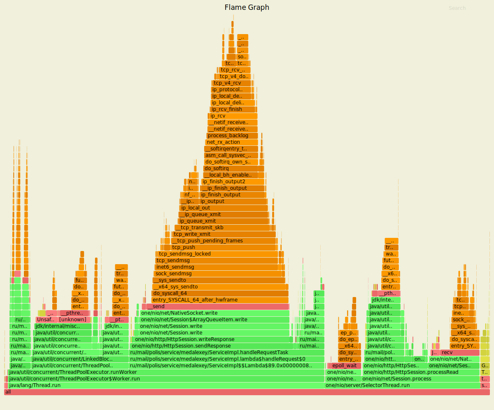
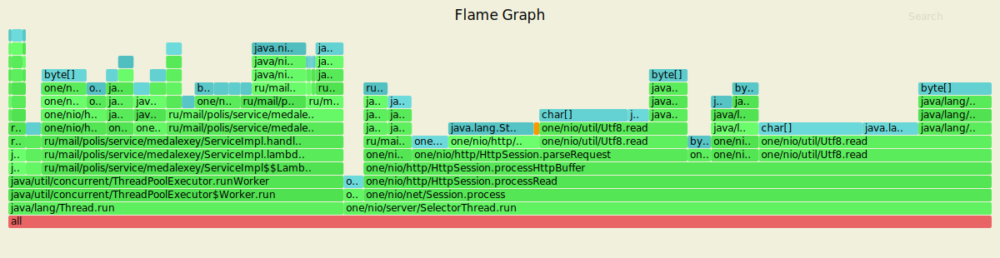
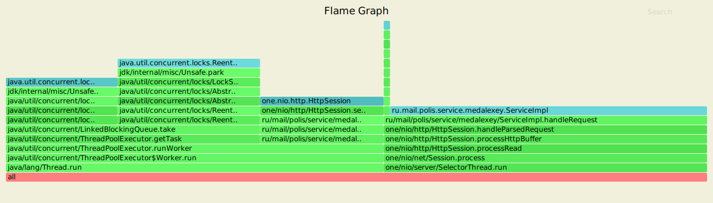
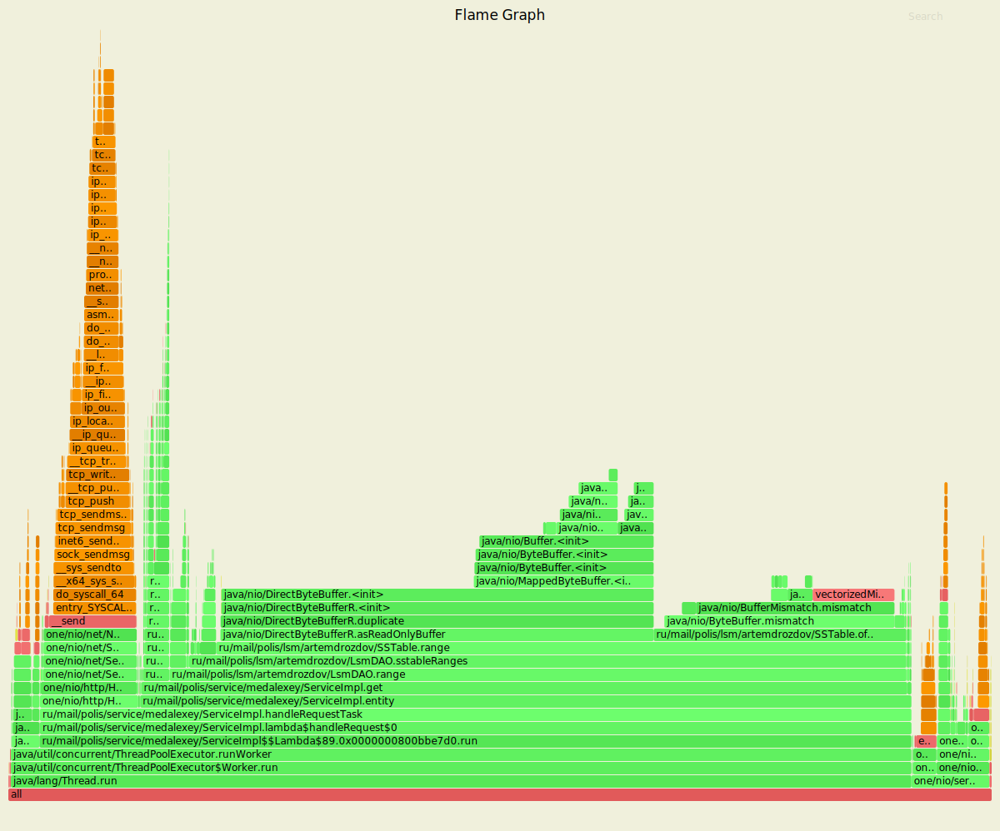
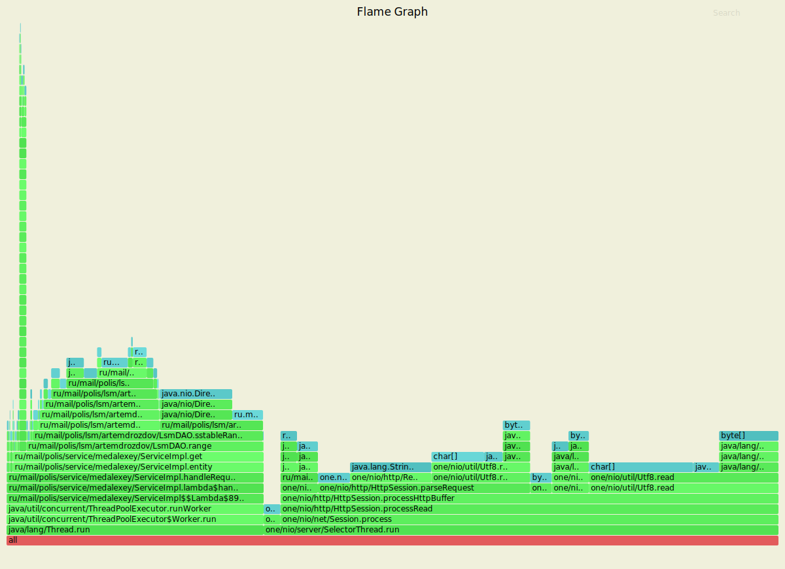
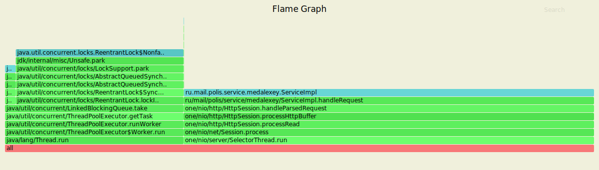

## Временные показатели с разными величинами размера очереди Executor'a

----

## Put-запросы

| queue size -> | 1 |  10   | 60 |  100   | 1_000  | 10_000 | 100_000 | 1_000_000|
|:-------:|:-------:|:------:|:------:|:------:|:------:|:------:|:-------:|:-------:|
| 50.000% | 0.97ms  | 0.92ms | 0.93ms | 0.93ms | 0.93ms | 0.93ms |  0.94ms | 0.93ms |
| 75.000% | 1.32ms  | 1.25ms | 1.25ms| 1.25ms | 1.25ms | 1.26ms |  1.26ms | 1.26ms |
| 90.000% | 1.62ms  | 1.50ms | 1.51ms | 1.51ms | 1.51ms | 1.52ms |  1.52ms | 1.52ms |
| 99.000% | 2.11ms  | 2.06ms | 2.06ms | 2.07ms | 2.07ms | 2.06ms |  2.05ms | 2.05ms |
| 99.900% | 4.34ms  | 4.19ms | 4.03ms | 4.00ms | 4.10ms | 3.88ms |  3.78ms | 3.74ms |
| 99.990% | 5.91ms  | 15.16ms | 6.48ms | 6.30ms | 7.00ms | 6.42ms |  5.40ms | 4.88ms |
| 99.999% | 10.31ms | 36.32ms | 9.56ms | 9.00ms | 10.87ms | 11.30ms |  11.71ms | 6.50ms |
| 100.000% | 35.74ms | 40.19ms | 49.63ms | 38.27ms | 38.62ms | 34.08ms |  39.90ms | 32.56ms |
| Non-2xx or 3xx| 758418 | 14446 | 8 |  0 | 0 | 0 | 0 | 0 |

## Get-запросы

| queue size -> | 1 |   10  | 60 |  100  | 1_000  | 10_000 | 100_000| 1_000_000|
|:-------:|:-------:|:------:|:------:|:------:|:------:|:------:|:------:|:------:|
| 50.000% | 1.04ms | 1.03ms | 1.06ms |  1.03ms | 1.03ms | 1.04ms | 1.03ms | 1.20ms |
| 75.000% | 1.40ms | 1.38ms | 1.43ms | 1.39ms | 1.39ms | 1.39ms | 1.39ms | 1.58ms |
| 90.000% | 1.68ms | 1.63ms | 1.78ms | 1.65ms | 1.64ms | 1.65ms | 1.65ms | 1.92ms |
| 99.000% | 2.09ms | 2.12ms | 7.28ms | 2.13ms | 2.14ms | 2.14ms | 2.14ms | 2.54ms |
| 99.900% | 2.48ms | 2.59ms | 20.74ms | 2.68ms | 2.73ms | 2.58ms | 2.68ms | 3.19ms |
| 99.990% | 4.09ms | 4.70ms | 32.33ms | 5.01ms | 5.90ms | 3.25ms | 4.82ms | 4.65ms |
| 99.999% | 8.14ms | 8.37ms | 40.58ms | 7.65ms | 9.99ms | 6.26ms| 7.16ms | 7.39ms |
| 100.000% | 12.58ms | 10.05ms | 55.90ms| 9.53ms | 12.34ms | 7.97ms | 9.37ms | 9.79ms |
| Non-2xx or 3xx| 797326 | 4779 | 442 | 0 | 0 | 0 | 0 | 0 |

## Анализ результатов

Результаты тестирования показывают:
* Из-за малого (до 100) размера очереди происходит reject некоторых запросов;
* При увеличении очереди от 100 и более результаты испытаний не меняются (небольшие отклонения связываю с работой стороннего ПО).

## Профилирование

----
## PUT-запросы

| | асинхронная версия | синхронная версия |
|:-------:|:-------:|:-------:|
| **Cpu**  |  |  |
| **Alloc** |  |  |
| **Lock** |  |  |

## GET-запросы

| | асинхронная версия | синхронная версия |
|:-------:|:-------:|:-------:|
| **Cpu** |  |   |
| **Alloc** |  |  |
| **Lock** |  |  |

## Подробные результаты нагрузочных испытаний

---

## Executor queue size = 1

**Put-запросы:**
```
wrk -c 64 -t 4 -R 10000 -s ../wrk-scripts/put.lua -d 5m -L http://localhost:8080
Running 5m test @ http://localhost:8080
4 threads and 64 connections
Thread calibration: mean lat.: 0.955ms, rate sampling interval: 10ms
Thread calibration: mean lat.: 0.952ms, rate sampling interval: 10ms
Thread calibration: mean lat.: 0.952ms, rate sampling interval: 10ms
Thread calibration: mean lat.: 1.170ms, rate sampling interval: 10ms
Thread Stats   Avg      Stdev     Max   +/- Stdev
Latency     1.00ms  499.83us  35.71ms   69.01%
Req/Sec     2.62k   390.34     5.33k    78.33%
Latency Distribution (HdrHistogram - Recorded Latency)
50.000%    0.97ms
75.000%    1.32ms
90.000%    1.62ms
99.000%    2.11ms
99.900%    4.34ms
99.990%    5.91ms
99.999%   10.31ms
100.000%   35.74ms

Detailed Percentile spectrum:
Value   Percentile   TotalCount 1/(1-Percentile)

       0.047     0.000000            2         1.00
       0.384     0.100000       290624         1.11
       0.559     0.200000       581087         1.25
       0.704     0.300000       871513         1.43
       0.839     0.400000      1160727         1.67
       0.973     0.500000      1450708         2.00
       1.041     0.550000      1596311         2.22
       1.109     0.600000      1740800         2.50
       1.177     0.650000      1886361         2.86
       1.245     0.700000      2029868         3.33
       1.318     0.750000      2175280         4.00
       1.357     0.775000      2248168         4.44
       1.398     0.800000      2320733         5.00
       1.442     0.825000      2392601         5.71
       1.492     0.850000      2464524         6.67
       1.551     0.875000      2537500         8.00
       1.583     0.887500      2573112         8.89
       1.619     0.900000      2609453        10.00
       1.657     0.912500      2645783        11.43
       1.698     0.925000      2682322        13.33
       1.741     0.937500      2718080        16.00
       1.765     0.943750      2736461        17.78
       1.790     0.950000      2754548        20.00
       1.817     0.956250      2772759        22.86
       1.847     0.962500      2791069        26.67
       1.880     0.968750      2808968        32.00
       1.899     0.971875      2818013        35.56
       1.920     0.975000      2827018        40.00
       1.943     0.978125      2835907        45.71
       1.971     0.981250      2844956        53.33
       2.005     0.984375      2853969        64.00
       2.026     0.985938      2858512        71.11
       2.051     0.987500      2863049        80.00
       2.085     0.989062      2867706        91.43
       2.131     0.990625      2872118       106.67
       2.213     0.992188      2876575       128.00
       2.297     0.992969      2878849       142.22
       2.445     0.993750      2881081       160.00
       2.649     0.994531      2883346       182.86
       2.879     0.995313      2885621       213.33
       3.107     0.996094      2887882       256.00
       3.223     0.996484      2889003       284.44
       3.359     0.996875      2890140       320.00
       3.497     0.997266      2891270       365.71
       3.645     0.997656      2892401       426.67
       3.819     0.998047      2893536       512.00
       3.907     0.998242      2894108       568.89
       4.001     0.998437      2894669       640.00
       4.107     0.998633      2895254       731.43
       4.219     0.998828      2895800       853.33
       4.355     0.999023      2896380      1024.00
       4.431     0.999121      2896650      1137.78
       4.511     0.999219      2896932      1280.00
       4.599     0.999316      2897222      1462.86
       4.691     0.999414      2897504      1706.67
       4.795     0.999512      2897785      2048.00
       4.859     0.999561      2897925      2275.56
       4.931     0.999609      2898068      2560.00
       5.015     0.999658      2898212      2925.71
       5.107     0.999707      2898349      3413.33
       5.219     0.999756      2898487      4096.00
       5.279     0.999780      2898557      4551.11
       5.363     0.999805      2898632      5120.00
       5.471     0.999829      2898699      5851.43
       5.611     0.999854      2898771      6826.67
       5.767     0.999878      2898841      8192.00
       5.839     0.999890      2898876      9102.22
       5.923     0.999902      2898911     10240.00
       6.031     0.999915      2898947     11702.86
       6.263     0.999927      2898982     13653.33
       6.567     0.999939      2899018     16384.00
       6.771     0.999945      2899035     18204.44
       6.939     0.999951      2899053     20480.00
       7.211     0.999957      2899071     23405.71
       7.579     0.999963      2899088     27306.67
       8.031     0.999969      2899106     32768.00
       8.191     0.999973      2899115     36408.89
       8.359     0.999976      2899124     40960.00
       8.567     0.999979      2899133     46811.43
       8.719     0.999982      2899141     54613.33
       9.199     0.999985      2899150     65536.00
       9.535     0.999986      2899155     72817.78
       9.783     0.999988      2899159     81920.00
      10.231     0.999989      2899164     93622.86
      10.447     0.999991      2899168    109226.67
      10.655     0.999992      2899172    131072.00
      10.863     0.999993      2899175    145635.56
      10.935     0.999994      2899177    163840.00
      10.983     0.999995      2899179    187245.71
      11.007     0.999995      2899181    218453.33
      11.127     0.999996      2899183    262144.00
      11.167     0.999997      2899185    291271.11
      11.255     0.999997      2899186    327680.00
      11.271     0.999997      2899187    374491.43
      11.303     0.999998      2899188    436906.67
      11.335     0.999998      2899189    524288.00
      11.399     0.999998      2899190    582542.22
      11.399     0.999998      2899190    655360.00
      16.751     0.999999      2899191    748982.86
      16.751     0.999999      2899191    873813.33
      23.087     0.999999      2899192   1048576.00
      23.087     0.999999      2899192   1165084.44
      23.087     0.999999      2899192   1310720.00
      29.439     0.999999      2899193   1497965.71
      29.439     0.999999      2899193   1747626.67
      29.439     1.000000      2899193   2097152.00
      29.439     1.000000      2899193   2330168.89
      29.439     1.000000      2899193   2621440.00
      35.743     1.000000      2899194   2995931.43
      35.743     1.000000      2899194          inf
#[Mean    =        1.001, StdDeviation   =        0.500]
#[Max     =       35.712, Total count    =      2899194]
#[Buckets =           27, SubBuckets     =         2048]
----------------------------------------------------------
2997247 requests in 5.00m, 201.64MB read
Non-2xx or 3xx responses: 758418
Requests/sec:   9990.71
Transfer/sec:    688.25KB
```

**Get-запросы:**
```
wrk -c 64 -t 4 -R 10000 -s ../wrk-scripts/get.lua -d 5m -L http://localhost:8080
Running 5m test @ http://localhost:8080
4 threads and 64 connections
Thread calibration: mean lat.: 0.984ms, rate sampling interval: 10ms
Thread calibration: mean lat.: 0.977ms, rate sampling interval: 10ms
Thread calibration: mean lat.: 1.158ms, rate sampling interval: 10ms
Thread calibration: mean lat.: 0.982ms, rate sampling interval: 10ms
Thread Stats   Avg      Stdev     Max   +/- Stdev
Latency     1.06ms  468.00us  12.58ms   64.16%
Req/Sec     2.65k   391.16     5.22k    77.15%
Latency Distribution (HdrHistogram - Recorded Latency)
50.000%    1.04ms
75.000%    1.40ms
90.000%    1.68ms
99.000%    2.09ms
99.900%    2.48ms
99.990%    4.09ms
99.999%    8.14ms
100.000%   12.58ms

Detailed Percentile spectrum:
Value   Percentile   TotalCount 1/(1-Percentile)

       0.050     0.000000            1         1.00
       0.433     0.100000       290811         1.11
       0.607     0.200000       580435         1.25
       0.764     0.300000       870350         1.43
       0.906     0.400000      1160773         1.67
       1.043     0.500000      1450255         2.00
       1.114     0.550000      1596090         2.22
       1.184     0.600000      1739736         2.50
       1.255     0.650000      1885261         2.86
       1.326     0.700000      2030304         3.33
       1.399     0.750000      2175246         4.00
       1.436     0.775000      2247125         4.44
       1.475     0.800000      2319406         5.00
       1.517     0.825000      2392314         5.71
       1.563     0.850000      2464727         6.67
       1.616     0.875000      2536978         8.00
       1.646     0.887500      2573486         8.89
       1.678     0.900000      2609428        10.00
       1.714     0.912500      2646195        11.43
       1.752     0.925000      2681787        13.33
       1.795     0.937500      2718070        16.00
       1.819     0.943750      2736791        17.78
       1.843     0.950000      2754612        20.00
       1.869     0.956250      2772492        22.86
       1.898     0.962500      2791026        26.67
       1.929     0.968750      2809007        32.00
       1.946     0.971875      2818109        35.56
       1.964     0.975000      2826861        40.00
       1.984     0.978125      2835934        45.71
       2.006     0.981250      2844852        53.33
       2.032     0.984375      2854155        64.00
       2.046     0.985938      2858537        71.11
       2.063     0.987500      2863402        80.00
       2.079     0.989062      2867619        91.43
       2.099     0.990625      2872237       106.67
       2.123     0.992188      2876852       128.00
       2.135     0.992969      2878863       142.22
       2.151     0.993750      2881287       160.00
       2.167     0.994531      2883386       182.86
       2.187     0.995313      2885634       213.33
       2.213     0.996094      2888001       256.00
       2.227     0.996484      2889115       284.44
       2.245     0.996875      2890259       320.00
       2.265     0.997266      2891353       365.71
       2.289     0.997656      2892433       426.67
       2.321     0.998047      2893565       512.00
       2.341     0.998242      2894108       568.89
       2.365     0.998437      2894678       640.00
       2.399     0.998633      2895250       731.43
       2.437     0.998828      2895816       853.33
       2.491     0.999023      2896372      1024.00
       2.523     0.999121      2896653      1137.78
       2.561     0.999219      2896941      1280.00
       2.605     0.999316      2897224      1462.86
       2.659     0.999414      2897506      1706.67
       2.715     0.999512      2897791      2048.00
       2.753     0.999561      2897928      2275.56
       2.793     0.999609      2898067      2560.00
       2.841     0.999658      2898208      2925.71
       2.895     0.999707      2898353      3413.33
       2.979     0.999756      2898491      4096.00
       3.035     0.999780      2898561      4551.11
       3.103     0.999805      2898634      5120.00
       3.201     0.999829      2898703      5851.43
       3.361     0.999854      2898775      6826.67
       3.627     0.999878      2898845      8192.00
       3.917     0.999890      2898880      9102.22
       4.119     0.999902      2898915     10240.00
       4.355     0.999915      2898951     11702.86
       4.599     0.999927      2898986     13653.33
       4.859     0.999939      2899022     16384.00
       5.059     0.999945      2899039     18204.44
       5.195     0.999951      2899057     20480.00
       5.415     0.999957      2899075     23405.71
       5.535     0.999963      2899092     27306.67
       5.707     0.999969      2899110     32768.00
       5.827     0.999973      2899120     36408.89
       5.915     0.999976      2899128     40960.00
       6.103     0.999979      2899137     46811.43
       6.443     0.999982      2899145     54613.33
       6.919     0.999985      2899154     65536.00
       7.391     0.999986      2899159     72817.78
       7.487     0.999988      2899163     81920.00
       8.123     0.999989      2899168     93622.86
       8.207     0.999991      2899172    109226.67
       8.391     0.999992      2899176    131072.00
       8.551     0.999993      2899179    145635.56
       8.679     0.999994      2899182    163840.00
       8.711     0.999995      2899183    187245.71
       8.751     0.999995      2899185    218453.33
       8.847     0.999996      2899187    262144.00
       9.015     0.999997      2899189    291271.11
       9.047     0.999997      2899190    327680.00
       9.255     0.999997      2899191    374491.43
       9.463     0.999998      2899192    436906.67
       9.615     0.999998      2899193    524288.00
       9.623     0.999998      2899194    582542.22
       9.623     0.999998      2899194    655360.00
       9.871     0.999999      2899195    748982.86
       9.871     0.999999      2899195    873813.33
      10.151     0.999999      2899196   1048576.00
      10.151     0.999999      2899196   1165084.44
      10.151     0.999999      2899196   1310720.00
      10.191     0.999999      2899197   1497965.71
      10.191     0.999999      2899197   1747626.67
      10.191     1.000000      2899197   2097152.00
      10.191     1.000000      2899197   2330168.89
      10.191     1.000000      2899197   2621440.00
      12.583     1.000000      2899198   2995931.43
      12.583     1.000000      2899198          inf
#[Mean    =        1.056, StdDeviation   =        0.468]
#[Max     =       12.576, Total count    =      2899198]
#[Buckets =           27, SubBuckets     =         2048]
----------------------------------------------------------
2997249 requests in 5.00m, 216.37MB read
Non-2xx or 3xx responses: 797326
Requests/sec:   9990.72
Transfer/sec:    738.53KB
```

## Executor queue size = 10

**Put-запросы:**
```
wrk -c 64 -t 4 -R 10000 -s ../wrk-scripts/put.lua -d 5m -L http://localhost:8080
Running 5m test @ http://localhost:8080
4 threads and 64 connections
Thread calibration: mean lat.: 0.968ms, rate sampling interval: 10ms
Thread calibration: mean lat.: 0.968ms, rate sampling interval: 10ms
Thread calibration: mean lat.: 0.962ms, rate sampling interval: 10ms
Thread calibration: mean lat.: 0.956ms, rate sampling interval: 10ms
Thread Stats   Avg      Stdev     Max   +/- Stdev
Latency     0.95ms  544.87us  40.16ms   77.47%
Req/Sec     2.61k   178.75    12.44k    75.16%
Latency Distribution (HdrHistogram - Recorded Latency)
50.000%    0.92ms
75.000%    1.25ms
90.000%    1.50ms
99.000%    2.06ms
99.900%    4.19ms
99.990%   15.16ms
99.999%   36.32ms
100.000%   40.19ms

Detailed Percentile spectrum:
Value   Percentile   TotalCount 1/(1-Percentile)

       0.042     0.000000            1         1.00
       0.363     0.100000       290072         1.11
       0.527     0.200000       580672         1.25
       0.667     0.300000       871260         1.43
       0.797     0.400000      1161108         1.67
       0.922     0.500000      1450136         2.00
       0.985     0.550000      1596134         2.22
       1.049     0.600000      1741655         2.50
       1.114     0.650000      1886257         2.86
       1.180     0.700000      2031078         3.33
       1.246     0.750000      2174970         4.00
       1.281     0.775000      2247308         4.44
       1.318     0.800000      2320282         5.00
       1.357     0.825000      2393592         5.71
       1.398     0.850000      2465254         6.67
       1.445     0.875000      2537829         8.00
       1.472     0.887500      2574335         8.89
       1.502     0.900000      2610406        10.00
       1.536     0.912500      2646071        11.43
       1.575     0.925000      2681874        13.33
       1.622     0.937500      2718624        16.00
       1.648     0.943750      2736400        17.78
       1.677     0.950000      2754585        20.00
       1.709     0.956250      2772653        22.86
       1.744     0.962500      2790482        26.67
       1.786     0.968750      2809004        32.00
       1.809     0.971875      2817796        35.56
       1.836     0.975000      2827031        40.00
       1.865     0.978125      2835884        45.71
       1.899     0.981250      2844975        53.33
       1.940     0.984375      2854023        64.00
       1.964     0.985938      2858549        71.11
       1.992     0.987500      2863078        80.00
       2.027     0.989062      2867517        91.43
       2.077     0.990625      2872123       106.67
       2.161     0.992188      2876580       128.00
       2.235     0.992969      2878826       142.22
       2.363     0.993750      2881098       160.00
       2.531     0.994531      2883360       182.86
       2.731     0.995313      2885620       213.33
       2.939     0.996094      2887879       256.00
       3.053     0.996484      2889007       284.44
       3.175     0.996875      2890140       320.00
       3.307     0.997266      2891284       365.71
       3.447     0.997656      2892420       426.67
       3.615     0.998047      2893539       512.00
       3.711     0.998242      2894104       568.89
       3.817     0.998437      2894674       640.00
       3.921     0.998633      2895239       731.43
       4.057     0.998828      2895807       853.33
       4.211     0.999023      2896377      1024.00
       4.295     0.999121      2896651      1137.78
       4.403     0.999219      2896941      1280.00
       4.535     0.999316      2897222      1462.86
       4.707     0.999414      2897504      1706.67
       4.927     0.999512      2897785      2048.00
       5.091     0.999561      2897927      2275.56
       5.291     0.999609      2898071      2560.00
       5.575     0.999658      2898210      2925.71
       5.951     0.999707      2898351      3413.33
       6.403     0.999756      2898493      4096.00
       6.675     0.999780      2898564      4551.11
       7.175     0.999805      2898633      5120.00
       7.939     0.999829      2898704      5851.43
       8.855     0.999854      2898775      6826.67
      11.295     0.999878      2898846      8192.00
      13.399     0.999890      2898881      9102.22
      15.503     0.999902      2898916     10240.00
      17.583     0.999915      2898952     11702.86
      20.511     0.999927      2898987     13653.33
      23.231     0.999939      2899023     16384.00
      25.151     0.999945      2899040     18204.44
      26.735     0.999951      2899058     20480.00
      28.271     0.999957      2899076     23405.71
      29.551     0.999963      2899094     27306.67
      31.311     0.999969      2899111     32768.00
      32.239     0.999973      2899120     36408.89
      33.183     0.999976      2899129     40960.00
      33.599     0.999979      2899138     46811.43
      34.111     0.999982      2899146     54613.33
      34.815     0.999985      2899156     65536.00
      35.263     0.999986      2899161     72817.78
      35.743     0.999988      2899165     81920.00
      36.255     0.999989      2899169     93622.86
      36.575     0.999991      2899174    109226.67
      37.183     0.999992      2899177    131072.00
      37.471     0.999993      2899180    145635.56
      37.599     0.999994      2899183    163840.00
      37.695     0.999995      2899184    187245.71
      37.855     0.999995      2899186    218453.33
      37.887     0.999996      2899188    262144.00
      38.399     0.999997      2899190    291271.11
      38.559     0.999997      2899191    327680.00
      38.655     0.999997      2899192    374491.43
      38.751     0.999998      2899193    436906.67
      38.911     0.999998      2899194    524288.00
      39.231     0.999998      2899195    582542.22
      39.231     0.999998      2899195    655360.00
      39.551     0.999999      2899196    748982.86
      39.551     0.999999      2899196    873813.33
      39.807     0.999999      2899198   1048576.00
      39.807     0.999999      2899198   1165084.44
      39.807     0.999999      2899198   1310720.00
      39.807     0.999999      2899198   1497965.71
      39.807     0.999999      2899198   1747626.67
      39.807     1.000000      2899198   2097152.00
      39.807     1.000000      2899198   2330168.89
      39.807     1.000000      2899198   2621440.00
      40.191     1.000000      2899199   2995931.43
      40.191     1.000000      2899199          inf
#[Mean    =        0.948, StdDeviation   =        0.545]
#[Max     =       40.160, Total count    =      2899199]
#[Buckets =           27, SubBuckets     =         2048]
----------------------------------------------------------
2999649 requests in 5.00m, 191.86MB read
Non-2xx or 3xx responses: 14446
Requests/sec:   9998.82
Transfer/sec:    654.88KB
```

**Get-запросы:**
```
wrk -c 64 -t 4 -R 10000 -s ../wrk-scripts/get.lua -d 5m -L http://localhost:8080
Running 5m test @ http://localhost:8080
4 threads and 64 connections
Thread calibration: mean lat.: 1.032ms, rate sampling interval: 10ms
Thread calibration: mean lat.: 1.031ms, rate sampling interval: 10ms
Thread calibration: mean lat.: 1.024ms, rate sampling interval: 10ms
Thread calibration: mean lat.: 1.028ms, rate sampling interval: 10ms
ц  Thread Stats   Avg      Stdev     Max   +/- Stdev
Latency     1.04ms  460.41us  10.04ms   63.90%
Req/Sec     2.64k   167.87     4.70k    74.56%
Latency Distribution (HdrHistogram - Recorded Latency)
50.000%    1.03ms
75.000%    1.38ms
90.000%    1.63ms
99.000%    2.12ms
99.900%    2.59ms
99.990%    4.70ms
99.999%    8.37ms
100.000%   10.05ms

Detailed Percentile spectrum:
Value   Percentile   TotalCount 1/(1-Percentile)

       0.068     0.000000            1         1.00
       0.435     0.100000       290673         1.11
       0.596     0.200000       581669         1.25
       0.751     0.300000       870835         1.43
       0.894     0.400000      1160047         1.67
       1.028     0.500000      1449852         2.00
       1.096     0.550000      1596568         2.22
       1.164     0.600000      1740971         2.50
       1.236     0.650000      1885324         2.86
       1.309     0.700000      2030900         3.33
       1.382     0.750000      2175804         4.00
       1.420     0.775000      2248692         4.44
       1.458     0.800000      2320270         5.00
       1.497     0.825000      2392517         5.71
       1.537     0.850000      2464511         6.67
       1.582     0.875000      2537508         8.00
       1.607     0.887500      2573382         8.89
       1.635     0.900000      2609366        10.00
       1.667     0.912500      2645684        11.43
       1.703     0.925000      2681807        13.33
       1.745     0.937500      2718017        16.00
       1.770     0.943750      2736409        17.78
       1.798     0.950000      2754662        20.00
       1.830     0.956250      2772807        22.86
       1.866     0.962500      2790875        26.67
       1.906     0.968750      2808739        32.00
       1.928     0.971875      2817669        35.56
       1.953     0.975000      2827066        40.00
       1.979     0.978125      2835790        45.71
       2.009     0.981250      2844871        53.33
       2.043     0.984375      2854036        64.00
       2.061     0.985938      2858508        71.11
       2.081     0.987500      2862984        80.00
       2.103     0.989062      2867523        91.43
       2.129     0.990625      2872331       106.67
       2.157     0.992188      2876682       128.00
       2.175     0.992969      2879035       142.22
       2.193     0.993750      2881153       160.00
       2.215     0.994531      2883438       182.86
       2.239     0.995313      2885646       213.33
       2.271     0.996094      2887979       256.00
       2.289     0.996484      2889117       284.44
       2.309     0.996875      2890218       320.00
       2.333     0.997266      2891300       365.71
       2.363     0.997656      2892438       426.67
       2.403     0.998047      2893555       512.00
       2.427     0.998242      2894113       568.89
       2.457     0.998437      2894703       640.00
       2.493     0.998633      2895243       731.43
       2.539     0.998828      2895817       853.33
       2.603     0.999023      2896380      1024.00
       2.645     0.999121      2896649      1137.78
       2.695     0.999219      2896935      1280.00
       2.753     0.999316      2897226      1462.86
       2.827     0.999414      2897503      1706.67
       2.917     0.999512      2897783      2048.00
       2.975     0.999561      2897923      2275.56
       3.049     0.999609      2898065      2560.00
       3.155     0.999658      2898207      2925.71
       3.301     0.999707      2898348      3413.33
       3.503     0.999756      2898492      4096.00
       3.621     0.999780      2898560      4551.11
       3.773     0.999805      2898631      5120.00
       3.949     0.999829      2898702      5851.43
       4.171     0.999854      2898773      6826.67
       4.435     0.999878      2898845      8192.00
       4.587     0.999890      2898882      9102.22
       4.751     0.999902      2898914     10240.00
       4.955     0.999915      2898950     11702.86
       5.183     0.999927      2898986     13653.33
       5.499     0.999939      2899022     16384.00
       5.675     0.999945      2899038     18204.44
       5.919     0.999951      2899056     20480.00
       6.227     0.999957      2899074     23405.71
       6.439     0.999963      2899091     27306.67
       6.619     0.999969      2899110     32768.00
       6.891     0.999973      2899118     36408.89
       7.023     0.999976      2899127     40960.00
       7.227     0.999979      2899136     46811.43
       7.423     0.999982      2899144     54613.33
       7.635     0.999985      2899153     65536.00
       7.811     0.999986      2899158     72817.78
       7.915     0.999988      2899162     81920.00
       8.247     0.999989      2899167     93622.86
       8.431     0.999991      2899171    109226.67
       8.591     0.999992      2899175    131072.00
       8.695     0.999993      2899178    145635.56
       8.807     0.999994      2899180    163840.00
       8.871     0.999995      2899182    187245.71
       8.967     0.999995      2899184    218453.33
       9.191     0.999996      2899186    262144.00
       9.255     0.999997      2899188    291271.11
       9.287     0.999997      2899189    327680.00
       9.311     0.999997      2899191    374491.43
       9.311     0.999998      2899191    436906.67
       9.455     0.999998      2899192    524288.00
       9.503     0.999998      2899193    582542.22
       9.503     0.999998      2899193    655360.00
       9.527     0.999999      2899194    748982.86
       9.527     0.999999      2899194    873813.33
       9.567     0.999999      2899195   1048576.00
       9.567     0.999999      2899195   1165084.44
       9.567     0.999999      2899195   1310720.00
       9.695     0.999999      2899196   1497965.71
       9.695     0.999999      2899196   1747626.67
       9.695     1.000000      2899196   2097152.00
       9.695     1.000000      2899196   2330168.89
       9.695     1.000000      2899196   2621440.00
      10.047     1.000000      2899197   2995931.43
      10.047     1.000000      2899197          inf
#[Mean    =        1.043, StdDeviation   =        0.460]
#[Max     =       10.040, Total count    =      2899197]
#[Buckets =           27, SubBuckets     =         2048]
----------------------------------------------------------
2999644 requests in 5.00m, 211.24MB read
Non-2xx or 3xx responses: 4779
Requests/sec:   9998.82
Transfer/sec:    721.05KB
```

## Executor queue size = 60

```
wrk -c 64 -t 4 -R 10000 -s ../wrk-scripts/put.lua -d 5m -L http://localhost:8080
Running 5m test @ http://localhost:8080
  4 threads and 64 connections
  Thread calibration: mean lat.: 0.967ms, rate sampling interval: 10ms
  Thread calibration: mean lat.: 0.966ms, rate sampling interval: 10ms
  Thread calibration: mean lat.: 0.963ms, rate sampling interval: 10ms
  Thread calibration: mean lat.: 0.964ms, rate sampling interval: 10ms
  Thread Stats   Avg      Stdev     Max   +/- Stdev
    Latency     0.95ms  475.94us  49.60ms   69.72%
    Req/Sec     2.62k   178.75     5.00k    73.09%
  Latency Distribution (HdrHistogram - Recorded Latency)
 50.000%    0.93ms
 75.000%    1.25ms
 90.000%    1.51ms
 99.000%    2.06ms
 99.900%    4.03ms
 99.990%    6.48ms
 99.999%    9.56ms
100.000%   49.63ms

  Detailed Percentile spectrum:
       Value   Percentile   TotalCount 1/(1-Percentile)

       0.051     0.000000            1         1.00
       0.363     0.100000       291488         1.11
       0.525     0.200000       580988         1.25
       0.667     0.300000       870206         1.43
       0.799     0.400000      1160771         1.67
       0.928     0.500000      1450552         2.00
       0.993     0.550000      1595958         2.22
       1.058     0.600000      1739723         2.50
       1.123     0.650000      1884672         2.86
       1.188     0.700000      2030210         3.33
       1.254     0.750000      2174438         4.00
       1.289     0.775000      2248456         4.44
       1.324     0.800000      2320171         5.00
       1.361     0.825000      2391874         5.71
       1.403     0.850000      2465621         6.67
       1.450     0.875000      2537511         8.00
       1.477     0.887500      2573613         8.89
       1.508     0.900000      2610240        10.00
       1.542     0.912500      2645826        11.43
       1.582     0.925000      2682518        13.33
       1.627     0.937500      2718190        16.00
       1.653     0.943750      2736227        17.78
       1.682     0.950000      2754747        20.00
       1.713     0.956250      2772754        22.86
       1.749     0.962500      2790788        26.67
       1.790     0.968750      2808983        32.00
       1.812     0.971875      2817851        35.56
       1.838     0.975000      2826973        40.00
       1.867     0.978125      2835842        45.71
       1.901     0.981250      2844919        53.33
       1.942     0.984375      2853977        64.00
       1.967     0.985938      2858518        71.11
       1.996     0.987500      2862957        80.00
       2.033     0.989062      2867570        91.43
       2.087     0.990625      2872154       106.67
       2.171     0.992188      2876542       128.00
       2.249     0.992969      2878852       142.22
       2.371     0.993750      2881091       160.00
       2.537     0.994531      2883351       182.86
       2.715     0.995313      2885614       213.33
       2.915     0.996094      2887879       256.00
       3.029     0.996484      2889003       284.44
       3.147     0.996875      2890148       320.00
       3.267     0.997266      2891282       365.71
       3.399     0.997656      2892408       426.67
       3.549     0.998047      2893540       512.00
       3.629     0.998242      2894103       568.89
       3.717     0.998437      2894665       640.00
       3.817     0.998633      2895239       731.43
       3.927     0.998828      2895803       853.33
       4.051     0.999023      2896366      1024.00
       4.127     0.999121      2896646      1137.78
       4.215     0.999219      2896931      1280.00
       4.315     0.999316      2897212      1462.86
       4.439     0.999414      2897496      1706.67
       4.595     0.999512      2897783      2048.00
       4.695     0.999561      2897918      2275.56
       4.803     0.999609      2898060      2560.00
       4.951     0.999658      2898205      2925.71
       5.147     0.999707      2898345      3413.33
       5.339     0.999756      2898487      4096.00
       5.491     0.999780      2898555      4551.11
       5.639     0.999805      2898625      5120.00
       5.851     0.999829      2898696      5851.43
       6.035     0.999854      2898767      6826.67
       6.235     0.999878      2898839      8192.00
       6.347     0.999890      2898873      9102.22
       6.515     0.999902      2898909     10240.00
       6.687     0.999915      2898944     11702.86
       6.927     0.999927      2898979     13653.33
       7.099     0.999939      2899015     16384.00
       7.271     0.999945      2899032     18204.44
       7.387     0.999951      2899050     20480.00
       7.631     0.999957      2899068     23405.71
       7.755     0.999963      2899085     27306.67
       7.995     0.999969      2899103     32768.00
       8.155     0.999973      2899112     36408.89
       8.343     0.999976      2899121     40960.00
       8.423     0.999979      2899130     46811.43
       8.583     0.999982      2899138     54613.33
       8.759     0.999985      2899147     65536.00
       8.927     0.999986      2899152     72817.78
       9.015     0.999988      2899156     81920.00
       9.423     0.999989      2899161     93622.86
       9.871     0.999991      2899165    109226.67
      10.375     0.999992      2899169    131072.00
      10.815     0.999993      2899172    145635.56
      10.967     0.999994      2899174    163840.00
      11.287     0.999995      2899176    187245.71
      11.583     0.999995      2899178    218453.33
      11.759     0.999996      2899180    262144.00
      12.199     0.999997      2899183    291271.11
      12.199     0.999997      2899183    327680.00
      12.439     0.999997      2899184    374491.43
      14.599     0.999998      2899185    436906.67
      18.527     0.999998      2899186    524288.00
      24.783     0.999998      2899187    582542.22
      24.783     0.999998      2899187    655360.00
      31.023     0.999999      2899188    748982.86
      31.023     0.999999      2899188    873813.33
      37.343     0.999999      2899189   1048576.00
      37.343     0.999999      2899189   1165084.44
      37.343     0.999999      2899189   1310720.00
      43.615     0.999999      2899190   1497965.71
      43.615     0.999999      2899190   1747626.67
      43.615     1.000000      2899190   2097152.00
      43.615     1.000000      2899190   2330168.89
      43.615     1.000000      2899190   2621440.00
      49.631     1.000000      2899191   2995931.43
      49.631     1.000000      2899191          inf
#[Mean    =        0.949, StdDeviation   =        0.476]
#[Max     =       49.600, Total count    =      2899191]
#[Buckets =           27, SubBuckets     =         2048]
----------------------------------------------------------
  2999646 requests in 5.00m, 191.67MB read
  Non-2xx or 3xx responses: 8
Requests/sec:   9998.83
Transfer/sec:    654.22KB
```
```
wrk -c 64 -t 4 -R 10000 -s ../wrk-scripts/get.lua -d 5m -L http://localhost:8080
Running 5m test @ http://localhost:8080
  4 threads and 64 connections
  Thread calibration: mean lat.: 1.421ms, rate sampling interval: 10ms
  Thread calibration: mean lat.: 1.432ms, rate sampling interval: 10ms
  Thread calibration: mean lat.: 1.369ms, rate sampling interval: 10ms
  Thread calibration: mean lat.: 1.423ms, rate sampling interval: 10ms
  Thread Stats   Avg      Stdev     Max   +/- Stdev
    Latency     1.25ms    1.48ms  55.87ms   97.05%
    Req/Sec     2.64k   326.53    10.67k    86.35%
  Latency Distribution (HdrHistogram - Recorded Latency)
 50.000%    1.06ms
 75.000%    1.43ms
 90.000%    1.78ms
 99.000%    7.28ms
 99.900%   20.74ms
 99.990%   32.33ms
 99.999%   40.58ms
100.000%   55.90ms

  Detailed Percentile spectrum:
       Value   Percentile   TotalCount 1/(1-Percentile)

       0.071     0.000000            1         1.00
       0.446     0.100000       291428         1.11
       0.613     0.200000       580392         1.25
       0.772     0.300000       870862         1.43
       0.920     0.400000      1160193         1.67
       1.063     0.500000      1449897         2.00
       1.135     0.550000      1595132         2.22
       1.207     0.600000      1740147         2.50
       1.281     0.650000      1885634         2.86
       1.357     0.700000      2031356         3.33
       1.435     0.750000      2174895         4.00
       1.477     0.775000      2247758         4.44
       1.521     0.800000      2320191         5.00
       1.569     0.825000      2392456         5.71
       1.624     0.850000      2464838         6.67
       1.691     0.875000      2536812         8.00
       1.732     0.887500      2573774         8.89
       1.778     0.900000      2609849        10.00
       1.832     0.912500      2645697        11.43
       1.898     0.925000      2682038        13.33
       1.982     0.937500      2718377        16.00
       2.034     0.943750      2736337        17.78
       2.099     0.950000      2754424        20.00
       2.187     0.956250      2772573        22.86
       2.329     0.962500      2790661        26.67
       2.605     0.968750      2808606        32.00
       2.849     0.971875      2817666        35.56
       3.187     0.975000      2826734        40.00
       3.637     0.978125      2835808        45.71
       4.211     0.981250      2844843        53.33
       4.963     0.984375      2853900        64.00
       5.451     0.985938      2858435        71.11
       6.047     0.987500      2862963        80.00
       6.771     0.989062      2867505        91.43
       7.651     0.990625      2872037       106.67
       8.743     0.992188      2876553       128.00
       9.391     0.992969      2878819       142.22
      10.111     0.993750      2881093       160.00
      10.951     0.994531      2883350       182.86
      11.935     0.995313      2885626       213.33
      13.039     0.996094      2887887       256.00
      13.671     0.996484      2889013       284.44
      14.343     0.996875      2890146       320.00
      15.079     0.997266      2891277       365.71
      15.943     0.997656      2892408       426.67
      16.975     0.998047      2893545       512.00
      17.583     0.998242      2894113       568.89
      18.271     0.998437      2894686       640.00
      19.039     0.998633      2895253       731.43
      19.871     0.998828      2895811       853.33
      20.847     0.999023      2896369      1024.00
      21.391     0.999121      2896655      1137.78
      22.095     0.999219      2896938      1280.00
      22.927     0.999316      2897230      1462.86
      23.775     0.999414      2897506      1706.67
      24.735     0.999512      2897785      2048.00
      25.183     0.999561      2897926      2275.56
      25.791     0.999609      2898070      2560.00
      26.463     0.999658      2898210      2925.71
      27.247     0.999707      2898351      3413.33
      28.063     0.999756      2898495      4096.00
      28.511     0.999780      2898566      4551.11
      29.023     0.999805      2898634      5120.00
      29.727     0.999829      2898707      5851.43
      30.559     0.999854      2898776      6826.67
      31.375     0.999878      2898847      8192.00
      31.935     0.999890      2898882      9102.22
      32.415     0.999902      2898917     10240.00
      32.895     0.999915      2898954     11702.86
      33.471     0.999927      2898993     13653.33
      34.143     0.999939      2899024     16384.00
      34.559     0.999945      2899042     18204.44
      34.975     0.999951      2899059     20480.00
      35.487     0.999957      2899077     23405.71
      36.127     0.999963      2899095     27306.67
      36.863     0.999969      2899112     32768.00
      37.503     0.999973      2899122     36408.89
      37.823     0.999976      2899130     40960.00
      38.463     0.999979      2899140     46811.43
      38.719     0.999982      2899147     54613.33
      39.359     0.999985      2899157     65536.00
      39.743     0.999986      2899161     72817.78
      39.967     0.999988      2899166     81920.00
      40.223     0.999989      2899170     93622.86
      41.151     0.999991      2899174    109226.67
      42.943     0.999992      2899178    131072.00
      44.383     0.999993      2899182    145635.56
      44.863     0.999994      2899183    163840.00
      45.791     0.999995      2899185    187245.71
      47.135     0.999995      2899187    218453.33
      48.031     0.999996      2899189    262144.00
      48.703     0.999997      2899191    291271.11
      48.991     0.999997      2899192    327680.00
      49.311     0.999997      2899193    374491.43
      49.503     0.999998      2899194    436906.67
      50.815     0.999998      2899195    524288.00
      51.135     0.999998      2899196    582542.22
      51.135     0.999998      2899196    655360.00
      52.287     0.999999      2899197    748982.86
      52.287     0.999999      2899197    873813.33
      53.343     0.999999      2899198   1048576.00
      53.343     0.999999      2899198   1165084.44
      53.343     0.999999      2899198   1310720.00
      53.439     0.999999      2899199   1497965.71
      53.439     0.999999      2899199   1747626.67
      53.439     1.000000      2899199   2097152.00
      53.439     1.000000      2899199   2330168.89
      53.439     1.000000      2899199   2621440.00
      55.903     1.000000      2899200   2995931.43
      55.903     1.000000      2899200          inf
#[Mean    =        1.247, StdDeviation   =        1.482]
#[Max     =       55.872, Total count    =      2899200]
#[Buckets =           27, SubBuckets     =         2048]
----------------------------------------------------------
  2999647 requests in 5.00m, 211.23MB read
  Non-2xx or 3xx responses: 442
Requests/sec:   9998.81
Transfer/sec:    721.00KB
```


## Executor queue size = 100

**Put-запросы:**
```
wrk -c 64 -t 4 -R 10000 -s ../wrk-scripts/put.lua -d 5m -L http://localhost:8080
Running 5m test @ http://localhost:8080
4 threads and 64 connections
Thread calibration: mean lat.: 0.981ms, rate sampling interval: 10ms
Thread calibration: mean lat.: 0.980ms, rate sampling interval: 10ms
Thread calibration: mean lat.: 0.976ms, rate sampling interval: 10ms
Thread calibration: mean lat.: 0.979ms, rate sampling interval: 10ms
Thread Stats   Avg      Stdev     Max   +/- Stdev
Latency     0.95ms  474.03us  38.24ms   69.26%
Req/Sec     2.62k   186.44     5.00k    75.27%
Latency Distribution (HdrHistogram - Recorded Latency)
50.000%    0.93ms
75.000%    1.25ms
90.000%    1.51ms
99.000%    2.07ms
99.900%    4.00ms
99.990%    6.30ms
99.999%    9.00ms
100.000%   38.27ms

Detailed Percentile spectrum:
Value   Percentile   TotalCount 1/(1-Percentile)

       0.044     0.000000            1         1.00
       0.364     0.100000       291061         1.11
       0.525     0.200000       581050         1.25
       0.667     0.300000       871791         1.43
       0.799     0.400000      1159944         1.67
       0.930     0.500000      1450135         2.00
       0.995     0.550000      1596207         2.22
       1.060     0.600000      1741067         2.50
       1.124     0.650000      1884927         2.86
       1.189     0.700000      2031056         3.33
       1.255     0.750000      2176314         4.00
       1.289     0.775000      2247592         4.44
       1.325     0.800000      2319456         5.00
       1.364     0.825000      2392268         5.71
       1.407     0.850000      2465792         6.67
       1.454     0.875000      2537356         8.00
       1.481     0.887500      2573087         8.89
       1.512     0.900000      2609554        10.00
       1.548     0.912500      2646412        11.43
       1.588     0.925000      2682323        13.33
       1.635     0.937500      2718427        16.00
       1.661     0.943750      2736356        17.78
       1.690     0.950000      2754613        20.00
       1.722     0.956250      2772660        22.86
       1.758     0.962500      2790903        26.67
       1.799     0.968750      2808974        32.00
       1.821     0.971875      2817683        35.56
       1.847     0.975000      2826862        40.00
       1.876     0.978125      2835926        45.71
       1.909     0.981250      2844851        53.33
       1.950     0.984375      2853937        64.00
       1.974     0.985938      2858425        71.11
       2.003     0.987500      2863045        80.00
       2.039     0.989062      2867565        91.43
       2.087     0.990625      2872128       106.67
       2.165     0.992188      2876545       128.00
       2.233     0.992969      2878836       142.22
       2.351     0.993750      2881090       160.00
       2.507     0.994531      2883347       182.86
       2.683     0.995313      2885613       213.33
       2.879     0.996094      2887888       256.00
       2.983     0.996484      2889010       284.44
       3.099     0.996875      2890134       320.00
       3.217     0.997266      2891284       365.71
       3.347     0.997656      2892411       426.67
       3.497     0.998047      2893533       512.00
       3.583     0.998242      2894108       568.89
       3.679     0.998437      2894664       640.00
       3.777     0.998633      2895241       731.43
       3.885     0.998828      2895796       853.33
       4.013     0.999023      2896366      1024.00
       4.089     0.999121      2896647      1137.78
       4.175     0.999219      2896941      1280.00
       4.275     0.999316      2897223      1462.86
       4.375     0.999414      2897499      1706.67
       4.523     0.999512      2897789      2048.00
       4.603     0.999561      2897922      2275.56
       4.723     0.999609      2898064      2560.00
       4.867     0.999658      2898208      2925.71
       5.015     0.999707      2898345      3413.33
       5.211     0.999756      2898488      4096.00
       5.359     0.999780      2898556      4551.11
       5.507     0.999805      2898629      5120.00
       5.639     0.999829      2898699      5851.43
       5.855     0.999854      2898769      6826.67
       6.055     0.999878      2898840      8192.00
       6.203     0.999890      2898875      9102.22
       6.323     0.999902      2898910     10240.00
       6.439     0.999915      2898946     11702.86
       6.647     0.999927      2898982     13653.33
       6.871     0.999939      2899017     16384.00
       6.995     0.999945      2899034     18204.44
       7.131     0.999951      2899052     20480.00
       7.231     0.999957      2899070     23405.71
       7.431     0.999963      2899087     27306.67
       7.607     0.999969      2899105     32768.00
       7.715     0.999973      2899114     36408.89
       7.843     0.999976      2899123     40960.00
       8.019     0.999979      2899132     46811.43
       8.231     0.999982      2899140     54613.33
       8.407     0.999985      2899150     65536.00
       8.575     0.999986      2899154     72817.78
       8.743     0.999988      2899158     81920.00
       8.951     0.999989      2899163     93622.86
       9.079     0.999991      2899167    109226.67
       9.383     0.999992      2899171    131072.00
       9.615     0.999993      2899174    145635.56
      10.287     0.999994      2899176    163840.00
      11.255     0.999995      2899178    187245.71
      11.927     0.999995      2899180    218453.33
      12.559     0.999996      2899182    262144.00
      13.119     0.999997      2899184    291271.11
      13.391     0.999997      2899185    327680.00
      13.847     0.999997      2899186    374491.43
      14.031     0.999998      2899187    436906.67
      14.119     0.999998      2899188    524288.00
      14.615     0.999998      2899189    582542.22
      14.615     0.999998      2899189    655360.00
      19.391     0.999999      2899190    748982.86
      19.391     0.999999      2899190    873813.33
      25.631     0.999999      2899191   1048576.00
      25.631     0.999999      2899191   1165084.44
      25.631     0.999999      2899191   1310720.00
      31.967     0.999999      2899192   1497965.71
      31.967     0.999999      2899192   1747626.67
      31.967     1.000000      2899192   2097152.00
      31.967     1.000000      2899192   2330168.89
      31.967     1.000000      2899192   2621440.00
      38.271     1.000000      2899193   2995931.43
      38.271     1.000000      2899193          inf
#[Mean    =        0.951, StdDeviation   =        0.474]
#[Max     =       38.240, Total count    =      2899193]
#[Buckets =           27, SubBuckets     =         2048]
----------------------------------------------------------
2999646 requests in 5.00m, 191.67MB read
Requests/sec:   9998.84
Transfer/sec:    654.22KB
```

**Get-запросы:**
```
wrk -c 64 -t 4 -R 10000 -s ../wrk-scripts/get.lua -d 5m -L http://localhost:8080
Running 5m test @ http://localhost:8080
4 threads and 64 connections
Thread calibration: mean lat.: 1.372ms, rate sampling interval: 10ms
Thread calibration: mean lat.: 1.434ms, rate sampling interval: 10ms
Thread calibration: mean lat.: 1.536ms, rate sampling interval: 10ms
Thread calibration: mean lat.: 1.499ms, rate sampling interval: 10ms
Thread Stats   Avg      Stdev     Max   +/- Stdev
Latency     1.05ms  463.40us   9.53ms   63.91%
Req/Sec     2.63k   176.36     4.78k    72.47%
Latency Distribution (HdrHistogram - Recorded Latency)
50.000%    1.03ms
75.000%    1.39ms
90.000%    1.65ms
99.000%    2.13ms
99.900%    2.68ms
99.990%    5.01ms
99.999%    7.65ms
100.000%    9.53ms

Detailed Percentile spectrum:
Value   Percentile   TotalCount 1/(1-Percentile)

       0.085     0.000000            1         1.00
       0.442     0.100000       290585         1.11
       0.599     0.200000       580027         1.25
       0.753     0.300000       871454         1.43
       0.898     0.400000      1161088         1.67
       1.032     0.500000      1451574         2.00
       1.099     0.550000      1595498         2.22
       1.168     0.600000      1740489         2.50
       1.239     0.650000      1885303         2.86
       1.312     0.700000      2030575         3.33
       1.387     0.750000      2174629         4.00
       1.426     0.775000      2248502         4.44
       1.464     0.800000      2319631         5.00
       1.505     0.825000      2393034         5.71
       1.548     0.850000      2465760         6.67
       1.594     0.875000      2537213         8.00
       1.620     0.887500      2573834         8.89
       1.648     0.900000      2609566        10.00
       1.679     0.912500      2645616        11.43
       1.716     0.925000      2682624        13.33
       1.758     0.937500      2718552        16.00
       1.782     0.943750      2736418        17.78
       1.809     0.950000      2754372        20.00
       1.840     0.956250      2772835        22.86
       1.875     0.962500      2790846        26.67
       1.915     0.968750      2808984        32.00
       1.937     0.971875      2817817        35.56
       1.962     0.975000      2826926        40.00
       1.989     0.978125      2835969        45.71
       2.019     0.981250      2845032        53.33
       2.053     0.984375      2854271        64.00
       2.071     0.985938      2858478        71.11
       2.093     0.987500      2863308        80.00
       2.115     0.989062      2867508        91.43
       2.143     0.990625      2872202       106.67
       2.175     0.992188      2876659       128.00
       2.193     0.992969      2878874       142.22
       2.213     0.993750      2881080       160.00
       2.237     0.994531      2883356       182.86
       2.265     0.995313      2885667       213.33
       2.299     0.996094      2887905       256.00
       2.321     0.996484      2889082       284.44
       2.343     0.996875      2890131       320.00
       2.373     0.997266      2891322       365.71
       2.407     0.997656      2892396       426.67
       2.453     0.998047      2893543       512.00
       2.483     0.998242      2894118       568.89
       2.517     0.998437      2894663       640.00
       2.559     0.998633      2895237       731.43
       2.613     0.998828      2895799       853.33
       2.691     0.999023      2896364      1024.00
       2.739     0.999121      2896641      1137.78
       2.795     0.999219      2896925      1280.00
       2.865     0.999316      2897215      1462.86
       2.939     0.999414      2897496      1706.67
       3.053     0.999512      2897777      2048.00
       3.121     0.999561      2897916      2275.56
       3.215     0.999609      2898058      2560.00
       3.369     0.999658      2898201      2925.71
       3.541     0.999707      2898340      3413.33
       3.785     0.999756      2898482      4096.00
       3.959     0.999780      2898553      4551.11
       4.131     0.999805      2898626      5120.00
       4.291     0.999829      2898694      5851.43
       4.475     0.999854      2898767      6826.67
       4.727     0.999878      2898836      8192.00
       4.859     0.999890      2898871      9102.22
       5.083     0.999902      2898906     10240.00
       5.267     0.999915      2898942     11702.86
       5.523     0.999927      2898977     13653.33
       5.783     0.999939      2899013     16384.00
       5.923     0.999945      2899031     18204.44
       6.019     0.999951      2899048     20480.00
       6.131     0.999957      2899066     23405.71
       6.287     0.999963      2899083     27306.67
       6.539     0.999969      2899101     32768.00
       6.667     0.999973      2899112     36408.89
       6.767     0.999976      2899119     40960.00
       6.851     0.999979      2899128     46811.43
       7.043     0.999982      2899136     54613.33
       7.247     0.999985      2899145     65536.00
       7.331     0.999986      2899150     72817.78
       7.399     0.999988      2899154     81920.00
       7.619     0.999989      2899159     93622.86
       7.707     0.999991      2899163    109226.67
       7.811     0.999992      2899167    131072.00
       7.891     0.999993      2899170    145635.56
       8.019     0.999994      2899172    163840.00
       8.059     0.999995      2899174    187245.71
       8.367     0.999995      2899176    218453.33
       8.535     0.999996      2899178    262144.00
       8.783     0.999997      2899180    291271.11
       8.903     0.999997      2899181    327680.00
       8.935     0.999997      2899182    374491.43
       9.055     0.999998      2899183    436906.67
       9.103     0.999998      2899184    524288.00
       9.255     0.999998      2899185    582542.22
       9.255     0.999998      2899185    655360.00
       9.319     0.999999      2899186    748982.86
       9.319     0.999999      2899186    873813.33
       9.351     0.999999      2899187   1048576.00
       9.351     0.999999      2899187   1165084.44
       9.351     0.999999      2899187   1310720.00
       9.359     0.999999      2899188   1497965.71
       9.359     0.999999      2899188   1747626.67
       9.359     1.000000      2899188   2097152.00
       9.359     1.000000      2899188   2330168.89
       9.359     1.000000      2899188   2621440.00
       9.535     1.000000      2899189   2995931.43
       9.535     1.000000      2899189          inf
#[Mean    =        1.049, StdDeviation   =        0.463]
#[Max     =        9.528, Total count    =      2899189]
#[Buckets =           27, SubBuckets     =         2048]
----------------------------------------------------------
2999638 requests in 5.00m, 211.23MB read
Requests/sec:   9998.80
Transfer/sec:    720.99KB
```

## Executor queue size = 1_000

**Put-запросы:**
```
wrk -c 64 -t 4 -R 10000 -s ../wrk-scripts/put.lua -d 5m -L http://localhost:8080
Running 5m test @ http://localhost:8080
4 threads and 64 connections
Thread calibration: mean lat.: 1.220ms, rate sampling interval: 10ms
Thread calibration: mean lat.: 1.222ms, rate sampling interval: 10ms
Thread calibration: mean lat.: 1.220ms, rate sampling interval: 10ms
Thread calibration: mean lat.: 1.198ms, rate sampling interval: 10ms
Thread Stats   Avg      Stdev     Max   +/- Stdev
Latency     0.95ms  475.97us  38.59ms   70.02%
Req/Sec     2.61k   173.45     5.60k    73.38%
Latency Distribution (HdrHistogram - Recorded Latency)
50.000%    0.93ms
75.000%    1.25ms
90.000%    1.51ms
99.000%    2.07ms
99.900%    4.10ms
99.990%    7.00ms
99.999%   10.87ms
100.000%   38.62ms

Detailed Percentile spectrum:
Value   Percentile   TotalCount 1/(1-Percentile)

       0.040     0.000000            1         1.00
       0.369     0.100000       290930         1.11
       0.530     0.200000       581611         1.25
       0.668     0.300000       869895         1.43
       0.800     0.400000      1161280         1.67
       0.929     0.500000      1450322         2.00
       0.994     0.550000      1595705         2.22
       1.059     0.600000      1741454         2.50
       1.123     0.650000      1884690         2.86
       1.188     0.700000      2030881         3.33
       1.253     0.750000      2174824         4.00
       1.288     0.775000      2248032         4.44
       1.324     0.800000      2320403         5.00
       1.362     0.825000      2392922         5.71
       1.403     0.850000      2465405         6.67
       1.450     0.875000      2538102         8.00
       1.476     0.887500      2573686         8.89
       1.506     0.900000      2609973        10.00
       1.540     0.912500      2646189        11.43
       1.579     0.925000      2682313        13.33
       1.624     0.937500      2718299        16.00
       1.650     0.943750      2736434        17.78
       1.678     0.950000      2754473        20.00
       1.709     0.956250      2772450        22.86
       1.744     0.962500      2790744        26.67
       1.785     0.968750      2808799        32.00
       1.808     0.971875      2817720        35.56
       1.835     0.975000      2826919        40.00
       1.865     0.978125      2835965        45.71
       1.899     0.981250      2844934        53.33
       1.941     0.984375      2854054        64.00
       1.966     0.985938      2858431        71.11
       1.996     0.987500      2862988        80.00
       2.035     0.989062      2867537        91.43
       2.091     0.990625      2872106       106.67
       2.183     0.992188      2876557       128.00
       2.267     0.992969      2878815       142.22
       2.397     0.993750      2881096       160.00
       2.561     0.994531      2883357       182.86
       2.739     0.995313      2885636       213.33
       2.943     0.996094      2887891       256.00
       3.045     0.996484      2889003       284.44
       3.157     0.996875      2890150       320.00
       3.275     0.997266      2891276       365.71
       3.413     0.997656      2892415       426.67
       3.573     0.998047      2893535       512.00
       3.661     0.998242      2894099       568.89
       3.755     0.998437      2894666       640.00
       3.863     0.998633      2895237       731.43
       3.981     0.998828      2895798       853.33
       4.123     0.999023      2896366      1024.00
       4.207     0.999121      2896652      1137.78
       4.303     0.999219      2896941      1280.00
       4.415     0.999316      2897219      1462.86
       4.559     0.999414      2897500      1706.67
       4.731     0.999512      2897781      2048.00
       4.851     0.999561      2897923      2275.56
       4.983     0.999609      2898064      2560.00
       5.127     0.999658      2898205      2925.71
       5.359     0.999707      2898347      3413.33
       5.631     0.999756      2898489      4096.00
       5.779     0.999780      2898558      4551.11
       5.943     0.999805      2898629      5120.00
       6.151     0.999829      2898700      5851.43
       6.379     0.999854      2898772      6826.67
       6.731     0.999878      2898842      8192.00
       6.899     0.999890      2898878      9102.22
       7.031     0.999902      2898912     10240.00
       7.343     0.999915      2898948     11702.86
       7.603     0.999927      2898984     13653.33
       7.943     0.999939      2899019     16384.00
       8.115     0.999945      2899036     18204.44
       8.343     0.999951      2899054     20480.00
       8.599     0.999957      2899072     23405.71
       8.831     0.999963      2899089     27306.67
       9.119     0.999969      2899107     32768.00
       9.247     0.999973      2899118     36408.89
       9.415     0.999976      2899125     40960.00
       9.511     0.999979      2899134     46811.43
       9.839     0.999982      2899142     54613.33
      10.111     0.999985      2899151     65536.00
      10.343     0.999986      2899156     72817.78
      10.471     0.999988      2899160     81920.00
      10.871     0.999989      2899166     93622.86
      11.071     0.999991      2899169    109226.67
      11.335     0.999992      2899173    131072.00
      11.391     0.999993      2899176    145635.56
      11.543     0.999994      2899178    163840.00
      11.719     0.999995      2899180    187245.71
      12.143     0.999995      2899182    218453.33
      12.295     0.999996      2899184    262144.00
      12.439     0.999997      2899186    291271.11
      12.591     0.999997      2899187    327680.00
      12.807     0.999997      2899188    374491.43
      13.303     0.999998      2899189    436906.67
      13.543     0.999998      2899190    524288.00
      13.743     0.999998      2899191    582542.22
      13.743     0.999998      2899191    655360.00
      19.807     0.999999      2899192    748982.86
      19.807     0.999999      2899192    873813.33
      26.095     0.999999      2899193   1048576.00
      26.095     0.999999      2899193   1165084.44
      26.095     0.999999      2899193   1310720.00
      32.351     0.999999      2899194   1497965.71
      32.351     0.999999      2899194   1747626.67
      32.351     1.000000      2899194   2097152.00
      32.351     1.000000      2899194   2330168.89
      32.351     1.000000      2899194   2621440.00
      38.623     1.000000      2899195   2995931.43
      38.623     1.000000      2899195          inf
#[Mean    =        0.951, StdDeviation   =        0.476]
#[Max     =       38.592, Total count    =      2899195]
#[Buckets =           27, SubBuckets     =         2048]
----------------------------------------------------------
2999642 requests in 5.00m, 191.67MB read
Requests/sec:   9998.81
Transfer/sec:    654.22KB
```

**Get-запросы:**
```
wrk -c 64 -t 4 -R 10000 -s ../wrk-scripts/get.lua -d 5m -L http://localhost:8080
Running 5m test @ http://localhost:8080
4 threads and 64 connections
Thread calibration: mean lat.: 1.456ms, rate sampling interval: 10ms
Thread calibration: mean lat.: 1.449ms, rate sampling interval: 10ms
Thread calibration: mean lat.: 1.465ms, rate sampling interval: 10ms
Thread calibration: mean lat.: 1.455ms, rate sampling interval: 10ms
Thread Stats   Avg      Stdev     Max   +/- Stdev
Latency     1.05ms  467.56us  12.33ms   64.57%
Req/Sec     2.64k   174.93     5.67k    73.98%
Latency Distribution (HdrHistogram - Recorded Latency)
50.000%    1.03ms
75.000%    1.39ms
90.000%    1.64ms
99.000%    2.14ms
99.900%    2.73ms
99.990%    5.90ms
99.999%    9.99ms
100.000%   12.34ms

Detailed Percentile spectrum:
Value   Percentile   TotalCount 1/(1-Percentile)

       0.086     0.000000            1         1.00
       0.439     0.100000       291123         1.11
       0.597     0.200000       581076         1.25
       0.749     0.300000       870639         1.43
       0.895     0.400000      1160335         1.67
       1.031     0.500000      1450928         2.00
       1.099     0.550000      1594879         2.22
       1.169     0.600000      1740988         2.50
       1.240     0.650000      1885966         2.86
       1.313     0.700000      2029718         3.33
       1.386     0.750000      2174849         4.00
       1.423     0.775000      2247163         4.44
       1.462     0.800000      2320619         5.00
       1.501     0.825000      2392267         5.71
       1.543     0.850000      2465953         6.67
       1.587     0.875000      2536820         8.00
       1.613     0.887500      2573967         8.89
       1.641     0.900000      2609371        10.00
       1.674     0.912500      2646111        11.43
       1.711     0.925000      2682301        13.33
       1.754     0.937500      2718496        16.00
       1.779     0.943750      2736682        17.78
       1.807     0.950000      2754576        20.00
       1.839     0.956250      2772416        22.86
       1.877     0.962500      2790943        26.67
       1.918     0.968750      2808774        32.00
       1.941     0.971875      2817941        35.56
       1.965     0.975000      2826747        40.00
       1.993     0.978125      2835965        45.71
       2.024     0.981250      2845072        53.33
       2.059     0.984375      2853957        64.00
       2.079     0.985938      2858488        71.11
       2.101     0.987500      2863134        80.00
       2.127     0.989062      2867841        91.43
       2.153     0.990625      2872090       106.67
       2.185     0.992188      2876630       128.00
       2.205     0.992969      2878987       142.22
       2.225     0.993750      2881120       160.00
       2.249     0.994531      2883359       182.86
       2.277     0.995313      2885605       213.33
       2.313     0.996094      2887937       256.00
       2.335     0.996484      2889084       284.44
       2.359     0.996875      2890180       320.00
       2.389     0.997266      2891319       365.71
       2.427     0.997656      2892434       426.67
       2.477     0.998047      2893561       512.00
       2.509     0.998242      2894114       568.89
       2.551     0.998437      2894688       640.00
       2.599     0.998633      2895247       731.43
       2.659     0.998828      2895809       853.33
       2.745     0.999023      2896365      1024.00
       2.795     0.999121      2896651      1137.78
       2.863     0.999219      2896927      1280.00
       2.937     0.999316      2897210      1462.86
       3.037     0.999414      2897494      1706.67
       3.189     0.999512      2897779      2048.00
       3.295     0.999561      2897917      2275.56
       3.463     0.999609      2898061      2560.00
       3.677     0.999658      2898201      2925.71
       3.939     0.999707      2898343      3413.33
       4.239     0.999756      2898484      4096.00
       4.467     0.999780      2898554      4551.11
       4.647     0.999805      2898625      5120.00
       4.911     0.999829      2898697      5851.43
       5.215     0.999854      2898769      6826.67
       5.551     0.999878      2898839      8192.00
       5.763     0.999890      2898873      9102.22
       5.943     0.999902      2898908     10240.00
       6.271     0.999915      2898945     11702.86
       6.527     0.999927      2898979     13653.33
       6.863     0.999939      2899016     16384.00
       7.015     0.999945      2899032     18204.44
       7.363     0.999951      2899050     20480.00
       7.579     0.999957      2899068     23405.71
       7.887     0.999963      2899085     27306.67
       8.231     0.999969      2899104     32768.00
       8.383     0.999973      2899112     36408.89
       8.663     0.999976      2899122     40960.00
       8.895     0.999979      2899130     46811.43
       9.007     0.999982      2899139     54613.33
       9.287     0.999985      2899148     65536.00
       9.415     0.999986      2899152     72817.78
       9.639     0.999988      2899156     81920.00
       9.887     0.999989      2899161     93622.86
      10.103     0.999991      2899165    109226.67
      10.375     0.999992      2899170    131072.00
      10.479     0.999993      2899172    145635.56
      10.599     0.999994      2899174    163840.00
      10.831     0.999995      2899176    187245.71
      11.023     0.999995      2899178    218453.33
      11.127     0.999996      2899180    262144.00
      11.263     0.999997      2899182    291271.11
      11.351     0.999997      2899184    327680.00
      11.351     0.999997      2899184    374491.43
      11.423     0.999998      2899185    436906.67
      11.431     0.999998      2899186    524288.00
      11.535     0.999998      2899187    582542.22
      11.535     0.999998      2899187    655360.00
      11.623     0.999999      2899188    748982.86
      11.623     0.999999      2899188    873813.33
      11.775     0.999999      2899189   1048576.00
      11.775     0.999999      2899189   1165084.44
      11.775     0.999999      2899189   1310720.00
      12.271     0.999999      2899190   1497965.71
      12.271     0.999999      2899190   1747626.67
      12.271     1.000000      2899190   2097152.00
      12.271     1.000000      2899190   2330168.89
      12.271     1.000000      2899190   2621440.00
      12.335     1.000000      2899191   2995931.43
      12.335     1.000000      2899191          inf
#[Mean    =        1.047, StdDeviation   =        0.468]
#[Max     =       12.328, Total count    =      2899191]
#[Buckets =           27, SubBuckets     =         2048]
----------------------------------------------------------
2999640 requests in 5.00m, 211.23MB read
Requests/sec:   9998.79
Transfer/sec:    720.99KB
```

## Executor queue size = 10_000

**Put-запросы:**
```
wrk -c 64 -t 4 -R 10000 -s ../wrk-scripts/put.lua -d 5m -L http://localhost:8080
Running 5m test @ http://localhost:8080
4 threads and 64 connections
Thread calibration: mean lat.: 0.971ms, rate sampling interval: 10ms
Thread calibration: mean lat.: 0.971ms, rate sampling interval: 10ms
Thread calibration: mean lat.: 0.956ms, rate sampling interval: 10ms
Thread calibration: mean lat.: 0.971ms, rate sampling interval: 10ms
Thread Stats   Avg      Stdev     Max   +/- Stdev
Latency     0.95ms  475.28us  34.05ms   68.90%
Req/Sec     2.62k   186.76     4.78k    73.38%
Latency Distribution (HdrHistogram - Recorded Latency)
50.000%    0.93ms
75.000%    1.26ms
90.000%    1.52ms
99.000%    2.06ms
99.900%    3.88ms
99.990%    6.42ms
99.999%   11.30ms
100.000%   34.08ms

Detailed Percentile spectrum:
Value   Percentile   TotalCount 1/(1-Percentile)

       0.044     0.000000            1         1.00
       0.363     0.100000       290354         1.11
       0.525     0.200000       580658         1.25
       0.668     0.300000       871451         1.43
       0.803     0.400000      1160819         1.67
       0.934     0.500000      1451602         2.00
       0.999     0.550000      1594558         2.22
       1.065     0.600000      1739940         2.50
       1.131     0.650000      1885546         2.86
       1.197     0.700000      2031470         3.33
       1.264     0.750000      2176064         4.00
       1.299     0.775000      2248266         4.44
       1.335     0.800000      2320242         5.00
       1.373     0.825000      2392112         5.71
       1.415     0.850000      2465234         6.67
       1.462     0.875000      2536829         8.00
       1.489     0.887500      2573347         8.89
       1.519     0.900000      2609360        10.00
       1.554     0.912500      2645910        11.43
       1.594     0.925000      2682394        13.33
       1.640     0.937500      2718085        16.00
       1.667     0.943750      2736244        17.78
       1.696     0.950000      2754559        20.00
       1.727     0.956250      2772403        22.86
       1.763     0.962500      2790659        26.67
       1.804     0.968750      2808857        32.00
       1.827     0.971875      2817805        35.56
       1.853     0.975000      2826952        40.00
       1.881     0.978125      2836016        45.71
       1.913     0.981250      2844927        53.33
       1.952     0.984375      2853993        64.00
       1.976     0.985938      2858594        71.11
       2.003     0.987500      2863007        80.00
       2.037     0.989062      2867506        91.43
       2.085     0.990625      2872120       106.67
       2.157     0.992188      2876556       128.00
       2.217     0.992969      2878864       142.22
       2.309     0.993750      2881071       160.00
       2.447     0.994531      2883338       182.86
       2.617     0.995313      2885603       213.33
       2.813     0.996094      2887875       256.00
       2.915     0.996484      2889001       284.44
       3.023     0.996875      2890137       320.00
       3.143     0.997266      2891265       365.71
       3.267     0.997656      2892401       426.67
       3.413     0.998047      2893529       512.00
       3.491     0.998242      2894092       568.89
       3.579     0.998437      2894662       640.00
       3.675     0.998633      2895238       731.43
       3.777     0.998828      2895797       853.33
       3.901     0.999023      2896360      1024.00
       3.977     0.999121      2896648      1137.78
       4.047     0.999219      2896925      1280.00
       4.135     0.999316      2897214      1462.86
       4.255     0.999414      2897496      1706.67
       4.387     0.999512      2897780      2048.00
       4.463     0.999561      2897916      2275.56
       4.551     0.999609      2898059      2560.00
       4.667     0.999658      2898200      2925.71
       4.815     0.999707      2898339      3413.33
       5.035     0.999756      2898481      4096.00
       5.163     0.999780      2898552      4551.11
       5.323     0.999805      2898621      5120.00
       5.555     0.999829      2898693      5851.43
       5.791     0.999854      2898763      6826.67
       6.051     0.999878      2898835      8192.00
       6.267     0.999890      2898869      9102.22
       6.463     0.999902      2898905     10240.00
       6.811     0.999915      2898941     11702.86
       7.091     0.999927      2898975     13653.33
       7.319     0.999939      2899011     16384.00
       7.495     0.999945      2899028     18204.44
       7.683     0.999951      2899046     20480.00
       7.899     0.999957      2899064     23405.71
       8.223     0.999963      2899081     27306.67
       8.559     0.999969      2899099     32768.00
       8.767     0.999973      2899109     36408.89
       9.031     0.999976      2899117     40960.00
       9.223     0.999979      2899126     46811.43
       9.375     0.999982      2899134     54613.33
       9.775     0.999985      2899143     65536.00
      10.135     0.999986      2899148     72817.78
      10.503     0.999988      2899152     81920.00
      11.111     0.999989      2899157     93622.86
      11.463     0.999991      2899161    109226.67
      11.823     0.999992      2899165    131072.00
      12.063     0.999993      2899168    145635.56
      12.671     0.999994      2899170    163840.00
      12.863     0.999995      2899172    187245.71
      13.519     0.999995      2899174    218453.33
      14.167     0.999996      2899176    262144.00
      14.575     0.999997      2899178    291271.11
      14.871     0.999997      2899179    327680.00
      15.111     0.999997      2899180    374491.43
      15.775     0.999998      2899181    436906.67
      20.511     0.999998      2899182    524288.00
      21.455     0.999998      2899183    582542.22
      21.455     0.999998      2899183    655360.00
      26.799     0.999999      2899184    748982.86
      26.799     0.999999      2899184    873813.33
      27.791     0.999999      2899185   1048576.00
      27.791     0.999999      2899185   1165084.44
      27.791     0.999999      2899185   1310720.00
      33.119     0.999999      2899186   1497965.71
      33.119     0.999999      2899186   1747626.67
      33.119     1.000000      2899186   2097152.00
      33.119     1.000000      2899186   2330168.89
      33.119     1.000000      2899186   2621440.00
      34.079     1.000000      2899187   2995931.43
      34.079     1.000000      2899187          inf
#[Mean    =        0.954, StdDeviation   =        0.475]
#[Max     =       34.048, Total count    =      2899187]
#[Buckets =           27, SubBuckets     =         2048]
----------------------------------------------------------
2999644 requests in 5.00m, 191.67MB read
Requests/sec:   9998.82
Transfer/sec:    654.22KB
```

**Get-запросы:**

```
wrk -c 64 -t 4 -R 10000 -s ../wrk-scripts/get.lua -d 5m -L http://localhost:8080
Running 5m test @ http://localhost:8080
4 threads and 64 connections
Thread calibration: mean lat.: 7.641ms, rate sampling interval: 10ms
Thread calibration: mean lat.: 7.993ms, rate sampling interval: 10ms
Thread calibration: mean lat.: 7.539ms, rate sampling interval: 10ms
Thread calibration: mean lat.: 7.404ms, rate sampling interval: 10ms
Thread Stats   Avg      Stdev     Max   +/- Stdev
Latency     1.05ms  461.50us   7.97ms   63.62%
Req/Sec     2.64k   178.71     4.00k    69.51%
Latency Distribution (HdrHistogram - Recorded Latency)
50.000%    1.04ms
75.000%    1.39ms
90.000%    1.65ms
99.000%    2.14ms
99.900%    2.58ms
99.990%    3.25ms
99.999%    6.26ms
100.000%    7.97ms

Detailed Percentile spectrum:
Value   Percentile   TotalCount 1/(1-Percentile)

       0.087     0.000000            1         1.00
       0.443     0.100000       290360         1.11
       0.601     0.200000       580862         1.25
       0.755     0.300000       870876         1.43
       0.901     0.400000      1161357         1.67
       1.036     0.500000      1450080         2.00
       1.104     0.550000      1594788         2.22
       1.174     0.600000      1740980         2.50
       1.245     0.650000      1884670         2.86
       1.319     0.700000      2031256         3.33
       1.392     0.750000      2174438         4.00
       1.430     0.775000      2247490         4.44
       1.469     0.800000      2320684         5.00
       1.508     0.825000      2391991         5.71
       1.550     0.850000      2464424         6.67
       1.597     0.875000      2536981         8.00
       1.624     0.887500      2573866         8.89
       1.653     0.900000      2610021        10.00
       1.686     0.912500      2646500        11.43
       1.723     0.925000      2682297        13.33
       1.767     0.937500      2718500        16.00
       1.792     0.943750      2736434        17.78
       1.820     0.950000      2754657        20.00
       1.851     0.956250      2772756        22.86
       1.886     0.962500      2790819        26.67
       1.926     0.968750      2809047        32.00
       1.947     0.971875      2817659        35.56
       1.972     0.975000      2826977        40.00
       1.998     0.978125      2835808        45.71
       2.028     0.981250      2844883        53.33
       2.063     0.984375      2854261        64.00
       2.081     0.985938      2858493        71.11
       2.103     0.987500      2863225        80.00
       2.127     0.989062      2867810        91.43
       2.153     0.990625      2872144       106.67
       2.183     0.992188      2876564       128.00
       2.201     0.992969      2878849       142.22
       2.221     0.993750      2881098       160.00
       2.245     0.994531      2883459       182.86
       2.271     0.995313      2885672       213.33
       2.303     0.996094      2887994       256.00
       2.321     0.996484      2889061       284.44
       2.343     0.996875      2890216       320.00
       2.367     0.997266      2891270       365.71
       2.397     0.997656      2892427       426.67
       2.431     0.998047      2893540       512.00
       2.453     0.998242      2894120       568.89
       2.477     0.998437      2894664       640.00
       2.505     0.998633      2895237       731.43
       2.541     0.998828      2895798       853.33
       2.585     0.999023      2896376      1024.00
       2.611     0.999121      2896652      1137.78
       2.639     0.999219      2896936      1280.00
       2.671     0.999316      2897226      1462.86
       2.707     0.999414      2897501      1706.67
       2.755     0.999512      2897773      2048.00
       2.787     0.999561      2897923      2275.56
       2.817     0.999609      2898059      2560.00
       2.853     0.999658      2898205      2925.71
       2.895     0.999707      2898345      3413.33
       2.939     0.999756      2898484      4096.00
       2.969     0.999780      2898554      4551.11
       3.007     0.999805      2898621      5120.00
       3.051     0.999829      2898693      5851.43
       3.103     0.999854      2898765      6826.67
       3.173     0.999878      2898835      8192.00
       3.211     0.999890      2898870      9102.22
       3.263     0.999902      2898906     10240.00
       3.359     0.999915      2898940     11702.86
       3.469     0.999927      2898975     13653.33
       3.669     0.999939      2899011     16384.00
       3.763     0.999945      2899028     18204.44
       3.915     0.999951      2899046     20480.00
       4.211     0.999957      2899064     23405.71
       4.647     0.999963      2899081     27306.67
       5.047     0.999969      2899099     32768.00
       5.231     0.999973      2899108     36408.89
       5.407     0.999976      2899117     40960.00
       5.587     0.999979      2899126     46811.43
       5.723     0.999982      2899135     54613.33
       5.879     0.999985      2899143     65536.00
       6.035     0.999986      2899148     72817.78
       6.099     0.999988      2899152     81920.00
       6.259     0.999989      2899157     93622.86
       6.431     0.999991      2899161    109226.67
       6.499     0.999992      2899165    131072.00
       6.555     0.999993      2899168    145635.56
       6.559     0.999994      2899170    163840.00
       6.707     0.999995      2899172    187245.71
       6.751     0.999995      2899174    218453.33
       6.899     0.999996      2899176    262144.00
       7.143     0.999997      2899178    291271.11
       7.243     0.999997      2899179    327680.00
       7.255     0.999997      2899180    374491.43
       7.279     0.999998      2899181    436906.67
       7.343     0.999998      2899182    524288.00
       7.471     0.999998      2899183    582542.22
       7.471     0.999998      2899183    655360.00
       7.715     0.999999      2899184    748982.86
       7.715     0.999999      2899184    873813.33
       7.743     0.999999      2899185   1048576.00
       7.743     0.999999      2899185   1165084.44
       7.743     0.999999      2899185   1310720.00
       7.871     0.999999      2899186   1497965.71
       7.871     0.999999      2899186   1747626.67
       7.871     1.000000      2899186   2097152.00
       7.871     1.000000      2899186   2330168.89
       7.871     1.000000      2899186   2621440.00
       7.975     1.000000      2899187   2995931.43
       7.975     1.000000      2899187          inf
#[Mean    =        1.052, StdDeviation   =        0.461]
#[Max     =        7.972, Total count    =      2899187]
#[Buckets =           27, SubBuckets     =         2048]
----------------------------------------------------------
2999635 requests in 5.00m, 211.23MB read
Requests/sec:   9998.79
Transfer/sec:    720.99KB
```

## Executor queue size = 100_000

**Put-запросы:**
```
wrk -c 64 -t 4 -R 10000 -s ../wrk-scripts/put.lua -d 5m -L http://localhost:8080
Running 5m test @ http://localhost:8080
Thread calibration: mean lat.: 0.971ms, rate sampling interval: 10ms
Thread calibration: mean lat.: 1.005ms, rate sampling interval: 10ms
Thread calibration: mean lat.: 0.978ms, rate sampling interval: 10ms
Thread Stats   Avg      Stdev     Max   +/- Stdev
Latency     0.96ms  469.57us  39.87ms   68.44%
Req/Sec     2.62k   172.71     5.33k    72.58%
Latency Distribution (HdrHistogram - Recorded Latency)
50.000%    0.94ms
75.000%    1.26ms
90.000%    1.52ms
99.000%    2.05ms
99.900%    3.78ms
99.990%    5.40ms
99.999%   11.71ms
100.000%   39.90ms

Detailed Percentile spectrum:
Value   Percentile   TotalCount 1/(1-Percentile)

       0.050     0.000000            1         1.00
       0.369     0.100000       290445         1.11
       0.533     0.200000       581086         1.25
       0.677     0.300000       871479         1.43
       0.810     0.400000      1160896         1.67
       0.940     0.500000      1451199         2.00
       1.005     0.550000      1595248         2.22
       1.070     0.600000      1740367         2.50
       1.134     0.650000      1885350         2.86
       1.199     0.700000      2031033         3.33
       1.265     0.750000      2174960         4.00
       1.301     0.775000      2248938         4.44
       1.337     0.800000      2319555         5.00
       1.377     0.825000      2393588         5.71
       1.419     0.850000      2465447         6.67
       1.466     0.875000      2536879         8.00
       1.494     0.887500      2574220         8.89
       1.524     0.900000      2609911        10.00
       1.558     0.912500      2645870        11.43
       1.597     0.925000      2681837        13.33
       1.643     0.937500      2718454        16.00
       1.668     0.943750      2736447        17.78
       1.695     0.950000      2754386        20.00
       1.725     0.956250      2772656        22.86
       1.758     0.962500      2790605        26.67
       1.797     0.968750      2808775        32.00
       1.819     0.971875      2817710        35.56
       1.845     0.975000      2827040        40.00
       1.872     0.978125      2835894        45.71
       1.904     0.981250      2845081        53.33
       1.941     0.984375      2853965        64.00
       1.964     0.985938      2858459        71.11
       1.992     0.987500      2863081        80.00
       2.024     0.989062      2867498        91.43
       2.069     0.990625      2872126       106.67
       2.133     0.992188      2876599       128.00
       2.185     0.992969      2878866       142.22
       2.265     0.993750      2881086       160.00
       2.403     0.994531      2883349       182.86
       2.573     0.995313      2885626       213.33
       2.757     0.996094      2887901       256.00
       2.859     0.996484      2889035       284.44
       2.965     0.996875      2890156       320.00
       3.085     0.997266      2891288       365.71
       3.205     0.997656      2892410       426.67
       3.343     0.998047      2893552       512.00
       3.425     0.998242      2894120       568.89
       3.505     0.998437      2894673       640.00
       3.587     0.998633      2895252       731.43
       3.687     0.998828      2895810       853.33
       3.799     0.999023      2896370      1024.00
       3.861     0.999121      2896657      1137.78
       3.929     0.999219      2896936      1280.00
       4.013     0.999316      2897229      1462.86
       4.107     0.999414      2897506      1706.67
       4.199     0.999512      2897787      2048.00
       4.267     0.999561      2897936      2275.56
       4.323     0.999609      2898075      2560.00
       4.395     0.999658      2898214      2925.71
       4.479     0.999707      2898352      3413.33
       4.603     0.999756      2898495      4096.00
       4.667     0.999780      2898565      4551.11
       4.755     0.999805      2898635      5120.00
       4.859     0.999829      2898706      5851.43
       4.999     0.999854      2898777      6826.67
       5.191     0.999878      2898849      8192.00
       5.299     0.999890      2898884      9102.22
       5.423     0.999902      2898918     10240.00
       5.527     0.999915      2898955     11702.86
       5.755     0.999927      2898989     13653.33
       6.031     0.999939      2899025     16384.00
       6.191     0.999945      2899042     18204.44
       6.515     0.999951      2899060     20480.00
       6.783     0.999957      2899078     23405.71
       7.147     0.999963      2899095     27306.67
       7.619     0.999969      2899113     32768.00
       8.063     0.999973      2899122     36408.89
       8.407     0.999976      2899131     40960.00
       8.799     0.999979      2899140     46811.43
       9.431     0.999982      2899148     54613.33
      10.087     0.999985      2899157     65536.00
      10.383     0.999986      2899162     72817.78
      10.687     0.999988      2899166     81920.00
      11.679     0.999989      2899171     93622.86
      11.983     0.999991      2899175    109226.67
      12.431     0.999992      2899179    131072.00
      13.639     0.999993      2899182    145635.56
      14.175     0.999994      2899184    163840.00
      14.639     0.999995      2899186    187245.71
      15.263     0.999995      2899188    218453.33
      16.399     0.999996      2899190    262144.00
      16.831     0.999997      2899192    291271.11
      17.807     0.999997      2899193    327680.00
      20.511     0.999997      2899194    374491.43
      20.959     0.999998      2899195    436906.67
      26.847     0.999998      2899196    524288.00
      27.295     0.999998      2899197    582542.22
      27.295     0.999998      2899197    655360.00
      33.151     0.999999      2899198    748982.86
      33.151     0.999999      2899198    873813.33
      33.599     0.999999      2899199   1048576.00
      33.599     0.999999      2899199   1165084.44
      33.599     0.999999      2899199   1310720.00
      39.423     0.999999      2899200   1497965.71
      39.423     0.999999      2899200   1747626.67
      39.423     1.000000      2899200   2097152.00
      39.423     1.000000      2899200   2330168.89
      39.423     1.000000      2899200   2621440.00
      39.903     1.000000      2899201   2995931.43
      39.903     1.000000      2899201          inf
#[Mean    =        0.958, StdDeviation   =        0.470]
#[Max     =       39.872, Total count    =      2899201]
#[Buckets =           27, SubBuckets     =         2048]
----------------------------------------------------------
2999644 requests in 5.00m, 191.67MB read
Requests/sec:   9998.81
Transfer/sec:    654.22KB
```

**Get-запросы:**

```
wrk -c 64 -t 4 -R 10000 -s ../wrk-scripts/get.lua -d 5m -L http://localhost:8080
Running 5m test @ http://localhost:8080
4 threads and 64 connections
Thread calibration: mean lat.: 1.038ms, rate sampling interval: 10ms
Thread calibration: mean lat.: 1.031ms, rate sampling interval: 10ms
Thread calibration: mean lat.: 1.038ms, rate sampling interval: 10ms
Thread calibration: mean lat.: 1.030ms, rate sampling interval: 10ms
Thread Stats   Avg      Stdev     Max   +/- Stdev
Latency     1.05ms  463.83us   9.36ms   64.18%
Req/Sec     2.64k   196.65     4.78k    69.89%
Latency Distribution (HdrHistogram - Recorded Latency)
50.000%    1.03ms
75.000%    1.39ms
90.000%    1.65ms
99.000%    2.14ms
99.900%    2.68ms
99.990%    4.82ms
99.999%    7.16ms
100.000%    9.37ms

Detailed Percentile spectrum:
Value   Percentile   TotalCount 1/(1-Percentile)

       0.083     0.000000            1         1.00
       0.440     0.100000       289969         1.11
       0.600     0.200000       580363         1.25
       0.753     0.300000       870511         1.43
       0.896     0.400000      1160120         1.67
       1.031     0.500000      1449759         2.00
       1.099     0.550000      1595958         2.22
       1.168     0.600000      1740478         2.50
       1.239     0.650000      1884714         2.86
       1.313     0.700000      2030614         3.33
       1.386     0.750000      2174447         4.00
       1.424     0.775000      2247423         4.44
       1.463     0.800000      2319576         5.00
       1.504     0.825000      2393006         5.71
       1.547     0.850000      2465910         6.67
       1.593     0.875000      2537586         8.00
       1.619     0.887500      2573500         8.89
       1.648     0.900000      2609401        10.00
       1.681     0.912500      2645891        11.43
       1.718     0.925000      2681919        13.33
       1.762     0.937500      2718635        16.00
       1.787     0.943750      2736750        17.78
       1.814     0.950000      2754485        20.00
       1.845     0.956250      2772441        22.86
       1.880     0.962500      2790754        26.67
       1.919     0.968750      2808775        32.00
       1.941     0.971875      2817879        35.56
       1.964     0.975000      2826734        40.00
       1.990     0.978125      2835799        45.71
       2.020     0.981250      2845026        53.33
       2.055     0.984375      2854150        64.00
       2.075     0.985938      2858690        71.11
       2.097     0.987500      2863166        80.00
       2.121     0.989062      2867671        91.43
       2.149     0.990625      2872275       106.67
       2.181     0.992188      2876618       128.00
       2.201     0.992969      2878961       142.22
       2.223     0.993750      2881229       160.00
       2.247     0.994531      2883350       182.86
       2.277     0.995313      2885613       213.33
       2.315     0.996094      2887953       256.00
       2.337     0.996484      2889054       284.44
       2.361     0.996875      2890174       320.00
       2.391     0.997266      2891307       365.71
       2.427     0.997656      2892418       426.67
       2.475     0.998047      2893567       512.00
       2.505     0.998242      2894132       568.89
       2.539     0.998437      2894686       640.00
       2.581     0.998633      2895249       731.43
       2.629     0.998828      2895818       853.33
       2.695     0.999023      2896379      1024.00
       2.733     0.999121      2896656      1137.78
       2.775     0.999219      2896939      1280.00
       2.827     0.999316      2897222      1462.86
       2.901     0.999414      2897501      1706.67
       3.001     0.999512      2897783      2048.00
       3.061     0.999561      2897926      2275.56
       3.127     0.999609      2898067      2560.00
       3.225     0.999658      2898208      2925.71
       3.365     0.999707      2898348      3413.33
       3.567     0.999756      2898490      4096.00
       3.695     0.999780      2898560      4551.11
       3.871     0.999805      2898632      5120.00
       4.075     0.999829      2898703      5851.43
       4.259     0.999854      2898773      6826.67
       4.563     0.999878      2898844      8192.00
       4.711     0.999890      2898879      9102.22
       4.835     0.999902      2898914     10240.00
       5.023     0.999915      2898950     11702.86
       5.287     0.999927      2898985     13653.33
       5.511     0.999939      2899021     16384.00
       5.627     0.999945      2899038     18204.44
       5.727     0.999951      2899056     20480.00
       5.883     0.999957      2899074     23405.71
       6.107     0.999963      2899092     27306.67
       6.227     0.999969      2899110     32768.00
       6.395     0.999973      2899119     36408.89
       6.599     0.999976      2899127     40960.00
       6.707     0.999979      2899136     46811.43
       6.811     0.999982      2899144     54613.33
       6.923     0.999985      2899153     65536.00
       6.975     0.999986      2899158     72817.78
       7.083     0.999988      2899162     81920.00
       7.155     0.999989      2899168     93622.86
       7.299     0.999991      2899172    109226.67
       7.383     0.999992      2899176    131072.00
       7.487     0.999993      2899178    145635.56
       7.527     0.999994      2899180    163840.00
       7.751     0.999995      2899182    187245.71
       7.879     0.999995      2899184    218453.33
       7.943     0.999996      2899186    262144.00
       8.083     0.999997      2899188    291271.11
       8.127     0.999997      2899189    327680.00
       8.151     0.999997      2899190    374491.43
       8.335     0.999998      2899191    436906.67
       8.423     0.999998      2899192    524288.00
       8.575     0.999998      2899193    582542.22
       8.575     0.999998      2899193    655360.00
       8.695     0.999999      2899194    748982.86
       8.695     0.999999      2899194    873813.33
       8.815     0.999999      2899195   1048576.00
       8.815     0.999999      2899195   1165084.44
       8.815     0.999999      2899195   1310720.00
       9.199     0.999999      2899196   1497965.71
       9.199     0.999999      2899196   1747626.67
       9.199     1.000000      2899196   2097152.00
       9.199     1.000000      2899196   2330168.89
       9.199     1.000000      2899196   2621440.00
       9.367     1.000000      2899197   2995931.43
       9.367     1.000000      2899197          inf
#[Mean    =        1.048, StdDeviation   =        0.464]
#[Max     =        9.360, Total count    =      2899197]
#[Buckets =           27, SubBuckets     =         2048]
----------------------------------------------------------
2999638 requests in 5.00m, 211.23MB read
Requests/sec:   9998.80
Transfer/sec:    720.99KB
```

## Executor queue size = 1_000_000

**Put-запросы:**
```
wrk -c 64 -t 4 -R 10000 -s ../wrk-scripts/put.lua -d 5m -L http://localhost:8080
Running 5m test @ http://localhost:8080
4 threads and 64 connections
Thread calibration: mean lat.: 0.990ms, rate sampling interval: 10ms
Thread calibration: mean lat.: 0.981ms, rate sampling interval: 10ms
Thread calibration: mean lat.: 0.982ms, rate sampling interval: 10ms
Thread calibration: mean lat.: 0.980ms, rate sampling interval: 10ms
Thread Stats   Avg      Stdev     Max   +/- Stdev
Latency     0.95ms  462.99us  32.54ms   68.26%
Req/Sec     2.62k   182.58     3.78k    74.15%
Latency Distribution (HdrHistogram - Recorded Latency)
50.000%    0.93ms
75.000%    1.26ms
90.000%    1.52ms
99.000%    2.05ms
99.900%    3.74ms
99.990%    4.88ms
99.999%    6.50ms
100.000%   32.56ms

Detailed Percentile spectrum:
Value   Percentile   TotalCount 1/(1-Percentile)

       0.038     0.000000            1         1.00
       0.371     0.100000       290746         1.11
       0.534     0.200000       581095         1.25
       0.675     0.300000       871373         1.43
       0.806     0.400000      1160821         1.67
       0.933     0.500000      1451018         2.00
       0.997     0.550000      1596379         2.22
       1.061     0.600000      1740695         2.50
       1.125     0.650000      1886152         2.86
       1.189     0.700000      2029611         3.33
       1.256     0.750000      2175873         4.00
       1.291     0.775000      2248765         4.44
       1.327     0.800000      2319816         5.00
       1.367     0.825000      2393219         5.71
       1.410     0.850000      2465468         6.67
       1.459     0.875000      2538101         8.00
       1.486     0.887500      2573036         8.89
       1.518     0.900000      2610000        10.00
       1.554     0.912500      2646302        11.43
       1.595     0.925000      2682370        13.33
       1.642     0.937500      2718270        16.00
       1.669     0.943750      2736183        17.78
       1.699     0.950000      2754642        20.00
       1.731     0.956250      2772746        22.86
       1.766     0.962500      2790690        26.67
       1.807     0.968750      2808804        32.00
       1.830     0.971875      2817948        35.56
       1.854     0.975000      2826871        40.00
       1.881     0.978125      2835979        45.71
       1.911     0.981250      2845012        53.33
       1.947     0.984375      2853981        64.00
       1.968     0.985938      2858431        71.11
       1.994     0.987500      2862971        80.00
       2.026     0.989062      2867601        91.43
       2.067     0.990625      2872146       106.67
       2.127     0.992188      2876563       128.00
       2.175     0.992969      2878884       142.22
       2.249     0.993750      2881108       160.00
       2.375     0.994531      2883363       182.86
       2.539     0.995313      2885624       213.33
       2.727     0.996094      2887884       256.00
       2.829     0.996484      2889004       284.44
       2.937     0.996875      2890150       320.00
       3.051     0.997266      2891273       365.71
       3.179     0.997656      2892406       426.67
       3.321     0.998047      2893540       512.00
       3.387     0.998242      2894106       568.89
       3.467     0.998437      2894665       640.00
       3.555     0.998633      2895236       731.43
       3.649     0.998828      2895804       853.33
       3.757     0.999023      2896363      1024.00
       3.815     0.999121      2896653      1137.78
       3.873     0.999219      2896930      1280.00
       3.943     0.999316      2897214      1462.86
       4.025     0.999414      2897503      1706.67
       4.115     0.999512      2897779      2048.00
       4.167     0.999561      2897922      2275.56
       4.223     0.999609      2898062      2560.00
       4.283     0.999658      2898216      2925.71
       4.355     0.999707      2898350      3413.33
       4.435     0.999756      2898489      4096.00
       4.487     0.999780      2898560      4551.11
       4.535     0.999805      2898630      5120.00
       4.603     0.999829      2898706      5851.43
       4.667     0.999854      2898770      6826.67
       4.759     0.999878      2898842      8192.00
       4.831     0.999890      2898877      9102.22
       4.891     0.999902      2898912     10240.00
       4.951     0.999915      2898947     11702.86
       5.023     0.999927      2898984     13653.33
       5.115     0.999939      2899018     16384.00
       5.195     0.999945      2899035     18204.44
       5.275     0.999951      2899053     20480.00
       5.339     0.999957      2899071     23405.71
       5.463     0.999963      2899090     27306.67
       5.639     0.999969      2899106     32768.00
       5.743     0.999973      2899115     36408.89
       5.835     0.999976      2899124     40960.00
       5.915     0.999979      2899134     46811.43
       5.999     0.999982      2899141     54613.33
       6.103     0.999985      2899150     65536.00
       6.195     0.999986      2899155     72817.78
       6.335     0.999988      2899159     81920.00
       6.487     0.999989      2899164     93622.86
       6.571     0.999991      2899168    109226.67
       6.867     0.999992      2899172    131072.00
       7.123     0.999993      2899175    145635.56
       7.199     0.999994      2899177    163840.00
       7.275     0.999995      2899179    187245.71
       7.831     0.999995      2899181    218453.33
       8.487     0.999996      2899183    262144.00
       8.519     0.999997      2899185    291271.11
       8.847     0.999997      2899186    327680.00
      13.455     0.999997      2899187    374491.43
      13.591     0.999998      2899188    436906.67
      19.775     0.999998      2899189    524288.00
      19.919     0.999998      2899190    582542.22
      19.919     0.999998      2899190    655360.00
      26.079     0.999999      2899191    748982.86
      26.079     0.999999      2899191    873813.33
      26.255     0.999999      2899192   1048576.00
      26.255     0.999999      2899192   1165084.44
      26.255     0.999999      2899192   1310720.00
      32.367     0.999999      2899193   1497965.71
      32.367     0.999999      2899193   1747626.67
      32.367     1.000000      2899193   2097152.00
      32.367     1.000000      2899193   2330168.89
      32.367     1.000000      2899193   2621440.00
      32.559     1.000000      2899194   2995931.43
      32.559     1.000000      2899194          inf
#[Mean    =        0.953, StdDeviation   =        0.463]
#[Max     =       32.544, Total count    =      2899194]
#[Buckets =           27, SubBuckets     =         2048]
----------------------------------------------------------
2999646 requests in 5.00m, 191.67MB read
Requests/sec:   9998.82
Transfer/sec:    654.22KB
```

**Get-запросы:**
```
wrk -c 64 -t 4 -R 10000 -s ../wrk-scripts/get.lua -d 5m -L http://localhost:8080
Running 5m test @ http://localhost:8080
4 threads and 64 connections
Thread calibration: mean lat.: 1.188ms, rate sampling interval: 10ms
Thread calibration: mean lat.: 1.341ms, rate sampling interval: 10ms
Thread calibration: mean lat.: 1.194ms, rate sampling interval: 10ms
Thread calibration: mean lat.: 1.201ms, rate sampling interval: 10ms
Thread Stats   Avg      Stdev     Max   +/- Stdev
Latency     1.23ms  519.85us   9.78ms   65.96%
Req/Sec     2.64k   387.41     4.33k    77.39%
Latency Distribution (HdrHistogram - Recorded Latency)
50.000%    1.20ms
75.000%    1.58ms
90.000%    1.92ms
99.000%    2.54ms
99.900%    3.19ms
99.990%    4.65ms
99.999%    7.39ms
100.000%    9.79ms

Detailed Percentile spectrum:
Value   Percentile   TotalCount 1/(1-Percentile)

       0.173     0.000000            1         1.00
       0.572     0.100000       290985         1.11
       0.747     0.200000       581141         1.25
       0.903     0.300000       871633         1.43
       1.051     0.400000      1161339         1.67
       1.196     0.500000      1450844         2.00
       1.270     0.550000      1596142         2.22
       1.344     0.600000      1740657         2.50
       1.420     0.650000      1884664         2.86
       1.500     0.700000      2030030         3.33
       1.584     0.750000      2174536         4.00
       1.629     0.775000      2247982         4.44
       1.675     0.800000      2319437         5.00
       1.726     0.825000      2392661         5.71
       1.782     0.850000      2465104         6.67
       1.845     0.875000      2537202         8.00
       1.881     0.887500      2573937         8.89
       1.919     0.900000      2609491        10.00
       1.961     0.912500      2645622        11.43
       2.008     0.925000      2681799        13.33
       2.063     0.937500      2718838        16.00
       2.093     0.943750      2736924        17.78
       2.125     0.950000      2754517        20.00
       2.161     0.956250      2772540        22.86
       2.203     0.962500      2791292        26.67
       2.249     0.968750      2808797        32.00
       2.277     0.971875      2818076        35.56
       2.307     0.975000      2826981        40.00
       2.341     0.978125      2835911        45.71
       2.381     0.981250      2845193        53.33
       2.427     0.984375      2854114        64.00
       2.453     0.985938      2858437        71.11
       2.485     0.987500      2863238        80.00
       2.519     0.989062      2867655        91.43
       2.559     0.990625      2872120       106.67
       2.605     0.992188      2876659       128.00
       2.633     0.992969      2878940       142.22
       2.663     0.993750      2881108       160.00
       2.699     0.994531      2883455       182.86
       2.739     0.995313      2885662       213.33
       2.789     0.996094      2887952       256.00
       2.817     0.996484      2889065       284.44
       2.847     0.996875      2890155       320.00
       2.883     0.997266      2891304       365.71
       2.925     0.997656      2892438       426.67
       2.977     0.998047      2893554       512.00
       3.009     0.998242      2894113       568.89
       3.045     0.998437      2894670       640.00
       3.085     0.998633      2895237       731.43
       3.139     0.998828      2895814       853.33
       3.201     0.999023      2896368      1024.00
       3.239     0.999121      2896652      1137.78
       3.281     0.999219      2896939      1280.00
       3.333     0.999316      2897214      1462.86
       3.393     0.999414      2897504      1706.67
       3.465     0.999512      2897785      2048.00
       3.521     0.999561      2897923      2275.56
       3.583     0.999609      2898064      2560.00
       3.657     0.999658      2898206      2925.71
       3.737     0.999707      2898346      3413.33
       3.865     0.999756      2898491      4096.00
       3.945     0.999780      2898558      4551.11
       4.043     0.999805      2898629      5120.00
       4.159     0.999829      2898702      5851.43
       4.299     0.999854      2898773      6826.67
       4.451     0.999878      2898842      8192.00
       4.555     0.999890      2898877      9102.22
       4.695     0.999902      2898912     10240.00
       4.879     0.999915      2898949     11702.86
       5.063     0.999927      2898983     13653.33
       5.323     0.999939      2899020     16384.00
       5.443     0.999945      2899036     18204.44
       5.527     0.999951      2899055     20480.00
       5.663     0.999957      2899072     23405.71
       5.811     0.999963      2899089     27306.67
       5.999     0.999969      2899107     32768.00
       6.131     0.999973      2899116     36408.89
       6.271     0.999976      2899125     40960.00
       6.455     0.999979      2899134     46811.43
       6.663     0.999982      2899142     54613.33
       6.779     0.999985      2899151     65536.00
       6.983     0.999986      2899156     72817.78
       7.111     0.999988      2899160     81920.00
       7.335     0.999989      2899165     93622.86
       7.427     0.999991      2899169    109226.67
       7.775     0.999992      2899173    131072.00
       7.831     0.999993      2899177    145635.56
       7.891     0.999994      2899178    163840.00
       7.911     0.999995      2899180    187245.71
       7.983     0.999995      2899182    218453.33
       8.119     0.999996      2899184    262144.00
       8.335     0.999997      2899186    291271.11
       8.495     0.999997      2899187    327680.00
       8.831     0.999997      2899188    374491.43
       8.911     0.999998      2899189    436906.67
       9.111     0.999998      2899190    524288.00
       9.223     0.999998      2899191    582542.22
       9.223     0.999998      2899191    655360.00
       9.255     0.999999      2899192    748982.86
       9.255     0.999999      2899192    873813.33
       9.447     0.999999      2899193   1048576.00
       9.447     0.999999      2899193   1165084.44
       9.447     0.999999      2899193   1310720.00
       9.583     0.999999      2899194   1497965.71
       9.583     0.999999      2899194   1747626.67
       9.583     1.000000      2899194   2097152.00
       9.583     1.000000      2899194   2330168.89
       9.583     1.000000      2899194   2621440.00
       9.791     1.000000      2899195   2995931.43
       9.791     1.000000      2899195          inf
#[Mean    =        1.231, StdDeviation   =        0.520]
#[Max     =        9.784, Total count    =      2899195]
#[Buckets =           27, SubBuckets     =         2048]
----------------------------------------------------------
2997238 requests in 5.00m, 211.06MB read
Requests/sec:   9990.71
Transfer/sec:    720.41KB
```