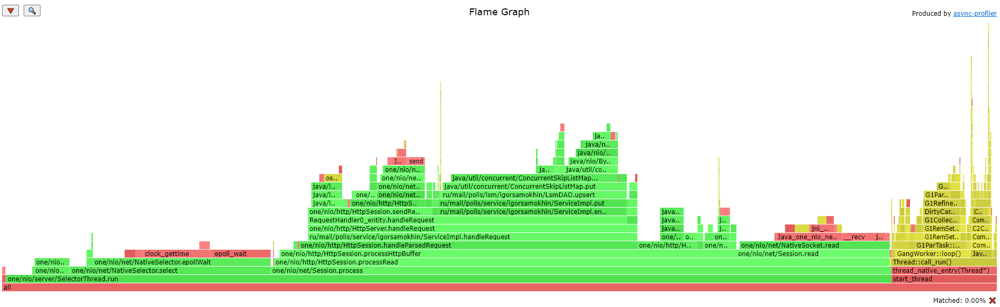
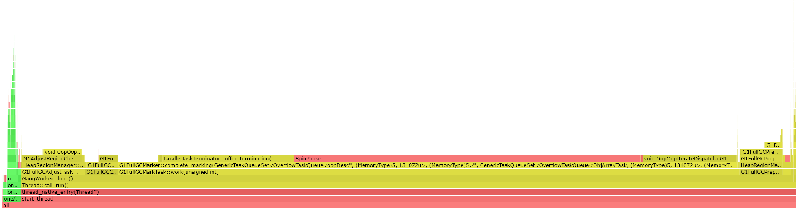
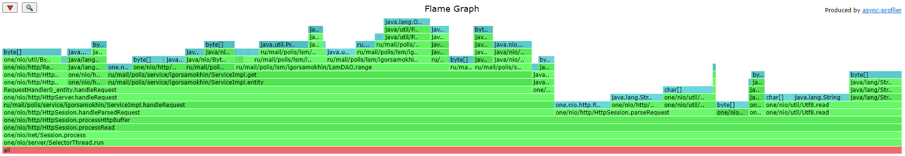

# Stage 1 Report

## Tips

* Нагрузка давалась в одно подключение и одно соединение с R = 1000 запросов в секунду на протяжении 11 минут для одного типа запросов.

* Профилировка при `GET` и при `PUT` запросах производлась на протяжении 5 минут для cpu и для alloc

* Выводы по Flame Graph делались на основе тех пунктов, которые шли после вызова `.../igorsamokhin/ServiceImpl.entity`, поскольку все остальные вызовы относятся к работе `one-nio`.  

## Нагрузочное тестирование `PUT`-запросами

```bash
wrk -c 1 -t 1 -d11m -R 1000 -L -s scripts/put.lua -L http://localhost:8080
```

#### Результаты

```text
 1 threads and 1 connections
  Thread calibration: mean lat.: 1.639ms, rate sampling interval: 10ms
  Thread Stats   Avg      Stdev     Max   +/- Stdev
    Latency     1.86ms    8.05ms 200.19ms   99.37%
    Req/Sec   773.92    518.14    14.89k    72.25%
  Latency Distribution (HdrHistogram - Recorded Latency)
 50.000%    1.30ms
 75.000%    1.67ms
 90.000%    2.05ms
 99.000%    2.47ms
 99.900%  147.97ms
 99.990%  174.59ms
 99.999%  196.10ms
100.000%  200.32ms

  Detailed Percentile spectrum:
       Value   Percentile   TotalCount 1/(1-Percentile)

       0.085     0.000000            1         1.00
       0.584     0.100000        47846         1.11
       0.832     0.200000        95883         1.25
       1.014     0.300000       143707         1.43
       1.158     0.400000       191539         1.67
       1.297     0.500000       239404         2.00
       1.365     0.550000       263161         2.22
       1.434     0.600000       287040         2.50
       1.507     0.650000       310950         2.86
       1.586     0.700000       335046         3.33
       1.668     0.750000       358986         4.00
       1.712     0.775000       370884         4.44
       1.763     0.800000       382694         5.00
       1.823     0.825000       394709         5.71
       1.889     0.850000       406620         6.67
       1.966     0.875000       418646         8.00
       2.007     0.887500       424595         8.89
       2.049     0.900000       430728        10.00
       2.089     0.912500       436652        11.43
       2.133     0.925000       442591        13.33
       2.177     0.937500       448584        16.00
       2.201     0.943750       451558        17.78
       2.225     0.950000       454567        20.00
       2.251     0.956250       457492        22.86
       2.279     0.962500       460403        26.67
       2.311     0.968750       463429        32.00
       2.329     0.971875       464936        35.56
       2.347     0.975000       466376        40.00
       2.367     0.978125       467954        45.71
       2.387     0.981250       469376        53.33
       2.413     0.984375       470888        64.00
       2.425     0.985938       471608        71.11
       2.441     0.987500       472382        80.00
       2.459     0.989062       473100        91.43
       2.485     0.990625       473829       106.67
       2.551     0.992188       474577       128.00
       3.317     0.992969       474943       142.22
      10.215     0.993750       475317       160.00
      26.015     0.994531       475691       182.86
      47.071     0.995313       476065       213.33
      68.415     0.996094       476438       256.00
      79.359     0.996484       476626       284.44
      90.175     0.996875       476812       320.00
     100.735     0.997266       476999       365.71
     111.679     0.997656       477187       426.67
     122.431     0.998047       477372       512.00
     127.551     0.998242       477466       568.89
     132.863     0.998437       477560       640.00
     138.239     0.998633       477655       731.43
     143.359     0.998828       477746       853.33
     148.607     0.999023       477840      1024.00
     151.295     0.999121       477888      1137.78
     153.855     0.999219       477933      1280.00
     156.543     0.999316       477982      1462.86
     158.975     0.999414       478027      1706.67
     161.791     0.999512       478074      2048.00
     163.071     0.999561       478096      2275.56
     164.607     0.999609       478122      2560.00
     165.759     0.999658       478143      2925.71
     167.295     0.999707       478168      3413.33
     168.959     0.999756       478192      4096.00
     169.471     0.999780       478201      4551.11
     170.239     0.999805       478214      5120.00
     171.135     0.999829       478225      5851.43
     172.415     0.999854       478236      6826.67
     173.439     0.999878       478249      8192.00
     174.207     0.999890       478256      9102.22
     175.103     0.999902       478260     10240.00
     176.511     0.999915       478266     11702.86
     178.303     0.999927       478272     13653.33
     180.095     0.999939       478278     16384.00
     180.991     0.999945       478280     18204.44
     181.887     0.999951       478284     20480.00
     182.783     0.999957       478286     23405.71
     185.471     0.999963       478289     27306.67
     188.159     0.999969       478292     32768.00
     189.055     0.999973       478293     36408.89
     190.719     0.999976       478295     40960.00
     191.615     0.999979       478296     46811.43
     193.407     0.999982       478298     54613.33
     194.303     0.999985       478299     65536.00
     195.199     0.999986       478300     72817.78
     196.095     0.999988       478301     81920.00
     196.095     0.999989       478301     93622.86
     196.863     0.999991       478302    109226.67
     197.759     0.999992       478303    131072.00
     197.759     0.999993       478303    145635.56
     198.655     0.999994       478304    163840.00
     198.655     0.999995       478304    187245.71
     198.655     0.999995       478304    218453.33
     199.551     0.999996       478305    262144.00
     199.551     0.999997       478305    291271.11
     199.551     0.999997       478305    327680.00
     199.551     0.999997       478305    374491.43
     199.551     0.999998       478305    436906.67
     200.319     0.999998       478306    524288.00
     200.319     1.000000       478306          inf
#[Mean    =        1.860, StdDeviation   =        8.046]
#[Max     =      200.192, Total count    =       478306]
#[Buckets =           27, SubBuckets     =         2048]
----------------------------------------------------------
  488310 requests in 11.00m, 31.20MB read
  Socket errors: connect 0, read 0, write 0, timeout 85
Requests/sec:    739.82
Transfer/sec:     48.41KB
```


### Cpu

```bash
./profiler.sh -e cpu -d 300 -f putCpu.html 175
```

#### Результаты

[](https://htmlpreview.github.io/?https://github.com/IgorSamohin/2021-highload-dht/blob/igor-samokhin/reports/Stage1/putCpu.html)

### Alloc

```bash
./profiler.sh -e alloc -d 300 -f putAlloc.html 175
```

#### Результаты

[](https://htmlpreview.github.io/?https://github.com/IgorSamohin/2021-highload-dht/blob/igor-samokhin/reports/Stage1/putAlloc.html)

## Нагрузочное тестирование `GET`-запросами

```bash
wrk -c 1 -t 1 -d11m -R 1000 -L -s scripts/get.lua -L http://localhost:8080
```

#### Результаты

```text
  1 threads and 1 connections
  Thread calibration: mean lat.: 24.614ms, rate sampling interval: 215ms
  Thread Stats   Avg      Stdev     Max   +/- Stdev
    Latency    26.50ms   49.61ms 327.68ms   83.85%
    Req/Sec     1.00k   376.30     2.24k    68.69%
  Latency Distribution (HdrHistogram - Recorded Latency)
 50.000%    1.52ms
 75.000%   19.97ms
 90.000%  115.26ms
 99.000%  184.19ms
 99.900%  235.26ms
 99.990%  284.93ms
 99.999%  322.56ms
100.000%  327.93ms

  Detailed Percentile spectrum:
       Value   Percentile   TotalCount 1/(1-Percentile)

       0.073     0.000000            1         1.00
       0.672     0.100000        65163         1.11
       0.949     0.200000       130176         1.25
       1.152     0.300000       195334         1.43
       1.331     0.400000       260139         1.67
       1.524     0.500000       325012         2.00
       1.640     0.550000       357652         2.22
       1.782     0.600000       390126         2.50
       1.978     0.650000       422550         2.86
       2.239     0.700000       455091         3.33
      19.967     0.750000       487503         4.00
      35.839     0.775000       503761         4.44
      51.711     0.800000       519999         5.00
      67.583     0.825000       536254         5.71
      83.455     0.850000       552515         6.67
      99.263     0.875000       568752         8.00
     107.199     0.887500       576886         8.89
     115.263     0.900000       585037        10.00
     123.391     0.912500       593162        11.43
     131.583     0.925000       601298        13.33
     139.775     0.937500       609379        16.00
     143.999     0.943750       613554        17.78
     148.095     0.950000       617532        20.00
     152.191     0.956250       621568        22.86
     156.415     0.962500       625678        26.67
     160.639     0.968750       629726        32.00
     162.815     0.971875       631767        35.56
     165.119     0.975000       633846        40.00
     167.423     0.978125       635787        45.71
     170.239     0.981250       637877        53.33
     173.567     0.984375       639901        64.00
     175.743     0.985938       640881        71.11
     178.431     0.987500       641897        80.00
     181.759     0.989062       642909        91.43
     185.855     0.990625       643905       106.67
     190.591     0.992188       644917       128.00
     193.279     0.992969       645442       142.22
     195.967     0.993750       645939       160.00
     198.911     0.994531       646454       182.86
     201.983     0.995313       646945       213.33
     205.695     0.996094       647453       256.00
     207.871     0.996484       647714       284.44
     210.303     0.996875       647969       320.00
     212.991     0.997266       648221       365.71
     216.191     0.997656       648471       426.67
     219.903     0.998047       648722       512.00
     222.335     0.998242       648857       568.89
     224.895     0.998437       648976       640.00
     227.967     0.998633       649105       731.43
     231.551     0.998828       649232       853.33
     235.903     0.999023       649363      1024.00
     238.335     0.999121       649422      1137.78
     241.023     0.999219       649484      1280.00
     243.967     0.999316       649547      1462.86
     247.935     0.999414       649613      1706.67
     252.159     0.999512       649675      2048.00
     254.463     0.999561       649706      2275.56
     256.767     0.999609       649739      2560.00
     259.327     0.999658       649771      2925.71
     262.655     0.999707       649802      3413.33
     267.007     0.999756       649833      4096.00
     269.823     0.999780       649851      4551.11
     271.871     0.999805       649865      5120.00
     274.687     0.999829       649880      5851.43
     278.015     0.999854       649896      6826.67
     281.855     0.999878       649913      8192.00
     283.647     0.999890       649921      9102.22
     285.439     0.999902       649929     10240.00
     287.231     0.999915       649937     11702.86
     289.535     0.999927       649945     13653.33
     292.607     0.999939       649952     16384.00
     295.935     0.999945       649956     18204.44
     299.775     0.999951       649960     20480.00
     303.359     0.999957       649964     23405.71
     306.943     0.999963       649968     27306.67
     310.527     0.999969       649972     32768.00
     312.319     0.999973       649974     36408.89
     314.367     0.999976       649976     40960.00
     316.159     0.999979       649978     46811.43
     317.951     0.999982       649980     54613.33
     319.743     0.999985       649982     65536.00
     320.767     0.999986       649983     72817.78
     321.535     0.999988       649984     81920.00
     322.559     0.999989       649985     93622.86
     323.327     0.999991       649986    109226.67
     324.351     0.999992       649987    131072.00
     324.351     0.999993       649987    145635.56
     325.119     0.999994       649988    163840.00
     325.119     0.999995       649988    187245.71
     326.143     0.999995       649989    218453.33
     326.143     0.999996       649989    262144.00
     326.143     0.999997       649989    291271.11
     326.911     0.999997       649990    327680.00
     326.911     0.999997       649990    374491.43
     326.911     0.999998       649990    436906.67
     326.911     0.999998       649990    524288.00
     326.911     0.999998       649990    582542.22
     327.935     0.999998       649991    655360.00
     327.935     1.000000       649991          inf
#[Mean    =       26.503, StdDeviation   =       49.612]
#[Max     =      327.680, Total count    =       649991]
#[Buckets =           27, SubBuckets     =         2048]
----------------------------------------------------------
  659996 requests in 11.00m, 45.64MB read
  Non-2xx or 3xx responses: 171686
Requests/sec:   1000.00
Transfer/sec:     70.82KB


```

### Cpu

```bash
./profiler.sh -e cpu -d 300 -f getCpu.html 175
```

#### Результаты

[](https://htmlpreview.github.io/?https://github.com/IgorSamohin/2021-highload-dht/blob/igor-samokhin/reports/Stage1/getCpu.html)

### Alloc

```bash
./profiler.sh -e alloc -d 300 -f getAlloc.html 175
```

#### Результаты

[](https://htmlpreview.github.io/?https://github.com/IgorSamohin/2021-highload-dht/blob/igor-samokhin/reports/Stage1/getAlloc.html)

## Выводы

* По процентильным спектрам, полученным из `wrk2` видно, что сервер немного лучше справляется с обработкой `GET` запросов, чем `PUT`, если рассматривать выполненное количество запросов, однако максимальная задержка больше при `GET` запросах. Причиной этому может быть усиленная работа сборщика мусора. Что же он там собирает такого?)
* Выделений памяти было зафиксированно в почти 4 раза больше при `GET` запросах. Параллельно с этим процессор проводит много времени в методе `range`. Кроме того, он занимает почти 24% выделений памяти, в то время как его "оппонент" - метод `upsert` - 6%. И скорее всего все этими выделениями и занимается сборщик. 
* Если продолжать рассматривать выделения памяти в методе `range`, то можно заметить, что почти все выделения памяти относятся к работе PriorityQueue, которая используется в итераторах. С этим явно неободимо что-то делать! Однако пока не понятно, что именно. 
* Настала пора вспомнить про отчеты по `cpu`. По ним видно, что процессор тратит много времени на работу внутри ConcurrentSkipListMap в обоих случаях. При вставке скорее всего время тратится на обеспечиваение необходимой потокобезопасности, так что здесь все вроде хорошо. При чтении процессор тратит много времени на построении итератора по всей ConcurrentSkipListMap. Интересно, можем ли мы как-то этого избежать? Например, не строя итератор, если нужен только один конкретный ключ. Это могло бы также решить проблему частых выделений памяти в PriorityQueue. 
