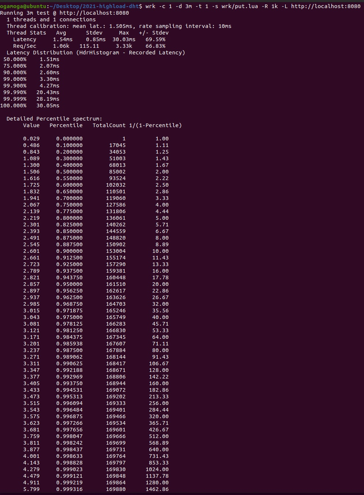
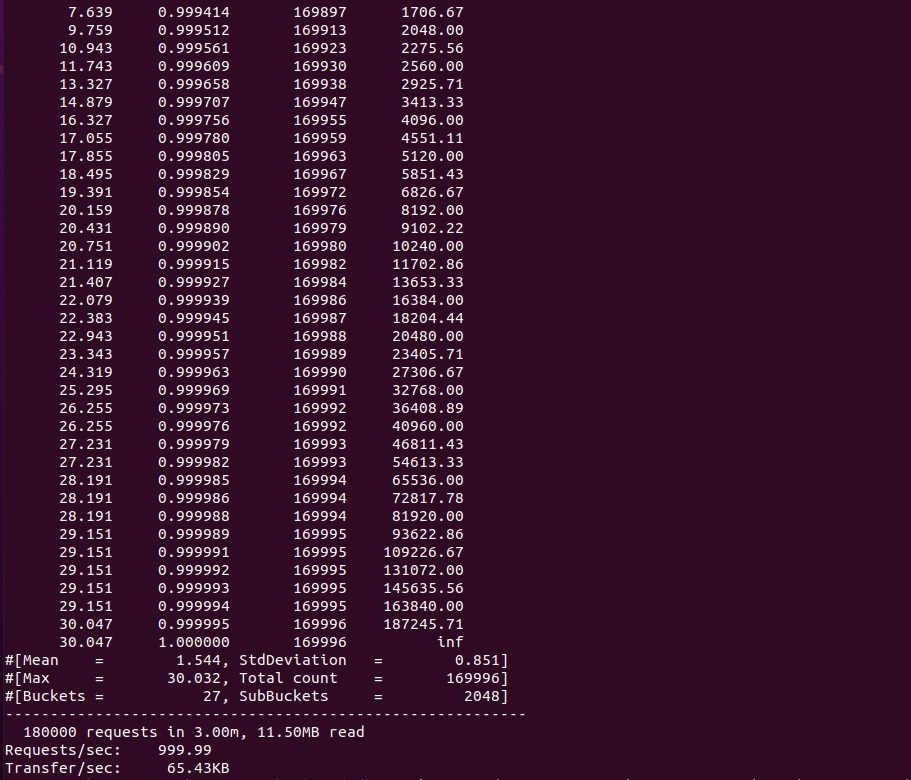
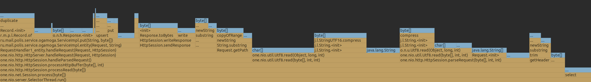
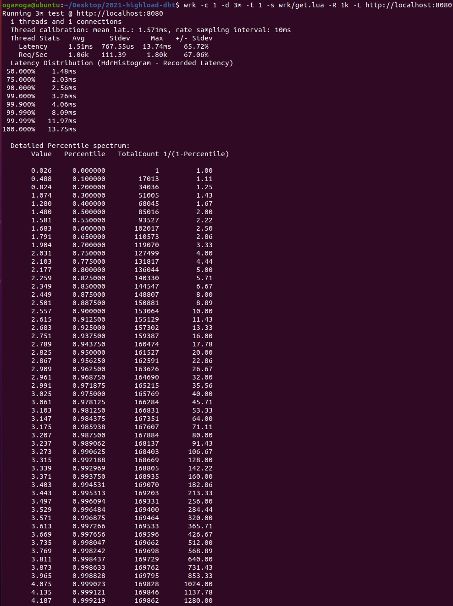
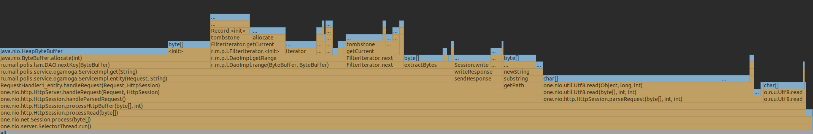

# 2021-highload-dht
Курсовой проект 2021 года [курса](https://polis.mail.ru/curriculum/program/discipline/1257/) "Проектирование высоконагруженных систем" в [Технополис](https://polis.mail.ru).

## Этап 1. HTTP + storage (deadline 2021-09-29 23:59:59 MSK)

### Задание

Проведите нагрузочное тестирование с помощью [wrk](https://github.com/giltene/wrk2) в **одно соединение**:
* `PUT` запросами на **стабильной** нагрузке (`wrk` должен обеспечивать заданный с помощью `-R` rate запросов)
* `GET` запросами на **стабильной** нагрузке по **наполненной** БД

Приложите полученный консольный вывод `wrk` для обоих видов нагрузки.

Отпрофилируйте приложение (CPU и alloc) под `PUT` и `GET` нагрузкой с помощью [async-profiler](https://github.com/jvm-profiling-tools/async-profiler).
Приложите FlameGraph `cpu`/`alloc` для `PUT`/`GET` нагрузки.

**Объясните** результаты нагрузочного тестирования и профилирования.


### Тестирование PUT запросами
Для нагрузочного тестирования PUT запросами запустим утилиту wrk2 следующей командой
```
$ wrk -c 1 -d 3m -t 1 -s wrk/put.lua -R 1k -L http://localhost:8080
```

Для формирования запроса используется скрипт put.lua

```
counter = 0

request = function()
    path = "/v0/entity?id=key" .. counter
    wrk.method = "PUT"
    wrk.body = "value" .. counter
    counter = counter + 1
    return wrk.format(nil, path)
end
```

Результаты тестирования следующие




Сервер выдерживает заданную частоту запросов. 99,9% запросов выполняются за приемлемое время, после чего задержка резко возрастает. 

При этой нагрузке произведем профилирование ресурсов процессора и памяти с помощью утилиты async-profiler.

[Результаты профилирования CPU](./pictures/cpu-put.html)

Можно заметить, что работа GC заняла 11.84% процессорного времени. Это большой показатель, следует выяснить причину такого количества мусора и устранить ее.

Основную часть процессорного времени использует метод HttpSession.sendResponse() - 65.92%. 
Полагаю, это нормальные показатели для сетевого взаимодействия. Можно попробовать оптимизировать это, отказавшись от http протокола в пользу более эффективного.

Методы DaoImpl занимают лишь 3.32% процессорного времени. Подавляющую часть этого времени занимает метод ConcurrentSkipListMap.put().
Возможно, следует работать с in memory storage эффективнее, но эти оптимизации не так сильно повлияют на общую картину.

Результаты профилирования памяти


Тяжело назвать причину большого расхода памяти. Практически все аллокации связаны с сетевым взаимодействием. Заметная часть памяти уходит на строки, возможно, 
следует это оптимизировать.


### Тестирование GET запросами
Для нагрузочного тестирования GET запросами запустим утилиту wrk2 следующей командой
```
$ wrk -c 1 -d 3m -t 1 -s wrk/get.lua -R 1k -L http://localhost:8080
```

Для формирования запроса используется скрипт put.lua

```
counter = 0

request = function()
    path = "/v0/entity?id=key" .. counter
    wrk.method = "GET"
    counter = counter + 1
    return wrk.format(nil, path)
end
```

Результаты тестирования следующие




Результаты мало чем отличаются от результатов тестирования PUT запроса. Разве что они немного оптимистичнее.

При этой нагрузке произведем профилирование ресурсов процессора и памяти с помощью утилиты async-profiler.

[Результаты профилирования CPU](./pictures/cpu-get.html)

Работа GC заняла 9.73% процессорного времени. Это меньше, чем у PUT запросов и, думаю, не нуждается в оптимизации.

Опять же, основную часть процессорного времени занял метод HttpSession.sendResponse() - 66.23%. Все аналогично.

Взаимодействие с DAO (DaoImpl.getRange()) занимает 4.12% процессорного времени. Подавляющую часть этого времени опять же занимает работа с in memory storage,
неожиданно много времени занял метод ByteBuffer.compareTo(), это следует оптимизировать. Merge и Filter итераторы работают эффективно - в сумме 0.53% времени, их оптимизировать
не нужно.

Результаты профилирования памяти


Эти результаты аналогичны результатам профилирования памяти для PUT запросов. Много памяти уходит на парсинг http запроса. 
Также следует оптимизировать FilterIterator. Метод DAO.nextKey() занимает значимую часть, но его использование полностью оправдано, и едва ли в этом методе получится обойтись без
аллокации байтбуффера.
