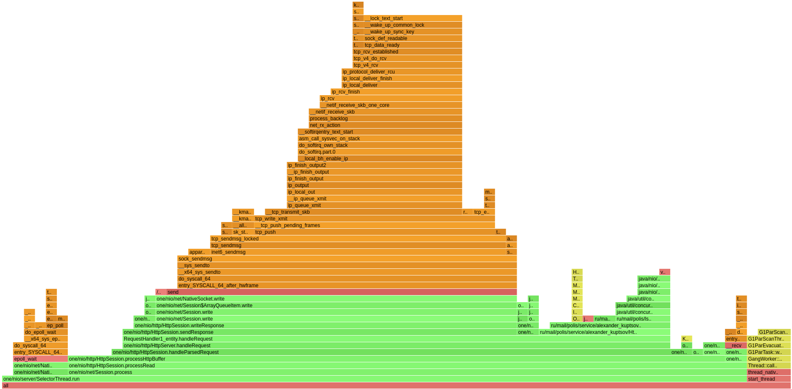
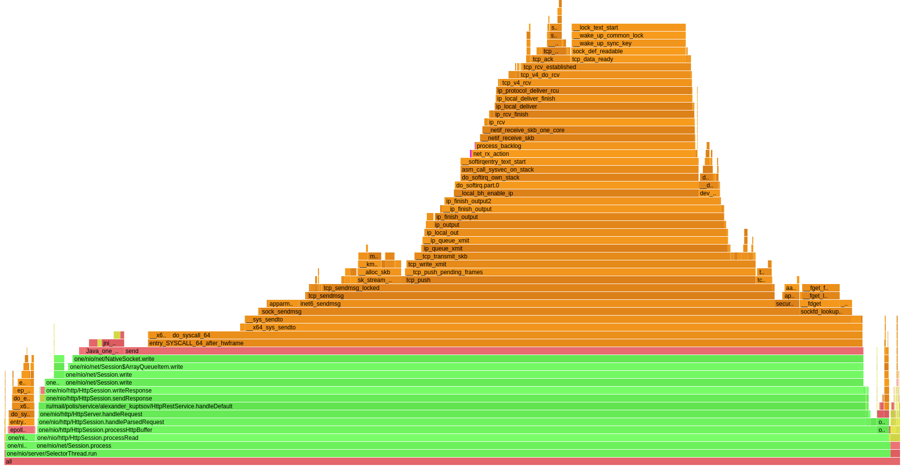
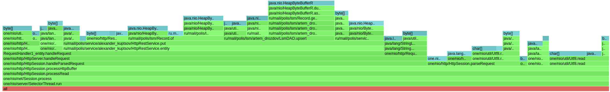
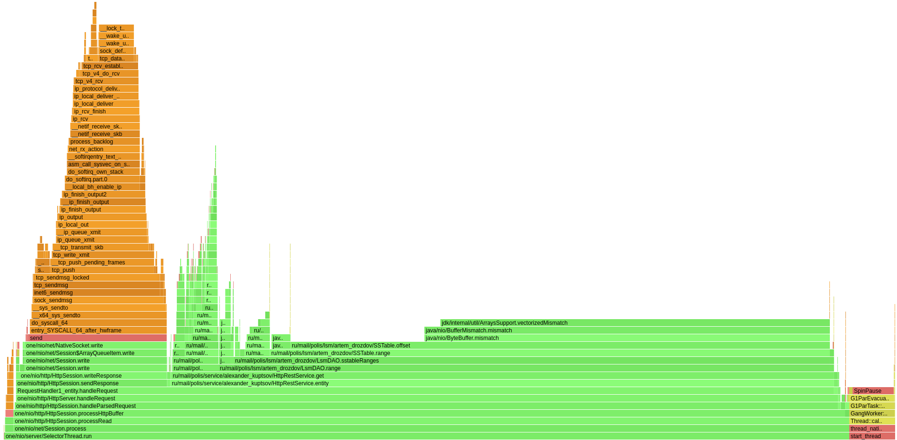
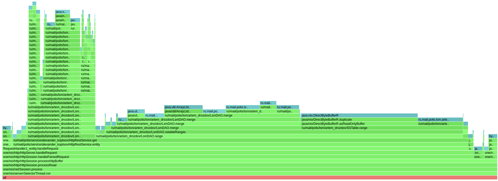

# Отчет

---

## Нагрузочное тестирование wrk
Было проведено нагрузочное тестирование с помощью [wrk](https://github.com/giltene/wrk2) в **одно соединение**.

### PUT запросы
Для автоматизации работы утилиты wrk с различными PUT запросами использовался скрипт:
```
counter = 0
request = function()
    path = "/v0/entity?id=key" .. counter
    wrk.method = "PUT"
    wrk.body = "value" .. counter
    counter = counter + 1
    return wrk.format(nil, path)
end
```
Параметры запуска: одно соединение, один поток, 30 секунд.

Результаты на стабильной нагрузке:
```
alexander@alexander-desktop:~/Projects/2021-highload-dht/wrk$ wrk -c 1 -t 1 -d 30s -R 2000 -L -s put.lua http://localhost:8080
Running 30s test @ http://localhost:8080
  1 threads and 1 connections
  Thread calibration: mean lat.: 0.852ms, rate sampling interval: 10ms
  Thread Stats   Avg      Stdev     Max   +/- Stdev
    Latency     0.86ms  436.32us   7.76ms   63.42%
    Req/Sec     2.03k   139.10     3.00k    74.33%
  Latency Distribution (HdrHistogram - Recorded Latency)
 50.000%    0.86ms
 75.000%    1.16ms
 90.000%    1.47ms
 99.000%    1.66ms
 99.900%    1.71ms
 99.990%    5.94ms
 99.999%    7.77ms
100.000%    7.77ms

  Detailed Percentile spectrum:
       Value   Percentile   TotalCount 1/(1-Percentile)

       0.021     0.000000            1         1.00
       0.242     0.100000         4002         1.11
       0.457     0.200000         8021         1.25
       0.643     0.300000        12035         1.43
       0.749     0.400000        16010         1.67
       0.856     0.500000        20020         2.00
       0.909     0.550000        22008         2.22
       0.961     0.600000        24008         2.50
       1.016     0.650000        26023         2.86
       1.068     0.700000        28002         3.33
       1.156     0.750000        30008         4.00
       1.204     0.775000        30994         4.44
       1.255     0.800000        32003         5.00
       1.312     0.825000        33012         5.71
       1.365     0.850000        33993         6.67
       1.415     0.875000        35000         8.00
       1.441     0.887500        35507         8.89
       1.468     0.900000        36001        10.00
       1.495     0.912500        36495        11.43
       1.520     0.925000        36992        13.33
       1.550     0.937500        37493        16.00
       1.566     0.943750        37752        17.78
       1.579     0.950000        38007        20.00
       1.592     0.956250        38243        22.86
       1.605     0.962500        38497        26.67
       1.619     0.968750        38740        32.00
       1.626     0.971875        38880        35.56
       1.632     0.975000        38997        40.00
       1.637     0.978125        39124        45.71
       1.644     0.981250        39255        53.33
       1.649     0.984375        39369        64.00
       1.653     0.985938        39444        71.11
       1.656     0.987500        39509        80.00
       1.659     0.989062        39556        91.43
       1.663     0.990625        39643       106.67
       1.665     0.992188        39677       128.00
       1.667     0.992969        39712       142.22
       1.669     0.993750        39749       160.00
       1.671     0.994531        39780       182.86
       1.673     0.995313        39811       213.33
       1.675     0.996094        39834       256.00
       1.677     0.996484        39855       284.44
       1.679     0.996875        39868       320.00
       1.681     0.997266        39881       365.71
       1.683     0.997656        39896       426.67
       1.686     0.998047        39910       512.00
       1.689     0.998242        39919       568.89
       1.692     0.998437        39928       640.00
       1.699     0.998633        39934       731.43
       1.703     0.998828        39942       853.33
       1.714     0.999023        39949      1024.00
       1.719     0.999121        39953      1137.78
       1.733     0.999219        39957      1280.00
       1.754     0.999316        39961      1462.86
       1.790     0.999414        39965      1706.67
       2.561     0.999512        39969      2048.00
       3.035     0.999561        39971      2275.56
       3.507     0.999609        39973      2560.00
       3.981     0.999658        39975      2925.71
       4.451     0.999707        39977      3413.33
       4.919     0.999756        39979      4096.00
       4.995     0.999780        39980      4551.11
       5.379     0.999805        39981      5120.00
       5.467     0.999829        39982      5851.43
       5.795     0.999854        39983      6826.67
       5.939     0.999878        39984      8192.00
       5.939     0.999890        39984      9102.22
       6.407     0.999902        39985     10240.00
       6.407     0.999915        39985     11702.86
       6.879     0.999927        39986     13653.33
       6.879     0.999939        39986     16384.00
       6.879     0.999945        39986     18204.44
       7.347     0.999951        39987     20480.00
       7.347     0.999957        39987     23405.71
       7.347     0.999963        39987     27306.67
       7.347     0.999969        39987     32768.00
       7.347     0.999973        39987     36408.89
       7.767     0.999976        39988     40960.00
       7.767     1.000000        39988          inf
#[Mean    =        0.857, StdDeviation   =        0.436]
#[Max     =        7.764, Total count    =        39988]
#[Buckets =           27, SubBuckets     =         2048]
----------------------------------------------------------
  59998 requests in 30.00s, 3.83MB read
Requests/sec:   1999.93
Transfer/sec:    130.85KB
```
Из результатов видно, что с 2000 PUT запросами в секунду поддерживается стабильная работа.
По распределению задержек можно увидеть, 
что 99.9% запросов выполняются с небольшой зажержкой (< 1.71ms). И даже задержка остальных (0.1%) 
находится в разумных пределах и не превышает 7.77ms. Средняя задержка 0.86ms.

При увеличении кол-ва запросов до 5000 в секунду (-R 5000) видно, что уже 1% запросов имеют 
значительно высокую задержку (303.87ms) относительно других (~1.81ms). Средняя задержка все же находится в допустимых пределах (7.45ms).

Все файлы с логами нагрузочного тестирования PUT запросами можно найти в [..log/put](log/put).

### GET запросы
Для автоматизации работы утилиты wrk с различными PUT запросами использовался скрипт:
```
counter = 0
request = function()
    path = "/v0/entity?id=key" .. counter
    wrk.method = "GET"
    wrk.body = nil
    counter = counter + 1
    return wrk.format(nil, path)
end
```
Параметры запуска: одно соединение, один поток, 30 секунд.

Результаты на стабильной нагрузке:
```
alexander@alexander-desktop:~/Projects/2021-highload-dht/wrk$ wrk -c 1 -t 1 -d 30s -R 15000 -L -s get.lua http://localhost:8080
Running 30s test @ http://localhost:8080
  1 threads and 1 connections
  Thread calibration: mean lat.: 0.642ms, rate sampling interval: 10ms
  Thread Stats   Avg      Stdev     Max   +/- Stdev
    Latency   636.91us  463.83us   9.10ms   82.83%
    Req/Sec    15.80k     1.21k   24.20k    74.02%
  Latency Distribution (HdrHistogram - Recorded Latency)
 50.000%  605.00us
 75.000%    0.88ms
 90.000%    1.05ms
 99.000%    1.92ms
 99.900%    5.88ms
 99.990%    8.16ms
 99.999%    9.04ms
100.000%    9.11ms

  Detailed Percentile spectrum:
       Value   Percentile   TotalCount 1/(1-Percentile)

       0.024     0.000000            1         1.00
       0.151     0.100000        30033         1.11
       0.265     0.200000        60069         1.25
       0.379     0.300000        90208         1.43
       0.492     0.400000       120131         1.67
       0.605     0.500000       150169         2.00
       0.661     0.550000       165129         2.22
       0.717     0.600000       180095         2.50
       0.773     0.650000       195035         2.86
       0.828     0.700000       209951         3.33
       0.884     0.750000       225145         4.00
       0.911     0.775000       232532         4.44
       0.939     0.800000       240146         5.00
       0.966     0.825000       247475         5.71
       0.993     0.850000       254968         6.67
       1.020     0.875000       262463         8.00
       1.034     0.887500       266389         8.89
       1.047     0.900000       270075        10.00
       1.060     0.912500       273759        11.43
       1.073     0.925000       277511        13.33
       1.087     0.937500       281450        16.00
       1.094     0.943750       283109        17.78
       1.123     0.950000       284921        20.00
       1.227     0.956250       286786        22.86
       1.339     0.962500       288664        26.67
       1.459     0.968750       290537        32.00
       1.519     0.971875       291482        35.56
       1.581     0.975000       292417        40.00
       1.645     0.978125       293347        45.71
       1.713     0.981250       294290        53.33
       1.783     0.984375       295221        64.00
       1.819     0.985938       295689        71.11
       1.856     0.987500       296168        80.00
       1.896     0.989062       296627        91.43
       1.940     0.990625       297097       106.67
       1.993     0.992188       297567       128.00
       2.025     0.992969       297797       142.22
       2.077     0.993750       298034       160.00
       2.261     0.994531       298267       182.86
       2.511     0.995313       298500       213.33
       2.871     0.996094       298734       256.00
       3.075     0.996484       298852       284.44
       3.289     0.996875       298968       320.00
       3.497     0.997266       299085       365.71
       3.767     0.997656       299203       426.67
       4.163     0.998047       299320       512.00
       4.431     0.998242       299378       568.89
       4.675     0.998437       299438       640.00
       5.083     0.998633       299496       731.43
       5.515     0.998828       299554       853.33
       5.923     0.999023       299613      1024.00
       6.099     0.999121       299642      1137.78
       6.347     0.999219       299671      1280.00
       6.587     0.999316       299700      1462.86
       6.863     0.999414       299730      1706.67
       7.079     0.999512       299759      2048.00
       7.179     0.999561       299774      2275.56
       7.287     0.999609       299788      2560.00
       7.407     0.999658       299803      2925.71
       7.539     0.999707       299818      3413.33
       7.663     0.999756       299832      4096.00
       7.727     0.999780       299840      4551.11
       7.795     0.999805       299848      5120.00
       7.859     0.999829       299854      5851.43
       7.927     0.999854       299862      6826.67
       8.059     0.999878       299869      8192.00
       8.115     0.999890       299873      9102.22
       8.199     0.999902       299876     10240.00
       8.335     0.999915       299880     11702.86
       8.471     0.999927       299884     13653.33
       8.567     0.999939       299887     16384.00
       8.631     0.999945       299889     18204.44
       8.695     0.999951       299891     20480.00
       8.759     0.999957       299893     23405.71
       8.823     0.999963       299895     27306.67
       8.855     0.999969       299896     32768.00
       8.887     0.999973       299897     36408.89
       8.919     0.999976       299898     40960.00
       8.951     0.999979       299899     46811.43
       8.983     0.999982       299900     54613.33
       9.007     0.999985       299901     65536.00
       9.007     0.999986       299901     72817.78
       9.039     0.999988       299902     81920.00
       9.039     0.999989       299902     93622.86
       9.071     0.999991       299903    109226.67
       9.071     0.999992       299903    131072.00
       9.071     0.999993       299903    145635.56
       9.095     0.999994       299904    163840.00
       9.095     0.999995       299904    187245.71
       9.095     0.999995       299904    218453.33
       9.095     0.999996       299904    262144.00
       9.095     0.999997       299904    291271.11
       9.111     0.999997       299905    327680.00
       9.111     1.000000       299905          inf
#[Mean    =        0.637, StdDeviation   =        0.464]
#[Max     =        9.104, Total count    =       299905]
#[Buckets =           27, SubBuckets     =         2048]
----------------------------------------------------------
  449970 requests in 30.00s, 31.64MB read
Requests/sec:  14999.01
Transfer/sec:      1.05MB

```
Из результатов видно, что с 15000 GET запросами в секунду поддерживается стабильная работа.
По распределению задержек можно увидеть,
что 99% запросов выполняются с небольшой зажержкой (< 1.92ms). И даже задержка остальных (1%)
находится в разумных пределах и не превышает 9.11ms. Средняя задержка 636.91us.

При увеличении кол-ва запросов до 25000 в секунду (-R 25000) видно, что уже 10% запросов имеют
высокую задержку (до 21.92ms) относительно других (до 2.68ms).

При увеличении кол-ва запросов до 40000 (-R 40000) в секунду уже все запросы требуют от 4.86 секунд на выполнение.
Средняя задержка - высокая (4.95s).

Все файлы с логами нагрузочного тестирования GET запросами можно найти в [..log/get](log/get).

---

## Профилирование приложения с помощью async-profiler
Было отпрофилировано приложение (CPU и alloc) под `PUT` и `GET` нагрузкой с помощью 
[async-profiler](https://github.com/jvm-profiling-tools/async-profiler).

### PUT запросы
#### CPU
Параметры запуска: одно соединение, один поток, -R 2000. Команда: 
`./profiler.sh -d 30 -f put_cpu.html 11952`

Из результатов видно, что HttpSession.processRead использует 86.11% - база. 
На обработку запроса - 69.44%, 
из которых отправка запроса - 50%, 
считывание параметров - 2.78%, 
а работа реализованного HttpRestService.entity - 16.67%. 
Можно заметить, что присутсвуют затраты на копирование массива (1.39%) - потенциальное место для оптимизации. 
Кроме того, 5.56% уходит на работу сборщика мусора, что тоже вероятно можно улучшить.

Кроме того, было увеличено время работы wrk до 12 минут.
Параметры запуска: одно соединение, один поток. Команда:
`./profiler.sh -d 720 -f put_cpu_flush.html 11952`



#### Alloc
Параметры запуска: одно соединение, один поток, -R 2000. Команда:
`./profiler.sh -d 120 -e alloc -f put_mem.html 11952`

Из результатов видно, что HttpSession.processRead использует 100% - база.
На обработку запроса - 69.97%,
из которых отправка запроса - 6.11%,
считывание параметров - 3.82%,
а работа реализованного HttpRestService.put - 52.93%. 
Можно заметить, что на работу со строками (String.substring) уходит 7.12%, что явно можно улучшить.
Кроме того, часть ресурсов уходит на работу с кодировкой Utf8, 
что связано с записью сообщений запросов в строковой форме с последующим переводом в байты. 
Данное решение повышает наглядность кода, но при необходимости в оптимизации может быть изменено.

### GET запросы
#### CPU
Параметры запуска: одно соединение, один поток, -R 15000. Команда:
`./profiler.sh -d 120 -f get_cpu.html 11952`

Из результатов видно, что HttpSession.processRead использует 93.76% - база.
На обработку запроса - 91.78% (больше, чем для PUT запроса),
из которых отправка запроса - 16.96%,
считывание параметров - 0.38%,
а работа реализованного HttpRestService.get - 74.44% (значительно больше, чем для PUT запроса). 
Дальнейшие затраты по стеку уходят в основном на работу LsmDAO.
Можно заметить, что присутсвуют затраты на копирование массива (1.39%) - потенциальное место для оптимизации.
Кроме того, 5.10% уходит на работу сборщика мусора, что тоже вероятно можно улучшить.

#### Alloc
Параметры запуска: одно соединение, один поток, -R 15000. Команда:
`./profiler.sh -d 120 -e alloc -f get_mem.html 11952`

Из результатов видно, что HttpSession.processRead использует 100% - база.
На обработку запроса - 95.22% (больше, чем для PUT запроса),
из которых отправка запроса - 1.93%,
считывание параметров - 0.18%,
а работа реализованного HttpRestService.get - 91.99%.
Дальнейшие затраты по стеку уходят в основном на работу LsmDAO.
Можно заметить, что на работу с ByteBuffer.duplicate уходит 23.56%, что возможно можно улучшить.
Кроме того, часть ресурсов аналогично случаю с GET запросами уходит на работу с кодировкой Utf8.

