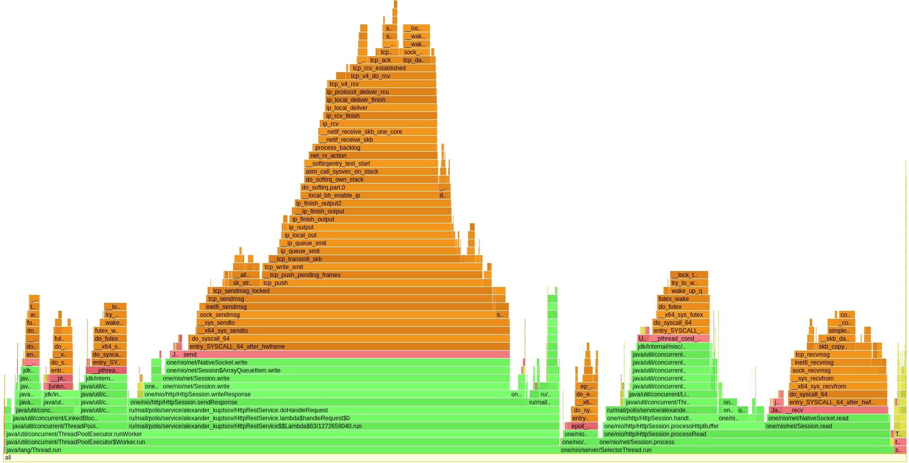

# Отчет 
### Этап 3. Асинхронный сервер

---

В данной работе была вынесена обработка запросов в отдельный ExecutorService с ограниченной очередью, 
что позволило разгрузить SelectorThreadы HTTP сервера.

## PUT запросы
Параметры запуска:
`wrk -c 64 -t 4 -R 10000 -s put.lua -d 2m -L http://localhost:8080`

### Размер очереди - 32
Результаты:
```
Running 2m test @ http://localhost:8080
  4 threads and 64 connections
  Thread calibration: mean lat.: 0.847ms, rate sampling interval: 10ms
  Thread calibration: mean lat.: 0.844ms, rate sampling interval: 10ms
  Thread calibration: mean lat.: 0.847ms, rate sampling interval: 10ms
  Thread calibration: mean lat.: 0.844ms, rate sampling interval: 10ms
  Thread Stats   Avg      Stdev     Max   +/- Stdev
    Latency   845.71us  453.42us   8.70ms   66.15%
    Req/Sec     2.57k   179.32     4.00k    71.24%
  Latency Distribution (HdrHistogram - Recorded Latency)
 50.000%  845.00us
 75.000%    1.13ms
 90.000%    1.48ms
 99.000%    1.91ms
 99.900%    2.05ms
 99.990%    4.56ms
 99.999%    6.86ms
100.000%    8.70ms

  Detailed Percentile spectrum:
       Value   Percentile   TotalCount 1/(1-Percentile)

       0.035     0.000000            1         1.00
       0.245     0.100000       110594         1.11
       0.403     0.200000       220346         1.25
       0.567     0.300000       330071         1.43
       0.719     0.400000       439752         1.67
       0.845     0.500000       549670         2.00
       0.903     0.550000       605161         2.22
       0.958     0.600000       660176         2.50
       1.013     0.650000       715334         2.86
       1.070     0.700000       769899         3.33
       1.128     0.750000       824983         4.00
       1.156     0.775000       852015         4.44
       1.186     0.800000       879476         5.00
       1.222     0.825000       907033         5.71
       1.285     0.850000       934552         6.67
       1.376     0.875000       961837         8.00
       1.428     0.887500       975682         8.89
       1.483     0.900000       989432        10.00
       1.534     0.912500      1003093        11.43
       1.584     0.925000      1016838        13.33
       1.635     0.937500      1030582        16.00
       1.661     0.943750      1037381        17.78
       1.689     0.950000      1044460        20.00
       1.717     0.956250      1051179        22.86
       1.745     0.962500      1057983        26.67
       1.776     0.968750      1064864        32.00
       1.792     0.971875      1068442        35.56
       1.807     0.975000      1071745        40.00
       1.824     0.978125      1075347        45.71
       1.841     0.981250      1078591        53.33
       1.862     0.984375      1082165        64.00
       1.873     0.985938      1083823        71.11
       1.885     0.987500      1085479        80.00
       1.899     0.989062      1087238        91.43
       1.913     0.990625      1088896       106.67
       1.927     0.992188      1090646       128.00
       1.935     0.992969      1091570       142.22
       1.942     0.993750      1092368       160.00
       1.951     0.994531      1093278       182.86
       1.960     0.995313      1094111       213.33
       1.971     0.996094      1094933       256.00
       1.978     0.996484      1095391       284.44
       1.985     0.996875      1095779       320.00
       1.993     0.997266      1096203       365.71
       2.002     0.997656      1096630       426.67
       2.013     0.998047      1097064       512.00
       2.019     0.998242      1097272       568.89
       2.026     0.998437      1097513       640.00
       2.032     0.998633      1097698       731.43
       2.041     0.998828      1097917       853.33
       2.053     0.999023      1098155      1024.00
       2.061     0.999121      1098241      1137.78
       2.071     0.999219      1098342      1280.00
       2.093     0.999316      1098452      1462.86
       2.217     0.999414      1098556      1706.67
       2.453     0.999512      1098664      2048.00
       2.645     0.999561      1098719      2275.56
       2.827     0.999609      1098771      2560.00
       2.995     0.999658      1098825      2925.71
       3.233     0.999707      1098878      3413.33
       3.477     0.999756      1098932      4096.00
       3.625     0.999780      1098959      4551.11
       3.763     0.999805      1098986      5120.00
       3.957     0.999829      1099013      5851.43
       4.127     0.999854      1099041      6826.67
       4.347     0.999878      1099066      8192.00
       4.487     0.999890      1099080      9102.22
       4.579     0.999902      1099093     10240.00
       4.759     0.999915      1099107     11702.86
       4.935     0.999927      1099120     13653.33
       5.095     0.999939      1099133     16384.00
       5.199     0.999945      1099141     18204.44
       5.287     0.999951      1099147     20480.00
       5.447     0.999957      1099154     23405.71
       5.539     0.999963      1099161     27306.67
       5.671     0.999969      1099167     32768.00
       5.791     0.999973      1099170     36408.89
       5.979     0.999976      1099174     40960.00
       6.171     0.999979      1099177     46811.43
       6.271     0.999982      1099180     54613.33
       6.383     0.999985      1099184     65536.00
       6.563     0.999986      1099185     72817.78
       6.723     0.999988      1099187     81920.00
       6.859     0.999989      1099189     93622.86
       6.871     0.999991      1099190    109226.67
       7.039     0.999992      1099192    131072.00
       7.075     0.999993      1099193    145635.56
       7.163     0.999994      1099194    163840.00
       7.431     0.999995      1099195    187245.71
       7.431     0.999995      1099195    218453.33
       7.887     0.999996      1099196    262144.00
       8.099     0.999997      1099197    291271.11
       8.099     0.999997      1099197    327680.00
       8.335     0.999997      1099198    374491.43
       8.335     0.999998      1099198    436906.67
       8.335     0.999998      1099198    524288.00
       8.615     0.999998      1099199    582542.22
       8.615     0.999998      1099199    655360.00
       8.615     0.999999      1099199    748982.86
       8.615     0.999999      1099199    873813.33
       8.615     0.999999      1099199   1048576.00
       8.703     0.999999      1099200   1165084.44
       8.703     1.000000      1099200          inf
#[Mean    =        0.846, StdDeviation   =        0.453]
#[Max     =        8.696, Total count    =      1099200]
#[Buckets =           27, SubBuckets     =         2048]
----------------------------------------------------------
  1199650 requests in 2.00m, 76.65MB read
Requests/sec:   9997.04
Transfer/sec:    654.10KB
```
#### CPU


#### Alloc


#### Loc


### Размер очереди - 128
Результаты:
```
Running 2m test @ http://localhost:8080
  4 threads and 64 connections
  Thread calibration: mean lat.: 0.853ms, rate sampling interval: 10ms
  Thread calibration: mean lat.: 0.866ms, rate sampling interval: 10ms
  Thread calibration: mean lat.: 0.890ms, rate sampling interval: 10ms
  Thread calibration: mean lat.: 0.863ms, rate sampling interval: 10ms
  Thread Stats   Avg      Stdev     Max   +/- Stdev
    Latency     0.86ms  448.43us   5.50ms   64.87%
    Req/Sec     2.55k   164.54     3.56k    73.95%
  Latency Distribution (HdrHistogram - Recorded Latency)
 50.000%    0.86ms
 75.000%    1.14ms
 90.000%    1.50ms
 99.000%    1.86ms
 99.900%    2.00ms
 99.990%    3.68ms
 99.999%    4.97ms
100.000%    5.50ms

  Detailed Percentile spectrum:
       Value   Percentile   TotalCount 1/(1-Percentile)

       0.036     0.000000            1         1.00
       0.251     0.100000       110235         1.11
       0.424     0.200000       220166         1.25
       0.594     0.300000       329720         1.43
       0.743     0.400000       439854         1.67
       0.860     0.500000       549850         2.00
       0.915     0.550000       605253         2.22
       0.968     0.600000       659555         2.50
       1.024     0.650000       714837         2.86
       1.083     0.700000       769973         3.33
       1.140     0.750000       824628         4.00
       1.168     0.775000       851800         4.44
       1.203     0.800000       879537         5.00
       1.262     0.825000       907044         5.71
       1.339     0.850000       934306         6.67
       1.421     0.875000       961670         8.00
       1.463     0.887500       975623         8.89
       1.503     0.900000       989112        10.00
       1.547     0.912500      1002967        11.43
       1.593     0.925000      1016781        13.33
       1.636     0.937500      1030459        16.00
       1.658     0.943750      1037447        17.78
       1.679     0.950000      1044254        20.00
       1.699     0.956250      1051013        22.86
       1.721     0.962500      1057940        26.67
       1.745     0.968750      1064731        32.00
       1.759     0.971875      1068300        35.56
       1.773     0.975000      1071689        40.00
       1.788     0.978125      1075012        45.71
       1.805     0.981250      1078572        53.33
       1.822     0.984375      1081952        64.00
       1.831     0.985938      1083592        71.11
       1.841     0.987500      1085394        80.00
       1.851     0.989062      1087034        91.43
       1.862     0.990625      1088719       106.67
       1.876     0.992188      1090541       128.00
       1.882     0.992969      1091290       142.22
       1.890     0.993750      1092234       160.00
       1.898     0.994531      1093081       182.86
       1.906     0.995313      1093901       213.33
       1.916     0.996094      1094777       256.00
       1.921     0.996484      1095181       284.44
       1.927     0.996875      1095578       320.00
       1.934     0.997266      1096014       365.71
       1.942     0.997656      1096456       426.67
       1.952     0.998047      1096885       512.00
       1.958     0.998242      1097082       568.89
       1.964     0.998437      1097298       640.00
       1.973     0.998633      1097532       731.43
       1.983     0.998828      1097722       853.33
       1.997     0.999023      1097946      1024.00
       2.004     0.999121      1098041      1137.78
       2.013     0.999219      1098148      1280.00
       2.029     0.999316      1098258      1462.86
       2.053     0.999414      1098363      1706.67
       2.115     0.999512      1098470      2048.00
       2.203     0.999561      1098524      2275.56
       2.349     0.999609      1098577      2560.00
       2.543     0.999658      1098631      2925.71
       2.737     0.999707      1098685      3413.33
       2.975     0.999756      1098739      4096.00
       3.081     0.999780      1098765      4551.11
       3.215     0.999805      1098792      5120.00
       3.333     0.999829      1098819      5851.43
       3.439     0.999854      1098846      6826.67
       3.573     0.999878      1098873      8192.00
       3.629     0.999890      1098886      9102.22
       3.689     0.999902      1098899     10240.00
       3.819     0.999915      1098913     11702.86
       3.959     0.999927      1098926     13653.33
       4.069     0.999939      1098939     16384.00
       4.119     0.999945      1098946     18204.44
       4.239     0.999951      1098953     20480.00
       4.287     0.999957      1098960     23405.71
       4.395     0.999963      1098966     27306.67
       4.459     0.999969      1098973     32768.00
       4.467     0.999973      1098976     36408.89
       4.499     0.999976      1098980     40960.00
       4.583     0.999979      1098984     46811.43
       4.611     0.999982      1098986     54613.33
       4.795     0.999985      1098990     65536.00
       4.819     0.999986      1098992     72817.78
       4.879     0.999988      1098993     81920.00
       4.967     0.999989      1098996     93622.86
       4.967     0.999991      1098996    109226.67
       5.003     0.999992      1098998    131072.00
       5.063     0.999993      1098999    145635.56
       5.067     0.999994      1099000    163840.00
       5.095     0.999995      1099001    187245.71
       5.095     0.999995      1099001    218453.33
       5.175     0.999996      1099002    262144.00
       5.179     0.999997      1099003    291271.11
       5.179     0.999997      1099003    327680.00
       5.311     0.999997      1099004    374491.43
       5.311     0.999998      1099004    436906.67
       5.311     0.999998      1099004    524288.00
       5.435     0.999998      1099005    582542.22
       5.435     0.999998      1099005    655360.00
       5.435     0.999999      1099005    748982.86
       5.435     0.999999      1099005    873813.33
       5.435     0.999999      1099005   1048576.00
       5.503     0.999999      1099006   1165084.44
       5.503     1.000000      1099006          inf
#[Mean    =        0.860, StdDeviation   =        0.448]
#[Max     =        5.500, Total count    =      1099006]
#[Buckets =           27, SubBuckets     =         2048]
----------------------------------------------------------
  1199450 requests in 2.00m, 76.64MB read
  Non-2xx or 3xx responses: 17
Requests/sec:   9995.43
Transfer/sec:    654.00KB

```
#### CPU


#### Alloc


#### Loc


### GET запросы
Параметры запуска:
`wrk -c 64 -t 4 -R 15000 -s get.lua -d 2m -L http://localhost:8080`

### Размер очереди - 32
Результаты:
```
Running 2m test @ http://localhost:8080
  4 threads and 64 connections
  Thread calibration: mean lat.: 0.901ms, rate sampling interval: 10ms
  Thread calibration: mean lat.: 0.900ms, rate sampling interval: 10ms
  Thread calibration: mean lat.: 0.901ms, rate sampling interval: 10ms
  Thread calibration: mean lat.: 0.904ms, rate sampling interval: 10ms
  Thread Stats   Avg      Stdev     Max   +/- Stdev
    Latency     0.90ms  427.77us  17.33ms   67.13%
    Req/Sec     3.89k   231.47     9.56k    72.84%
  Latency Distribution (HdrHistogram - Recorded Latency)
 50.000%    0.90ms
 75.000%    1.19ms
 90.000%    1.47ms
 99.000%    1.73ms
 99.900%    1.90ms
 99.990%    6.49ms
 99.999%   15.44ms
100.000%   17.34ms

  Detailed Percentile spectrum:
       Value   Percentile   TotalCount 1/(1-Percentile)

       0.030     0.000000            1         1.00
       0.329     0.100000       164970         1.11
       0.541     0.200000       330606         1.25
       0.669     0.300000       495272         1.43
       0.783     0.400000       660345         1.67
       0.899     0.500000       825116         2.00
       0.957     0.550000       906932         2.22
       1.017     0.600000       990342         2.50
       1.075     0.650000      1071790         2.86
       1.134     0.700000      1155372         3.33
       1.191     0.750000      1236962         4.00
       1.223     0.775000      1278917         4.44
       1.263     0.800000      1319483         5.00
       1.312     0.825000      1360615         5.71
       1.364     0.850000      1401938         6.67
       1.416     0.875000      1443181         8.00
       1.443     0.887500      1463854         8.89
       1.470     0.900000      1484027        10.00
       1.499     0.912500      1505129        11.43
       1.528     0.925000      1525714        13.33
       1.558     0.937500      1545924        16.00
       1.575     0.943750      1556618        17.78
       1.592     0.950000      1566898        20.00
       1.610     0.956250      1576854        22.86
       1.629     0.962500      1587073        26.67
       1.649     0.968750      1597524        32.00
       1.659     0.971875      1602680        35.56
       1.669     0.975000      1607613        40.00
       1.680     0.978125      1612939        45.71
       1.692     0.981250      1618300        53.33
       1.704     0.984375      1623216        64.00
       1.711     0.985938      1625901        71.11
       1.718     0.987500      1628356        80.00
       1.726     0.989062      1630851        91.43
       1.735     0.990625      1633454       106.67
       1.745     0.992188      1635946       128.00
       1.751     0.992969      1637245       142.22
       1.758     0.993750      1638553       160.00
       1.766     0.994531      1639900       182.86
       1.774     0.995313      1641092       213.33
       1.784     0.996094      1642360       256.00
       1.790     0.996484      1643031       284.44
       1.797     0.996875      1643668       320.00
       1.806     0.997266      1644341       365.71
       1.816     0.997656      1644964       426.67
       1.828     0.998047      1645596       512.00
       1.836     0.998242      1645930       568.89
       1.846     0.998437      1646243       640.00
       1.858     0.998633      1646552       731.43
       1.877     0.998828      1646874       853.33
       1.903     0.999023      1647195      1024.00
       1.921     0.999121      1647350      1137.78
       1.949     0.999219      1647511      1280.00
       2.004     0.999316      1647672      1462.86
       2.189     0.999414      1647834      1706.67
       2.595     0.999512      1647994      2048.00
       2.821     0.999561      1648075      2275.56
       3.051     0.999609      1648156      2560.00
       3.343     0.999658      1648236      2925.71
       3.663     0.999707      1648316      3413.33
       4.053     0.999756      1648397      4096.00
       4.283     0.999780      1648438      4551.11
       4.523     0.999805      1648477      5120.00
       4.803     0.999829      1648518      5851.43
       5.087     0.999854      1648558      6826.67
       5.583     0.999878      1648598      8192.00
       5.979     0.999890      1648619      9102.22
       6.707     0.999902      1648638     10240.00
       7.723     0.999915      1648659     11702.86
       9.119     0.999927      1648679     13653.33
      10.359     0.999939      1648699     16384.00
      11.055     0.999945      1648709     18204.44
      11.487     0.999951      1648719     20480.00
      12.447     0.999957      1648729     23405.71
      13.039     0.999963      1648739     27306.67
      13.567     0.999969      1648749     32768.00
      13.783     0.999973      1648754     36408.89
      14.055     0.999976      1648759     40960.00
      14.583     0.999979      1648764     46811.43
      14.863     0.999982      1648769     54613.33
      15.119     0.999985      1648774     65536.00
      15.247     0.999986      1648778     72817.78
      15.263     0.999988      1648779     81920.00
      15.367     0.999989      1648782     93622.86
      15.663     0.999991      1648784    109226.67
      15.887     0.999992      1648787    131072.00
      15.911     0.999993      1648788    145635.56
      15.927     0.999994      1648789    163840.00
      16.559     0.999995      1648791    187245.71
      16.847     0.999995      1648792    218453.33
      16.927     0.999996      1648793    262144.00
      17.039     0.999997      1648794    291271.11
      17.039     0.999997      1648794    327680.00
      17.055     0.999997      1648795    374491.43
      17.087     0.999998      1648796    436906.67
      17.087     0.999998      1648796    524288.00
      17.103     0.999998      1648797    582542.22
      17.103     0.999998      1648797    655360.00
      17.103     0.999999      1648797    748982.86
      17.167     0.999999      1648798    873813.33
      17.167     0.999999      1648798   1048576.00
      17.167     0.999999      1648798   1165084.44
      17.167     0.999999      1648798   1310720.00
      17.167     0.999999      1648798   1497965.71
      17.343     0.999999      1648799   1747626.67
      17.343     1.000000      1648799          inf
#[Mean    =        0.904, StdDeviation   =        0.428]
#[Max     =       17.328, Total count    =      1648799]
#[Buckets =           27, SubBuckets     =         2048]
----------------------------------------------------------
  1799456 requests in 2.00m, 118.41MB read
  Non-2xx or 3xx responses: 1799456
Requests/sec:  14995.43
Transfer/sec:      0.99MB

```
#### CPU


#### Alloc


#### Loc


### Размер очереди - 128
Результаты:
```
Running 3m test @ http://localhost:8080
  4 threads and 64 connections
  Thread calibration: mean lat.: 0.854ms, rate sampling interval: 10ms
  Thread calibration: mean lat.: 0.836ms, rate sampling interval: 10ms
  Thread calibration: mean lat.: 0.852ms, rate sampling interval: 10ms
  Thread calibration: mean lat.: 0.852ms, rate sampling interval: 10ms
  Thread Stats   Avg      Stdev     Max   +/- Stdev
    Latency     0.85ms  371.43us   4.06ms   64.21%
    Req/Sec     2.21k   254.91     3.22k    67.21%
  Latency Distribution (HdrHistogram - Recorded Latency)
 50.000%    0.85ms
 75.000%    1.13ms
 90.000%    1.36ms
 99.000%    1.58ms
 99.900%    1.68ms
 99.990%    1.87ms
 99.999%    2.85ms
100.000%    4.07ms

  Detailed Percentile spectrum:
       Value   Percentile   TotalCount 1/(1-Percentile)

       0.028     0.000000            1         1.00
       0.364     0.100000       147464         1.11
       0.507     0.200000       295412         1.25
       0.623     0.300000       442712         1.43
       0.738     0.400000       589903         1.67
       0.851     0.500000       738024         2.00
       0.906     0.550000       810506         2.22
       0.962     0.600000       884266         2.50
       1.019     0.650000       958078         2.86
       1.076     0.700000      1032009         3.33
       1.133     0.750000      1105471         4.00
       1.163     0.775000      1142746         4.44
       1.196     0.800000      1179764         5.00
       1.234     0.825000      1216231         5.71
       1.276     0.850000      1252709         6.67
       1.319     0.875000      1290007         8.00
       1.340     0.887500      1308287         8.89
       1.361     0.900000      1326252        10.00
       1.383     0.912500      1344829        11.43
       1.406     0.925000      1363543        13.33
       1.430     0.937500      1382228        16.00
       1.442     0.943750      1391313        17.78
       1.454     0.950000      1400040        20.00
       1.468     0.956250      1409537        22.86
       1.482     0.962500      1418526        26.67
       1.498     0.968750      1427678        32.00
       1.507     0.971875      1432201        35.56
       1.517     0.975000      1437015        40.00
       1.527     0.978125      1441402        45.71
       1.538     0.981250      1446038        53.33
       1.550     0.984375      1450564        64.00
       1.557     0.985938      1453070        71.11
       1.563     0.987500      1455107        80.00
       1.571     0.989062      1457648        91.43
       1.578     0.990625      1459724       106.67
       1.587     0.992188      1462087       128.00
       1.592     0.992969      1463250       142.22
       1.597     0.993750      1464340       160.00
       1.603     0.994531      1465495       182.86
       1.610     0.995313      1466664       213.33
       1.618     0.996094      1467817       256.00
       1.623     0.996484      1468452       284.44
       1.628     0.996875      1469009       320.00
       1.634     0.997266      1469577       365.71
       1.640     0.997656      1470099       426.67
       1.648     0.998047      1470673       512.00
       1.653     0.998242      1470982       568.89
       1.658     0.998437      1471259       640.00
       1.664     0.998633      1471550       731.43
       1.670     0.998828      1471804       853.33
       1.679     0.999023      1472101      1024.00
       1.684     0.999121      1472242      1137.78
       1.690     0.999219      1472376      1280.00
       1.697     0.999316      1472534      1462.86
       1.704     0.999414      1472667      1706.67
       1.715     0.999512      1472813      2048.00
       1.721     0.999561      1472882      2275.56
       1.729     0.999609      1472960      2560.00
       1.737     0.999658      1473028      2925.71
       1.747     0.999707      1473098      3413.33
       1.765     0.999756      1473170      4096.00
       1.774     0.999780      1473204      4551.11
       1.784     0.999805      1473240      5120.00
       1.794     0.999829      1473275      5851.43
       1.806     0.999854      1473311      6826.67
       1.833     0.999878      1473347      8192.00
       1.849     0.999890      1473365      9102.22
       1.872     0.999902      1473384     10240.00
       1.891     0.999915      1473401     11702.86
       1.931     0.999927      1473419     13653.33
       1.977     0.999939      1473437     16384.00
       1.996     0.999945      1473446     18204.44
       2.047     0.999951      1473455     20480.00
       2.095     0.999957      1473464     23405.71
       2.161     0.999963      1473473     27306.67
       2.251     0.999969      1473482     32768.00
       2.305     0.999973      1473486     36408.89
       2.363     0.999976      1473491     40960.00
       2.403     0.999979      1473495     46811.43
       2.451     0.999982      1473500     54613.33
       2.539     0.999985      1473504     65536.00
       2.665     0.999986      1473506     72817.78
       2.741     0.999988      1473509     81920.00
       2.847     0.999989      1473511     93622.86
       2.857     0.999991      1473513    109226.67
       2.923     0.999992      1473515    131072.00
       2.993     0.999993      1473516    145635.56
       3.045     0.999994      1473518    163840.00
       3.047     0.999995      1473519    187245.71
       3.175     0.999995      1473520    218453.33
       3.229     0.999996      1473521    262144.00
       3.229     0.999997      1473521    291271.11
       3.257     0.999997      1473522    327680.00
       3.303     0.999997      1473523    374491.43
       3.303     0.999998      1473523    436906.67
       3.941     0.999998      1473524    524288.00
       3.941     0.999998      1473524    582542.22
       3.941     0.999998      1473524    655360.00
       4.029     0.999999      1473525    748982.86
       4.029     0.999999      1473525    873813.33
       4.029     0.999999      1473525   1048576.00
       4.029     0.999999      1473525   1165084.44
       4.029     0.999999      1473525   1310720.00
       4.065     0.999999      1473526   1497965.71
       4.065     1.000000      1473526          inf
#[Mean    =        0.851, StdDeviation   =        0.371]
#[Max     =        4.064, Total count    =      1473526]
#[Buckets =           27, SubBuckets     =         2048]
----------------------------------------------------------
  1560635 requests in 3.00m, 103.47MB read
  Socket errors: connect 0, read 0, write 0, timeout 2403
  Non-2xx or 3xx responses: 1335203
Requests/sec:   8670.17
Transfer/sec:    588.66KB
```
#### CPU


#### Alloc


#### Loc


---
### Сравнение с предыдущей (синхронной) версией
#### GET
Async      |  Sync
:---:|:---:
  |  
  |  

#### PUT
Async      |  Sync
:---:|:---:
  |  
  |  

---
В сравнение с синхронной версией можно заметить, что сгладились скачки таймингов в wrk 99%.
Из результатов обстрела wrk и профилирования видно, что размером очереди можно влиять на тайминги обслуживания запросов
множественное соединении.
Из лога можно увидеть, что при настройках wrk в 64 соединения (-c 64) и очереди потоков обслуживания запросв равной 32
часто возникает ситуация, когда запрос не может быть обслужен из-за переполнения очереди. 
Увелечение очереди (например, 128) решает данную ситуацию.
```
21:37:30.418 [NIO Selector #5] INFO ru.mail.polis.service.alexander_kuptsov.HttpRestService - Can't handle request
21:37:30.418 [NIO Selector #13] INFO ru.mail.polis.service.alexander_kuptsov.HttpRestService - Can't handle request
21:37:30.418 [NIO Selector #15] INFO ru.mail.polis.service.alexander_kuptsov.HttpRestService - Can't handle request
21:37:30.419 [NIO Selector #7] INFO ru.mail.polis.service.alexander_kuptsov.HttpRestService - Can't handle request
21:37:30.419 [NIO Selector #4] INFO ru.mail.polis.service.alexander_kuptsov.HttpRestService - Can't handle request
21:37:30.419 [NIO Selector #3] INFO ru.mail.polis.service.alexander_kuptsov.HttpRestService - Can't handle request
21:37:30.419 [NIO Selector #13] INFO ru.mail.polis.service.alexander_kuptsov.HttpRestService - Can't handle request
21:37:30.419 [NIO Selector #12] INFO ru.mail.polis.service.alexander_kuptsov.HttpRestService - Can't handle request
21:37:30.419 [NIO Selector #5] INFO ru.mail.polis.service.alexander_kuptsov.HttpRestService - Can't handle request
```