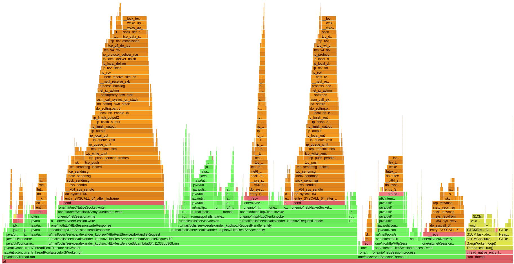

# Отчет 
### Этап 4. Шардирование

---

В данной работе было реализовано горизонтальное масштабирование через поддержку кластерных конфигураций, состоящих из 
нескольких узлов, взаимодействующих друг с другом через реализованный HTTP API.
В качестве алгоритма распределения данных между узлами был выбран **consistent hashing**.

Для профилирования и анализа запускалась утилита wrk по 3-м узлам сервиса.
## PUT запросы
Параметры запуска:
* `wrk -c 64 -t 4 -R 15000 -s put.lua -d 2m -L http://localhost:8080`
* `wrk -c 64 -t 4 -R 15000 -s put.lua -d 2m -L http://localhost:8081`
* `wrk -c 64 -t 4 -R 15000 -s put.lua -d 2m -L http://localhost:8082`

Результаты:
* [wrk PUT 8080](log/put/put_cpu_8080)
* [wrk PUT 8081](log/put/put_cpu_8081)
* [wrk PUT 8082](log/put/put_cpu_8082)

#### CPU
| 8080 | 8081 | 8082 |
| :---: | :----: | :---: |
|  |  |  |

Из результатов видно, что нагрузка равномерно распределяется между узлами.
Кроме того, появились дополнительные затраты на перенаправление запросов, работу с сетью.
#### Alloc

Аналогично CPU появились затраты на формирование перенаправления запроса на другой узел.

#### Loc

### GET запросы
Параметры запуска:
* `wrk -c 64 -t 4 -R 15000 -s get.lua -d 2m -L http://localhost:8080`
* `wrk -c 64 -t 4 -R 15000 -s get.lua -d 2m -L http://localhost:8081`
* `wrk -c 64 -t 4 -R 15000 -s get.lua -d 2m -L http://localhost:8082`

Результаты:
* [wrk GET 8080](log/get/get_cpu_8080)
* [wrk GET 8081](log/get/get_cpu_8081)
* [wrk GET 8082](log/get/get_cpu_8082)

#### CPU
| 8080 | 8081 | 8082 |
| :---: | :----: | :---: |
|  |  |  |

Из результатов видно, что нагрузка равномерно распределяется между узлами.
Кроме того, появились дополнительные затраты на перенаправление запросов, работу с сетью.
#### Alloc

Аналогично CPU появились затраты на формирование перенаправления запроса на другой узел.

#### Loc

---
### Сравнение с предыдущей версией
#### GET
|                  Async                   |                   Sync                   |
|:----------------------------------------:|:----------------------------------------:|
|   |  |
|   |       |
|  |      |

#### PUT
|                  Async                   |                   Sync                   |
|:----------------------------------------:|:----------------------------------------:|
|   |  |
|   |       |
|  |      |

---
Можно заметить, что в сравнении с версией из 3-го этапа (без шардирования) при одинаковой загрузке
среднее время обработки запросов сильно не изменилось, но в новой версии немного увеличелось максимальное время 
обработки и дисперсия. Данное изменение связано с ситуацией, когда запрос перенаправляется на другие узлы.

Варианты оптимизации - подбирать значение количества виртуальных нод в **consistent hashing** алгоритме, подбирать 
хэш функцию. В случае с хостами разной мощности следует адаптивно выделять промежутки попадания хэш функции и 
количество виртуальных нод, чтобы более мощному перенаправлялось больше запросов. Кроме того, можно заметить учеличение 
работы сборщика мусора, а значит это тоже можно попробовать оптимизировать.