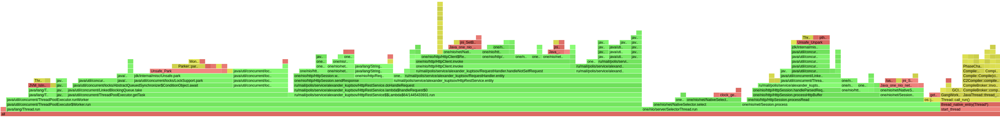
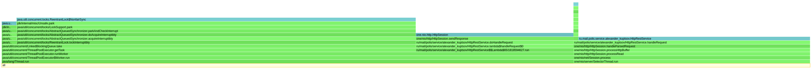

# Отчет
## Этап 8. Бонусный - Шардирование (анализ алгоритмов распределения узлов и алгоритмов хеширования)

---
## Вступление
В данной работе был подробно изучен подход consistent hashing - были исследованы, реализованы и сравнены 
различные алгоритмы распределения данных между узлами, а также различные алгоритмы хеширования. 
Были написаны новые тесты для проверки и оценки работоспособности, реализованных алгоритмов. 
Кроме того, был написан модуль (сценарий) для оценки и сравнения временных показателей алгоритмов.
Для сравнения алгоритмов на основе полученных данных построены графики, 
и в результате были сделаны выводы по всему проведенному исследованию.  

## Рассмотренные алгоритмы
В данной работе были рассмотрены и сравнены следующие алгоритмы распределения узлов:
- [VNodes](https://medium.com/interviewnoodle/how-to-use-consistent-hashing-in-a-system-design-interview-b738be3a1ae3)
- [Rendezvous](https://medium.com/i0exception/rendezvous-hashing-8c00e2fb58b0)
- [Maglev](https://static.googleusercontent.com/media/research.google.com/en//pubs/archive/44824.pdf)
- [AnchorHash](https://arxiv.org/pdf/1812.09674.pdf)
- [Jump](https://arxiv.org/ftp/arxiv/papers/1406/1406.2294.pdf)
- [Multi-probe](https://arxiv.org/pdf/1505.00062.pdf)

А также следующие алгоритмы хеширования:
- [FNV1](https://ru.wikipedia.org/wiki/FNV)
- [FNV1a](http://www.isthe.com/chongo/tech/comp/fnv/)
- [LoseLose](https://icpc.ninja/DataStructures/HashTables/HashFunctions/)
- [MD5](https://en.wikipedia.org/wiki/MD5)
- [Djb2](https://theartincode.stanis.me/008-djb2/)

## Реализация
Все алгоритмы наследуют абстрактный класс _DistributionHashAlgorithm_ и реализуют интерфейс _IDistributionAlgorithm_, 
через который как раз и происходят все обращения к алгоритмам:
- _addTopology(Set<String> topology)_
- _void addServer(String server)_
- _String getServer(String id)_
- _void removeServer(String server)_
- _void removeTopology(Set<String> topology)_

_DistributionHashAlgorithm_ имеет generic параметр _T_, реализующий интерфейс _IHashAlgorithm_. 
Таким образом, можно легко добавлять новые алгоритмы распределения данных между узлами и подставлять к ним альтернативные хеш-функции.
Для подключения алгоритма к приложению необходимо передать его в конструктор _ClusterNodeHandler_.
По моему субъективному мнению, _Rendezvous_ и _Jump_ оказались проще в реализации, чем остальные, а _Anchor_ оказался самым запутанным.

## Тестирование
Корректность всех алгоритмов была проверена уже имеющимися тестами, также были написаны наборы тестов, 
которые позволяет дополнительно оценить реализованные алгоритмы.

Для удобства использования был написан базовый абстрактный класс _DistributionTest_, отнаследованный от TestBase.
_DistributionTest_ имеет generic параметр _T_, который реализует _IDistributionAlgorithm_. 
Кроме того, были написаны еще 2 абстрактных класса, которые уже наследуются от _DistributionTest_ 
и также прокидывают generic параметр _T_. Первый - _DistributionErrorTest_, который описывает логику проверки отклонения 
от равномерного распределения. 
Второй - _DistributionTimeTest_, который описывает логику проверки времени выполнения операции получения узла по ключу.
Таким образом, можно легко добавлять тесты для новых алгоритмов. Нужно просто отнаследоваться от _DistributionErrorTest_ 
или от _DistributionTimeTest_ и передать в них в качестве generic параметра исследуемый алгоритм, реализующий интерфейс
_IDistributionAlgorithm_.

Первый набор тестов оценивает равномерность распределения узлов - проверяется, 
что отклонение от равномерного распределения при заданном количестве узлов не превышает заданного значения.

Из рисунка видно, что алгоритм _VNodes_ для любого количества узлов имеет отклонение от равномерного распределения 
примерно в 5-10%, тк проходит все тесты до точности в 5%. 5% пройдено только для 5 узлов, что может быть случайностью.
Такие тесты прогоняются для всех алгоритмов. 
Бывают случные отклонения - проваленные тесты или наоборот пройденные, но в целом они позволяют получить ясную картину 
о равномерности распределения узлов алгоритмов. 
Например, по результатам тестов для _Jump_ алгоритма можно сразу понять, что он имеет очень плохую равномерность, 
тк все тесты провалены. 

Второй набор тестов оценивает временные характеристики операции получения узла по ключу при заданном количестве узлов.

Второй набор тестов весьма спорный, т.к. делать unit тесты на выполнение за указанное время не совсем корректно (привязка к устройству).
Но в ходе разработки этот набор тестов помогал отслеживать текущие показатели, а потом помог быстро кластеризовать алгоритмы.
По результатам видно, что _Maglev_ и _VNodes_ - быстрые алгоритмы, а вот _Rendezvous_ проваливает все тесты. 
Еще раз отмечу, что эти тесты несут лишь вспомогательный характер. 
Далее в следующем пункте будут подробнее рассмотрены временные показатели всех алгоритмов.  

## Анализ временных показателей
Затем по аналогии с временными тестами была написана программа по расширенному замеру временных показателей всех алгоритмов - _TimeMeasuring_.
В данной программе присутствует замер времени выполнения следующих операций: _getServer_, _addServer_ и _removeServer_.

## Алгоритмы хеширования
Для начала, чтобы в дальнейшим не заниматься лишь полным перебором всех возможных комбинаций, 
было проверено влияние алгоритмов хеширования на равномерность распределения узлов и на временные показатели. 
Итого, присутствует 2 критерия оценки - равномерность и скорость.

#### Время выполнения операции получения узла по ключу (ns)
|   **Hash**   | **AnchorHash** | **Jump** | **Maglev** | **Multi probe** | **Rendezvous** | **VNodes** |
|:------------:|:----------:|:--------:|:----------:|:---------------:|:--------------:|:----------:|
|   **Fnv1**   |    208     |   100    |     22     |       909       |      959       |    242     |
|  **Fnv1a**   |    268     |   147    |     31     |      1041       |      971       |    290     |
| **LoseLose** |    180     |    47    |     19     |       732       |      568       |     97     |
|   **MD5**    |    556     |   234    |    299     |      4785       |      3303      |    426     |
|   **Djb2**   |    151     |    99    |     94     |      1181       |      1141      |    149     |

#### Отклонение от равномерного распределения (%)
|   **Hash**   | **AnchorHash** | **Jump** | **Maglev** | **Multi probe** | **Rendezvous** | **VNodes** |
|:------------:|:----------:|:--------:|:----------:|:---------------:|:--------------:|:----------:|
|   **Fnv1**   |     2      |   132    |     6      |        9        |       5        |     3      |
|  **Fnv1a**   |     3      |   130    |     6      |       55        |       42       |     11     |
| **LoseLose** |     64     |   161    |    177     |       194       |      453       |    857     |
|   **MD5**    |     8      |   148    |     12     |       19        |       16       |     13     |
|   **Djb2**   |     3      |   144    |     9      |       400       |      159       |     34     |

В целом видно, что алгоритмы _Fnv1_, _Fnv1a_, _Djb2_ показали хорошее время и неплохую равномерность распределения.
Алгоритм _LoseLose_ оказался самым быстрым, но имеет очень плохую равномерность, 
что плохо для решения задачи о равномерном горизонтальном масштабировании. А _MD5_ значительно медленнее остальных.
Кроме того, можно заметить смена алгоритма хеширования влияет по-разному на исследуемые алгоритмы распределения узлов.
Это может быть связано с форматом значений, передаваемых на вход, хеш-функциям, 
некоторые из которых имеют разное время выполнения и равномерность распределения для чисел и символов.  
По результатам видно, что алгоритм _FNV1_ показал себя лучше остальных - 
предоставляет хорошую равномерность распределения узлов за приемлемое время. 
Таким образом, в дальнейшем анализе все алгоритмы распределения данных между узлами будут использовать _FNV1_.

Также хочется отметить, что многие рассматриваемые алгоритмы имеют неплохую параметризацию - 
способы контролировать скорость/равномерность распределения. 
Например, начальное значение _capacity_ в _Anchor_ алгоритме, превышение которого недопустимо и заставляет переопределить общую топологию.
Или _lookupSize_ в _Maglev_ алгоритме, которое должно быть примерно в 127 раз больше, чем количество узлов, чтобы
поддерживать хорошую равномерность распределения. 
Аналогично с _numProbes_ в _Multi probe_ алгоритме и 
с _virtualNodesCount_ в _VNodes_ алгоритме, которое тоже влияют на скорость/равномерность распределения.
Все эти параметры также были зафиксированы на наиболее сбалансированных значениях, чтобы избежать подгона под различные случаи. 

#### getServer
Был произведен замер операции получения сервера по ключу для различного количества узлов (4, 16, 64, 256, 1024), 
чтобы оценить зависимость данной операции от размерности топологи для рассматриваемых алгоритмов.

| **Nodes** | **AnchorHash** | **Jump** | **Maglev** | **Multi probe** | **Rendezvous** | **VNodes** |
|:-----:|:------:|:----:|:------:|:-----------:|:----------:|:------:|
|   **4**   |  113   |  99  |   75   |     778     |    260     |  169   |
|  **16**   |  103   |  97  |   88   |     873     |    993     |  292   |
|  **64**   |  106   |  99  |   12   |    1073     |    4096    |  305   |
|  **256**  |  130   |  78  |   49   |    1357     |   15872    |  350   |
| **1024**  |  131   | 100  |   99   |    1699     |   65575    |  567   |

#### addServer
Также был произведен замер операции добавления нового узла. Размер начальной топологии - не пустой (16 узлов).

| **Nodes** | **AnchorHash** | **Jump** | **Maglev** | **Multi probe** | **Rendezvous** | **VNodes** |
|:-----:|:------:|:----:|:------:|:---------------:|:----------:|:------:|
|  **16**   |  825   | 976  | 40906  |      1056       |    296     | 46444  |

#### removeServer
Кроме того, был произведен замер операции удаления существующего узла. Размер начальной топологии - не пустой (16 узлов).

| **Nodes** | **AnchorHash** | **Jump** | **Maglev** | **Multi probe** | **Rendezvous** | **VNodes** |
|:-----:|:------:|:----:|:------:|:-----------:|:----------:|:------:|
|  **16**   |  2478  | 8338 | 261600 |     616     |    425     |  659   |

Анализ полученных данных приведен в следующем пункте (_Сравнение_).

## Сравнение
Для анализа и сравнения алгоритмов по полученным результатам были построены графики. 
В связи с тем, что данные имеют сильный разброс, были также построены графики с логарифмической шкалой по оси _Y_.
С такой шкалой оказалось намного удобнее оценивать зависимости данных, и как следствие делать выводы по алгоритмам.

### Операция getServer

По графикам видно, что все алгоритмы кроме _Rendezvous_ сильно не зависят от количества узлов. 
_Rendezvous_ имеет линейную зависимость от количества узлов. Таким образом, данный алгоритм не рекомендуется использовать 
в системах с масштабной топологией. Алгоритмы _VNodes_ и _Multi probe_ все таки тоже имеют небольшие замедления
при увеличении количества узлов, но в приемлемых границах. 
_Multi probe_ имеет наихудшее время при небольшом количестве узлов, поэтому не рекомендуется для небольших систем (2-10 узлов).
Алгоритмы _Anchor_, _Jump_, _Maglev_ показали себя очень неплохо и примерно идентично, но все же можно заметить, что 
_Maglev_ бывает быстрее. Если сравнивать минимальное возможное время, то побеждает однозначно _Maglev_.
Таким образом, оптимальным с точки зрения скорости оказался _Maglev_ алгоритм.

### Операция addServer

По графикам сразу видно, что _Maglev_ и _VNodes_ имеют плохое время добавления нового узла. 
Вероятно ситуацию может исправить пересмотр реализации этих алгоритмов.  
_Anchor_, _Jump_, _Multi probe_ имеют неплохое и примерно схожее время выполнения рассматриваемой операции. 
_Rendezvous_ быстрее всех справляется с добавлением новых узлов. 
Таким образом, его можно порекомендовать для систем, где ожидаются постоянные расширения количества узлов, 
но нельзя забывать, что для большего количества узлов этот алгоритм не подходит (обосновано в предыдущем пункте).

### Операция removeServer

Что касается операции удаления существующего узла, то тут опять проигрывает _Maglev_. 
_Rendezvous_, _Jump_, _Multi probe_ имеют неплохое и примерно схожее время выполнения рассматриваемой операции. 
_Anchor_ немного хуже, но не сильно относительно _Maglev_. Аналогично предыдущей операции _Rendezvous_ 
быстрее всех справляется с удалением существующих узлов. 
Теперь его можно порекомендовать для систем, где постоянно меняется количество узлов. 

Хочется отметить, что на практике, последние 2 операции (_addServer_, _removeServer_) применяются гораздо реже, 
чем первая (_getServer_). 
А исходя из этого факта можно сказать, что алгоритм _Rendezvous_ сильно проигрывает всем остальным по самой важной операции
_getServer_ из-за своей линейной зависимости от количества узлов.

## Профилирование
Для профилирования и анализа запускалась утилита wrk по 3-м узлам сервиса.
### PUT запросы
Параметры запуска:
* `wrk -c 64 -t 4 -R 15000 -s put.lua -d 2m -L http://localhost:8080`
* `wrk -c 64 -t 4 -R 15000 -s put.lua -d 2m -L http://localhost:8081`
* `wrk -c 64 -t 4 -R 15000 -s put.lua -d 2m -L http://localhost:8082`

Результаты:
* [wrk PUT VNodes](res/profiler/put/log/put_vnodes.txt)
* [wrk PUT Rendezvous](res/profiler/put/log/put_rendezvous.txt)
* [wrk PUT Maglev](res/profiler/put/log/put_maglev.txt)
* [wrk PUT AnchorHash](res/profiler/put/log/put_anchor.txt)
* [wrk PUT Jump](res/profiler/put/log/put_jump.txt)
* [wrk PUT Multi-probe](res/profiler/put/log/put_multi_probe.txt)

---

### VNodes
#### CPU

#### Alloc

#### Loc

---

### Rendezvous
#### CPU

#### Alloc

#### Loc

---

### Maglev
#### CPU

#### Alloc

#### Loc

---

### AnchorHash
#### CPU

#### Alloc

#### Loc

---

### Jump
#### CPU

#### Alloc

#### Loc

---

### Multi-probe
#### CPU

#### Alloc

#### Loc

---

По результатм профилирования видно, что разные алгоритмы имееют хоть и схожие, но все же разные затраты и издержки,
а также разную скорость выполнения. Во многих алгоритмах можно увидеть работу сборщика мусора.
Особенно это заметно в _VNodes_, _Maglev_ и _Jump_.
Это может быть связано с преобразованиями над ключами.  
_Jump_ алгоритм имеет минимальную среднюю задержку на ответ (0.91 ms).
_VNodes_ имеет наименьшую дисперсию (508.12 us), и как следствие наиболее стабильное время ответа. 
Также он имеет минимальную максимально возможную задержку (17.01 ms).
Самым медленным оказался _Rendezvous_. У него средняя задержка равна 0.95 ms, а максимально возможная - 33.31 ms.

### GET запросы
Параметры запуска:
* `wrk -c 64 -t 4 -R 15000 -s get.lua -d 2m -L http://localhost:8080`
* `wrk -c 64 -t 4 -R 15000 -s get.lua -d 2m -L http://localhost:8081`
* `wrk -c 64 -t 4 -R 15000 -s get.lua -d 2m -L http://localhost:8082`

Результаты:
* [wrk GET VNodes](res/profiler/get/log/get_vnodes.txt)
* [wrk GET Rendezvous](res/profiler/get/log/get_rendezvous.txt)
* [wrk GET Maglev](res/profiler/get/log/get_maglev.txt)
* [wrk GET AnchorHash](res/profiler/get/log/get_anchor.txt)
* [wrk GET Jump](res/profiler/get/log/get_jump.txt)
* [wrk GET Multi-probe](res/profiler/get/log/get_multi_probe.txt)

---

### VNodes
#### CPU

#### Alloc

#### Loc

---

### Rendezvous
#### CPU

#### Alloc

#### Loc

---

### Maglev
#### CPU

#### Alloc

#### Loc

---

### AnchorHash
#### CPU

#### Alloc

#### Loc

---

### Jump
#### CPU

#### Alloc

#### Loc

---

### Multi-probe
#### CPU

#### Alloc

#### Loc

---

По результатм профилирования видно, что разные алгоритмы имееют хоть и схожие, но все же разные затраты и издержки,
а также разную скорость выполнения. 
Аналогично случаю с PUT запросами во многих алгоритмах можно увидеть работу сборщика мусора. 
Особенно это заметно в _VNodes_, _Maglev_ и _Jump_.
Это может быть связано с преобразованиями над ключами.  
_Magkev_ алгоритм имеет минимальную среднюю задержку на ответ (0.90 ms).
_Jump_ имеет наименьшую дисперсию (438.87 us), и как следствие наиболее стабильное время ответа.
Также он имеет минимальную максимально возможную задержку (11.99 ms).
У _VNode_ оказалась самая большая максимально возможная задержка (20.99 ms) и наибольшая дисперсия (510.03 us), 
хотя этот алгоритм имеет неплохую среднюю задержку равна 0.91 ms. 

## Выводы
Таким образом, были рассмотрены различные алгоритмы распределения узлов и алгоритмы хеширования. 
Как оказалось, все они имеют как плюсы, так и минусы. И их использование - часто очень ситуативный вопрос. 
Однако после проведения данного исследования могу сделать вывод, что _Fnv1_, _Fnv1a_, _Djb2_ алгоритмы хеширования
хорошо подходят в качестве основы для алгоритмов распределения узлов. _Fnv1_ оказался самым сбалансированным по критериям 
скорость/равномерность распределения. С одной стороны, ожидаемо, что криптографические алгоритмы хеширования из-за своей 
скорости плохо себя показывают для частых операций получения узла по ключу - медленный отклик. 
С другой стороны, самый быстрый алгоритм LoseLose тоже не подходит из-за плохой 
равномерности распределения получаемых значений - плохая балансировка нагрузки.
Кроме того, было отмечено, что смена алгоритма хеширования влияет по-разному на исследуемые алгоритмы распределения узлов, 
а это значит, что можно всегда подобрать наилучшую хеш-функцию для конкретного алгоритма или использования.

Что касается самих алгоритмов распределения узлов, то тут происходит похожая балансировка между скоростью и
равномерностью распределения. 
Обычно нам не нужен алгоритм, который предоставляет идеальную балансировку, но работает бесконечно долго. 
И нам обычно не нужен алгоритм, который имеет мгновенный отклик, но вешает всю нагрузку на один узел.
На практике мы хотим улучшить одну характеристику, сохраняя другую в разумных пределах.

Алгоритмы _Anchor_, _Jump_, _Maglev_, _VNodes_ и _Multi probe_ в целом показали неплохую скорость при любом количестве узлов
и самое главное - не имеют заметной зависимости от количества узлов. 
А вот _Rendezvous_ имеет линейную зависимость. Если сравнивать минимальное возможное время, то побеждает однозначно _Maglev_.
_Jump_ алгоритм тоже оказался очень быстрым, но имеет весьма плохую равномерность распределения.
Таким образом, оптимальным с точки зрения скорости оказался _Maglev_.

Также хочется отметить, что многие рассматриваемые алгоритмы имеют неплохую параметризацию -
способы контролировать скорость/равномерность распределения.
Или _lookupSize_ в _Maglev_ алгоритме, которое должно быть как минимум в 127 раз больше, чем количество узлов, чтобы
поддерживать хорошую равномерность распределения.
Аналогично с _numProbes_ в _Multi probe_ алгоритме и
с _virtualNodesCount_ в _VNodes_ алгоритме, которое тоже влияют на скорость/равномерность распределения.
И это всегда удобно, когда есть возможность подстраивать алгоритмы под конкретные условия.

По полученным результатам и всему вышесказанному я бы назвал _Maglev_ и _Anchor_ вместе с _Fnv1_ 
оптимальными решениями для распределения узлов.
Данные решения являются быстрым для получения узлов по ключу и имеют очень хорошую равномерность распределения.
Но, как и было сказано выше, для различных использований могут лучше подойти и другие алгоритмы. 
Например, если нам вдруг не особо важно хорошее распределение нагрузки между узлами, но крайне важна скорость отклика, 
то можно попробовать использовать _Jump_ совместно с _LoseLose_ хеш-функцией.
_Maglev_ и _Anchor_ не являются лучшими во всем, а лишь хорошо балансирует между скоростью и равномерностью распределения.