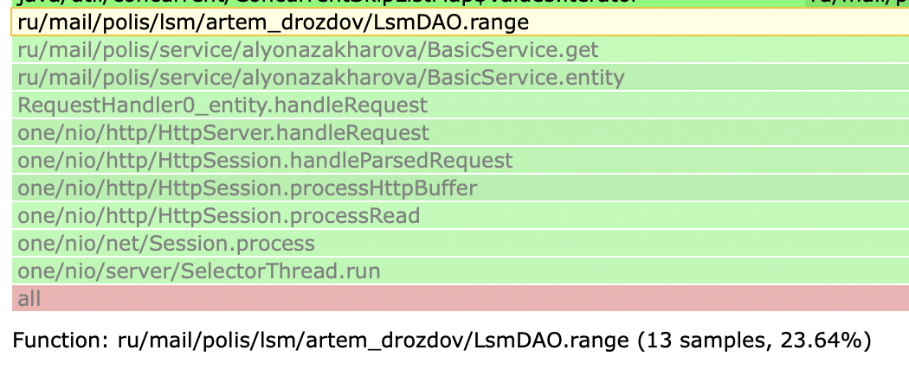
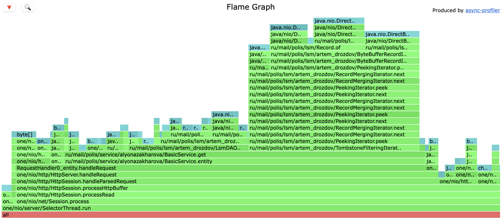

<h1>Stage 1</h1>

*Можно было бы подумать, что студенты Технополиса приобретают компуктеры на М1 ради допольнительных двух баллов, но даже два балла не стоили таких мучений...*

Нагрузочное тестирование и профилирование были произведены с помощью [lima-vm](https://github.com/lima-vm/lima).

Сначала с помощью wrk было произведено нагрузочное тестирование PUT-запросами на стабильной загрузке:

```
wrk -c 1 -t 1 -d 2m -R 2000 -L -s put.lua http://localhost:8080
Initialised 1 threads in 0 ms.
Running 2m test @ http://localhost:8080
  1 threads and 1 connections
  Thread calibration: mean lat.: 0.917ms, rate sampling interval: 10ms
  Thread Stats   Avg      Stdev     Max   +/- Stdev
    Latency     2.87ms   23.84ms 445.44ms   99.15%
    Req/Sec     2.15k   551.15    19.44k    99.16%
  Latency Distribution (HdrHistogram - Recorded Latency)
 50.000%    0.92ms
 75.000%    1.24ms
 90.000%    1.56ms
 99.000%    1.81ms
 99.900%  389.12ms
 99.990%  436.48ms
 99.999%  444.93ms
100.000%  445.69ms
```

Под нагрузкой было произведено 30-секундное профилирование CPU с помощью async-profiler:

```
./profiler.sh -d 30 -f putcpu.html 1914
```


Результаты 30-секундного профилирования alloc:


После этого было проведено тестирование GET-запросами. Так же в одно соединение, один поток, в течение двух минут на стабильной нагрузке 2000 запросов в секунду:

```
wrk -c 1 -t 1 -d 2m -R 2000 -L -s get.lua http://localhost:8080
Initialised 1 threads in 0 ms.
Running 2m test @ http://localhost:8080
  1 threads and 1 connections
  Thread calibration: mean lat.: 0.938ms, rate sampling interval: 10ms
  Thread Stats   Avg      Stdev     Max   +/- Stdev
    Latency     0.92ms  445.56us   6.13ms   62.30%
    Req/Sec     2.14k   121.81     2.78k    65.57%
  Latency Distribution (HdrHistogram - Recorded Latency)
 50.000%    0.92ms
 75.000%    1.24ms
 90.000%    1.55ms
 99.000%    1.75ms
 99.900%    1.83ms
 99.990%    3.27ms
 99.999%    5.74ms
100.000%    6.13ms
```

Время ожидания и стандартное отклонение значительно ниже, чем под PUT-нагрузкой *[я ещё в поисках адекватного объяснения]*

Результаты 30-секундного профилирования CPU под нагрузкой GET-запросов:




Видно, что большую часть времени занимает вызов метода range (23.64%). Можно предположить, что это связано с тем, что при 2-минутном заполнении БД все записи были записаны в один файл (размер которого составил 4МБ (а это, кстати, почти как "Война и мир")), и вероятно, поиск ключа в таком довольно большом файле занимает много времени.

Результат профилирования alloc под GET-нагрузкой:

