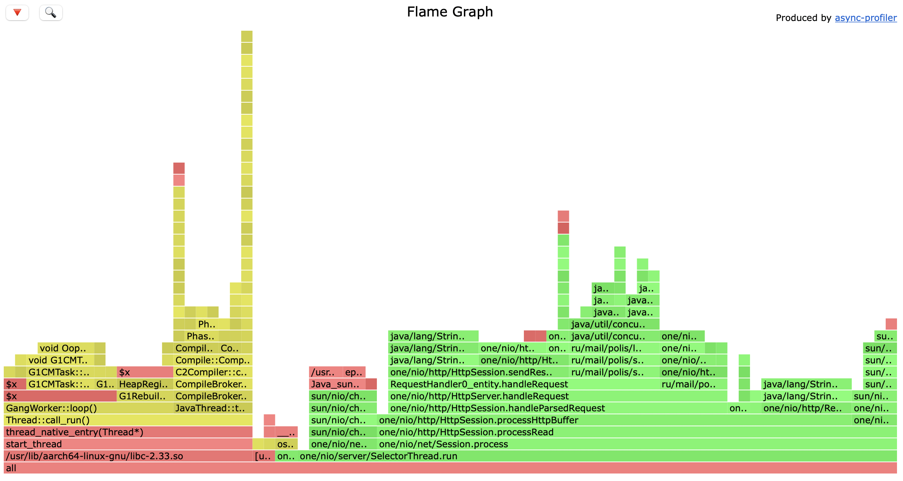
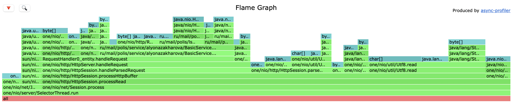

<h1>Stage 1</h1>

*Можно было бы подумать, что студенты Технополиса приобретают компуктеры на М1 ради допольнительных двух баллов, но даже два балла не стоили таких мучений...*

Нагрузочное тестирование и профилирование были произведены с помощью [lima-vm](https://github.com/lima-vm/lima).

Сначала с помощью wrk было произведено нагрузочное тестирование PUT-запросами на стабильной загрузке:

```
wrk -c 1 -t 1 -d 2m -R 2000 -s put.lua http://localhost:8080
Initialised 1 threads in 0 ms.
Running 2m test @ http://localhost:8080
  1 threads and 1 connections
  Thread calibration: mean lat.: 0.976ms, rate sampling interval: 10ms
  Thread Stats   Avg      Stdev     Max   +/- Stdev
    Latency     2.04ms   18.68ms 470.78ms   99.54%
    Req/Sec     2.16k   425.38    21.10k    99.40%
  240000 requests in 2.00m, 15.34MB read
Requests/sec:   1999.99
Transfer/sec:    130.86KB
```

Под нагрузкой было произведено 30-секундное профилирование CPU с помощью async-profiler:

```
./profiler.sh -d 30 -f putcpu.html 1914
```



Результаты 30-секундного профилирования alloc:



После этого было проведено тестирование GET-запросами. Так же в одно соединение, один поток, в течение двух минут на стабильной нагрузке 2000 запросов в секунду:

```
wrk -c 1 -t 1 -d 2m -R 2000 -s get.lua http://localhost:8080
Initialised 1 threads in 0 ms.
Running 2m test @ http://localhost:8080
  1 threads and 1 connections
  Thread calibration: mean lat.: 0.984ms, rate sampling interval: 10ms
  Thread Stats   Avg      Stdev     Max   +/- Stdev
    Latency     0.92ms  458.07us   9.42ms   63.37%
    Req/Sec     2.15k   130.91     3.50k    67.40%
  239998 requests in 2.00m, 16.82MB read
Requests/sec:   1999.98
Transfer/sec:    143.54KB
```

Результаты 30-секундного профилирования CPU под нагрузкой GET-запросов:


Видно, что большую часть времени занимает вызов метода range (23.64%). Можно предположить, что это связано с тем, что при 2-минутном заполнении БД все записи были записаны в один файл (размер которого составил 4МБ (а это, кстати, почти как "Война и мир")), и вероятно, поиск ключа в таком довольно большом файле занимает много времени.

Результат профилирования alloc под GET-нагрузкой:

